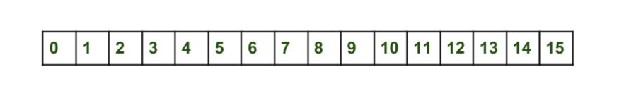

## Interface Map<Key, Value>
<details>
<summary>English version</summary>
<details>
<summary>MAP: Essence and Features</summary>

## MAP: Essence and Features

### Introduction

MAP in Java is a data structure organized as unique "key-value" pairs, closely resembling a dictionary. It serves not only as a data structure but also as an interface in the standard Java Development Kit (JDK), supporting various implementations, including the most popular—HashMap.

### Variants

MAP in Java represents the pinnacle of the Java collections hierarchy and has been included in the standard JDK since version 1.2. Over time, as Java continues to evolve and update, this interface has been enriched with new features.

#### Key Implementations

- **HashMap**
- **LinkedHashMap**
- **TreeMap**

HashMap is most commonly used in examples and applications, and will be discussed in greater detail in subsequent sections.

### Purpose and Usage

Maps are designed for efficient data retrieval. They store information in a "key-value" format, where each key is unique and unambiguously associated with a particular value. These unique "key-value" pairs form the elements of the map.

### Method Signatures

In Java, the `java.util.Map` interface offers a set of methods for adding, retrieving, and removing elements.

### Distinctive Features of Java's Map Interface

Map interfaces in the Java Collection Framework have various implementations, each with its own unique features and level of thread-safety. The most commonly encountered type is HashMap, which is widely used in the majority of Java applications.

### Uniqueness of Map Collections

Maps are special in the sense that they do not simply extend or directly implement the collection interface. This is due to their unique way of dealing with paired "key-value" elements, as opposed to handling individual values.

### Basic Operations with Map

To work efficiently with Maps in Java, it's essential to become familiar with the methods that implement various functions. These methods will be explored further, aiding in a deeper understanding of this component.


## Creating a Map

### Introduction

In a Map, keys and values can be objects of any type. Primitive data types cannot be used due to limitations related to generics. HashMap allows for one null key and multiple null values. The order of elements is not guaranteed.

### Example

An example of creating a HashMap with integer keys and string values:

```#java
Map<Integer, String> map = new HashMap<>();
```

All subsequent methods will apply to any Map implementations, as they all implement the same interface.

### Inserting Records
To add records, the `put` method is used, which takes two arguments:
* key
* value

#### Example

```java
map.put(1, "Tyrion Lannister");
map.put(2, "Arya Stark");
map.put(3, "Ned Stark");
map.put(4, "Cersei Lannister");
```

#### Table of Map Contents

| Key | Value           |
|-----|-----------------|
| 1   | Tyrion Lannister|
| 2   | Arya Stark      |
| 3   | Ned Stark       |
| 4   | Cersei Lannister|

#### Combining Maps
To add multiple records or combine two maps, the putAll method is used.

#### Keys and Duplicates
In Map, keys must be unique. If you try to add an existing key, the put method will return the previous value or null.

Example of checking the availability of a key:
```java
if (map.containsKey(4)) {
    throw new IllegalArgumentException("Duplicate key found");
}
``` 
#### Getting Data
The `get` method is used to extract information by taking the key as an argument.
```java
String value = map.get(4);  // Cersei Lannister
```
If the key is missing, the `get` method returns `null`.
Example:
```java
String value = map.get(10);  // null
```

##### Uniqueness of Keys in Map
The keys in the Map structure must be unique. If an attempt is made to add an already existing key, the following happens:

```java
map.put(4, "Daenerys Targaryen");
```
#### Table of Map Contents
| Key | Value             |
|-----|-------------------|
| 1   | Tyrion Lannister  |
| 2   | Arya Stark        |
| 3   | Ned Stark         |
| 4   | Daenerys Targaryen|

In this case, the `put` method returns the previous key value, if any. In the absence of the previous value, `null` is returned.

#### Checking For A Key
To determine the presence of a specific key, the `containsKey` method is used.

```java
if (map.containsKey(4)) {
    throw new IllegalArgumentException("Key already exists, cannot add duplicate");
}
```
#### Checking Values
To check for the presence of a certain value in the Map, the `containsValue` method is used.

```java
boolean exists = map.containsValue("Brienne of Tarth"); // Output: false
```

This method allows you to find out whether the Map contains the specified value.

#### Removing Elements from Map
In addition to adding elements, the Map structure also supports their removal. This is a basic operation that allows you to modify the contents of the Map.

##### Remove Method
To delete an element, the `remove` method is used, which works as follows:

1. Takes the key of the element as an argument.
2. Removes the corresponding element from the Map.
3. Returns the value of the deleted element or `null`, if there was none.
```java
map.remove(3); // Deletes and returns "Ned Stark"
map.remove(3); // Deletes nothing and returns null
```

#### Getting the Map Size and Checking for Emptiness
The `size` method returns the number of elements in the Map.
```java
int size = map.size(); // Getting the size
```

The 'isEmpty` method returns a Boolean value indicating whether the collection is empty or not.
```java
boolean isEmpty = map.isEmpty(); // Checking for emptiness
```
#### Viewing Map Content
Map interfaces provide methods for viewing content:

- `keySet`: Returns the set of all keys in the Map.
- `values`: Returns a collection of all values in the Map.
- `entrySet`: Returns the set of all key-value pairs in Map.

These "views" are directly related to the main map, and changes in them are reflected on the main map and vice versa. However, adding new elements through these views is not possible.

##### Clear method
To completely clear the Map, you can use the `clear` method.

```java
map.clear(); // Clears the entire map
```

#### Full Contents Of Your Map
To demonstrate the `keySet`, `values`, and `entrySet` methods, let's first look at the current contents of your Map:
##### Table of Map Contents
| Key | Value             |
|-----|-------------------|
| 1   | Tyrion Lannister  |
| 2   | Arya Stark        |
| 3   | Ned Stark         |
| 4   | Daenerys Targaryen|

#### Using keySet, values, and entrySet

##### keySet method
The `keySet` method returns a set of all keys contained in the Map.

```java
Set<Integer> keys = map.keySet();
// keys will contain [1, 2, 3, 4]
```
##### Values method
The `values` method returns a collection of all Map values.

```java
Collection<String> values = map.values();
// values will contain ["Tyrion Lannister", "Arya Stark", "Ned Stark", "Daenerys Targaryen"]
```
##### entrySet method
The 'entrySet` method returns a set of Map.Entry objects, each of which contains a key-value pair.
```java
Set<Map.Entry<Integer, String>> entries = map.entrySet();
// entries will contain:
// 1=Tyrion Lannister, 2=Arya Stark, 3=Ned Stark, 4=Daenerys Targaryen
```
With these methods you can access keys, values or a key-value pair of your Map for further use or manipulation.

#### Iterations
Iterations on maps (mapping collections) are possible in various ways. This section presents the most common iteration methods.

##### Features of exceptions
It is worth knowing that an attempt to iterate over a null map will result in a `NullPointerException` exception.

##### Application of Foreach
The most popular method of iterating over the map is using the `foreach` loop. This method is convenient for most tasks and provides access to both keys and values.

```java
map.forEach((key, value) -> {
    System.out.println("Key: " + key + ", Value: " + value);
});
```

##### Note
Above is an example of using lambda expressions in Java 8 to iterate over the map. In this case, the developer is given the opportunity to work with both keys and values.

##### Examples of iteration without using lambda expressions

##### Iteration using for-each and the `keySet()` method

```java
for (Integer key : map.keySet()) {
    String value = map.get(key);
    System.out.println("Key: " + key + ", Value: " + value);
}
```
#### Iteration using for-each and the 'entrySet()` method

```java
for (Map.Entry<Integer, String> entry : map.entrySet()) {
    Integer key = entry.getKey();
    String value = entry.getValue();
    System.out.println("Key: " + key + ", Value: " + value);
}
```
#### Iteration using an iterator

```java
Iterator<Map.Entry<Integer, String>> iterator = map.entrySet().iterator();
while (iterator.hasNext()) {
    Map.Entry<Integer, String> entry = iterator.next();
    Integer key = entry.getKey();
    String value = entry.getValue();
    System.out.println("Key: " + key + ", Value: " + value);
}
```

### Conclusion

#### Practical advantages of using Map (Map)

1. **Quick Access and Search**: Maps provide very quick access to key data.
2. **Unique keys**: There can be no duplicate keys in maps, which ensures data accuracy.
3. **Flexibility**: Maps can be used to store key-value pairs of different types.
4. **Ordering**: Some map implementations (for example, `TreeMap`) support data ordering.
5. **Availability of useful methods**: Built-in methods for performing basic operations such as adding, deleting and searching for elements.

#### Summary table with classes and complexity of operations

| Class | `get` | `put`   | `remove` | `containsKey` | Features |
|------------|---------|---------|----------|---------------|--------------------------------------|
| `HashMap` | O(1) | O(1) | O(1) | O(1) | Unordered |
| `TreeMap` | O(log n)| O(log n)| O(log n) | O(log n) | Ordered |
| `LinkedHashMap`| O(1) | O(1) | O(1) | O(1) | Ordered by insertion order |
| `Hashtable`| O(1) | O(1) | O(1) | O(1) | Thread-safe, but deprecated |

#### Map application options in practice

1. **Caching**: Storing the results of expensive calculations for quick re-access.
2. **Dictionaries and Thesauruses**: Building dictionaries for translation or synonyms.
3. **Data Indexing**: Maps can be used to index large amounts of data.
4. **Configuration Systems**: Storing key-value pairs for program settings.
5. **Graphs and networks**: Representation of graphs or networks using a map.
</details>


<details>
<summary>HashMap. What's "under the hood"</summary>

In this lesson, we will look at how hashmap's get and put methods work internally. What operations are being performed? How hashing happens. How the value is extracted by the key. How the key-value pair is stored.
The previous article said that HashMap contains an array Node, and Node can represent a class with the following objects:

- int hash
- K key (key)
- V value (value)
- Node next (next)
  Now we will look at how it works. First, let's look at the hashing process.

## Hashing

Hashing is the process of converting an object into an integer form using the `hashCode()` method. It is important to write the `hashCode()` method correctly for the best `HashMap` performance. Here I take the key of my class so that I can override the `hashCode()` method and show different scenarios. My `Key` class:

```java
class Key
{
  String key;
  Key(String key)
  {
    this.key = key;
  }
  
  @Override
  public int hashCode() 
  {
     return (int)key.charAt(0);
  }

  @Override
  public boolean equals(Object obj)
  {
    return key.equals((String)obj);
  }
}
```
Here, the redefined `hashCode()` method returns the ASCII value of the first character as a hash code. Therefore, every time the first character of the key is the same, the hash code will be the same. You should not use these criteria in your program. It's just for demonstration. Since HashMap also allows null as a key, the null hash code will always be 0.

hashCode() method: The hashCode() method is used to get the hash code of an object. The hashCode() method of the object class returns a reference to the object's memory in integer form. The definition of the hashCode() method is public native hashCode(). This indicates that the hashCode() implementation is native, since there is no direct method in Java to get a reference to an object. You can provide your own hashCode() implementation.
In HashMap, hashCode() is used to calculate the bucket and hence the index.

equals() method: This method is used to check the equality of two objects. This method is provided by the Object class. You can override it in your class to provide your own implementation.
HashMap uses equals() to compare keys for equality. If the equals() method returns true, they are equal, otherwise they are not equal.

## Buckets

The bucket is an element of the HashMap array. It is used to store nodes. Two or more nodes can have the same bucket. In this case, the linked list structure is used to connect the nodes. Baskets have different capacities. The relationship between the bucket and the capacity is as follows:
``java
capacity = number of buckets * load factor
``
One bucket can contain more than one node, it depends on the hashCode() method. The better your hashCode() method is, the better your buckets will be used.

## Calculating the index in HashMap

The hash code of the key can be large enough to create an array. The generated hash code can be in the integer range, and if we create arrays for such a range, it will easily cause an OutOfMemoryException. Therefore, we generate an index to minimize the size of the array. To calculate the index, the following operation is performed.
``java
index = hashCode(key) & (n-1).
``
where n is the number of buckets or the size of the array. In our example, I consider n as the standard size, which is 16.

## Why is the above method used to calculate the index?

Using the bitwise AND operator is similar to bit masking, which takes into account only the lower bits of the hash integer. This, in turn, provides a very efficient method for calculating the modulus based on the hashmap length.

## Initially empty HashMap
Here the hashmap size is assumed to be 16.
```java
HashMap map = new HashMap();
```


Inserting a key-value pair: Put one key-value pair in the HashMap specified above


``map.put(new Key("java"), 20);``
Steps:
1. Calculate the hash code of the key {“java”}. It will be equal to 118.
2. Calculate the index using the index method, it will be equal to 6.
3. Create a node object as follows:
```java
{
int hash = 118

// {"java"} is not a string, but
// an object of the Key class
  Key key = {"java"}
  Integer value = 20
  Node next = null
}
```
4. Place this object on index 6 if there is no other object there.

Inserting another key-value pair: Now let's put another pair, that is:

```map.put(new Key("python"), 30);```
Steps:
1. Calculate the hash code of the key {“python”}. It will be equal to 115.
2. Calculate the index using the index method, it will be equal to 3.
3. Create a node object as follows:

```java
{
  int hash = 115
  Key key = {"python"}
  Integer value = 30
  Node next = null
}
```
In case of a collision: Now let's put another pair, that is:


```map.put(new Key("golang"), 40);```
Steps:
1. Calculate the hash code of the key {“golang”}. It will be equal to 118.
2. Calculate the index using the index method, it will be equal to 6.
3. Create a node object as follows:


```java
{
  int hash = 118
  Key key = {"golang"}
  Integer value = 40
  Node next = null
}
```
Place this object on index 6 if there is no other object there.
In this case, the node object is detected at index 6 – this is a collision case.
In this case, check with the `hashCode()` and `equals()` methods whether both keys are the same.
If the keys are the same, replace the value with the current value.
Otherwise, connect this node object to the previous node object via a linked list, and both will be stored at index 6.
Now the HashMap looks like this:
3_hasharray

### Using the get() method

Now let's try some `get` methods to get the value. The `get(K key)` method is used to get the value by its key. If you do not know the key, it is not possible to extract the value.

Get the data for the python key:

```java
map.get(new Key("python"));  
```


Steps:
1. Calculate the hash code of the key {“python”}. It will be equal to 115.
2. Calculate the index using the index method, it will be equal to 3.
3. Go to the index 3 of the array and compare the key of the first element with the specified key. If both keys match, return the value, otherwise check the next element if it exists.
   In our case, it is found as the first element, and the return value is 30.

Get the data for the golang key:

```map.get(new Key("golang"));```

Steps:
1. Calculate the hash code of the key {“golang”}. It will be equal to 118.
2. Calculate the index using the `index` method, it will be equal to 6.
3. Go to index 6 of the array and compare the key of the first element with the specified key. If both keys match, return the value, otherwise check the next element if it exists.
   In our case, the first element is not found, and the next node object is not `null'.
   If the next node is `null', return `null'.
   If the node's `next` is not `null`, go to the second element and repeat step 3 until the key is found or next is `null'.
   The time complexity is almost constant for the put and get methods until the rehashing occurs.
   In case of a collision, i.e. the indexes of two or more nodes match, the nodes are connected by a linked list, i.e. the second node refers to the first, and the third to the second, and so on.
   If this key already exists in the `HashMap`, the value is replaced with a new value.
   The hash code of the `null` key is 0.
   When an object is received by its key, the linked list is viewed until the key matches or `null` is found in the next field.


</details>
</details>

<details>
<summary>Версия на русском</summary>  
<details>
<summary>MAP: Суть и Особенности</summary>

## MAP: Суть и Особенности

MAP в Java представляет собой структуру данных, организованную в форме уникальных пар "ключ-значение", и очень напоминает словарь. MAP не только является структурой данных, но и интерфейсом в стандартной Java Development Kit (JDK), поддерживающим различные реализации, включая самую популярную — HashMap.

### Введение и Разновидности

MAP в Java представляет вершину иерархии коллекций Java и включено в стандартный JDK начиная с версии 1.2. Этот интерфейс предлагает базовый набор операций для управления данными, представленными в форме "ключ-значение". С течением времени, с улучшением и обновлением Java, этот интерфейс обогащается новыми функциями.

Иерархия MAP в Java включает несколько ключевых реализаций:

- HashMap
- LinkedHashMap
- TreeMap

HashMap наиболее часто используется в примерах и приложениях, и о нем будет говориться подробнее в следующих разделах.

### Назначение и Применение

Карты (Maps) служат для эффективного поиска данных. Они хранят информацию в формате "ключ-значение", где каждый ключ является уникальным и однозначно связан с определенным значением. Такие уникальные пары "ключ-значение" и составляют элементы карты.

### Сигнатуры Основных Методов

В Java, интерфейс `java.util.Map` предлагает набор методов для добавления, извлечения и удаления элементов.

## Отличительные Характеристики Map в Java

Map интерфейсы в Java Collection Framework обладают различными реализациями, каждая с своими особенностями и уровнем потокобезопасности. Наиболее часто встречаемый тип — HashMap, который широко используется в большинстве Java-приложений.

### Уникальность Map Коллекций

Map являются особенными в том смысле, что они не просто расширяют или реализуют коллекционный интерфейс напрямую. Это связано с их особенностями работы с парными элементами "ключ-значение", в отличие от обработки индивидуальных значений.

### Основные Операции с Map

Чтобы эффективно работать с Map в Java, необходимо ознакомиться с методами, которые реализуют различные функции. Эти методы будут рассмотрены далее и помогут в дальнейшем изучении этого компонента.

#### Создание Map

В Map ключи и значения могут быть объектами любого типа. Примитивные типы данных не могут быть использованы из-за ограничений, связанных с использованием generics. HashMap позволяет иметь один нулевой ключ и множество нулевых значений. Порядок элементов не гарантирован.

Пример создания HashMap с целочисленными ключами и строковыми значениями:

```java
Map<Integer, String> map = new HashMap<>();
```

Все последующие методы будут применимы для любых реализаций Map, так как все они реализуют один и тот же интерфейс.

#### Вставка Записей
Для добавления записей используется метод put, принимающий два аргумента:
* ключ
* значение  
Пример:

```java
map.put(1, "Tyrion Lannister");
map.put(2, "Arya Stark");
map.put(3, "Ned Stark");
map.put(4, "Cersei Lannister");
```

#### Таблица содержимого Map:
| Key | Value           |
|-----|-----------------|
| 1   | Tyrion Lannister|
| 2   | Arya Stark      |
| 3   | Ned Stark       |
| 4   | Cersei Lannister|

#### Объединение Карт
Для добавления нескольких записей или объединения двух карт используется метод `putAll`.

#### Ключи и Дубликаты
В Map ключи должны быть уникальными. Если попытаться добавить существующий ключ, метод `put` вернёт предыдущее значение или `null`.

##### Пример проверки наличия ключа:
```java
if (map.containsKey(4)) {
    throw new IllegalArgumentException("Duplicate key found");
}
```  
##### Получение Данных
Метод `get` используется для извлечения информации, принимая ключ как аргумент.

Пример:
```java
String value = map.get(4);  // Cersei Lannister
```
Если ключ отсутствует, метод `get` возвращает `null`.
```java
String value = map.get(10);  // null
```

##### Уникальность Ключей в Map
Ключи в структуре Map должны быть уникальными. В случае попытки добавления уже существующего ключа происходит следующее:


```java
map.put(4, "Daenerys Targaryen");
```
#### Таблица содеражимого Map:
| Key | Value             |
|-----|-------------------|
| 1   | Tyrion Lannister  |
| 2   | Arya Stark        |
| 3   | Ned Stark         |
| 4   | Daenerys Targaryen|

В данном случае, метод `put` возвращает предыдущее значение ключа, если таковое имеется. В отсутствие предыдущего значения возвращается `null`.

#### Проверка Наличия Ключа
Для определения наличия конкретного ключа используется метод `containsKey`.


```java
if (map.containsKey(4)) {
    throw new IllegalArgumentException("Key already exists, cannot add duplicate");
}
```

#### Проверка Значений
Для проверки наличия определенного значения в Map применяется метод `containsValue`.


```java
boolean exists = map.containsValue("Brienne of Tarth"); // Output: false
```

Этот метод позволяет узнать, содержится ли в Map заданное значение.

#### Удаление Элементов из Map
Кроме добавления элементов, в структуре Map также поддерживается их удаление. Это базовая операция, которая позволяет модифицировать содержимое Map.

##### Метод Remove
Для удаления элемента используется метод `remove`, который работает следующим образом:

1. Принимает ключ элемента как аргумент.
2. Удаляет соответствующий элемент из Map.
3. Возвращает значение удаленного элемента или `null`, если такового не было.

```java
map.remove(3); // Удаляет и возвращает "Ned Stark"
map.remove(3); // Ничего не удаляет и возвращает null
```

#### Получение Размера Map и Проверка на Пустоту
Метод `size` возвращает количество элементов в Map.

```java
int size = map.size(); // Получение размера
```
Метод `isEmpty` возвращает булево значение, указывающее, пуста ли коллекция или нет.
```java
boolean isEmpty = map.isEmpty(); // Проверка на пустоту
```
#### Просмотр Содержимого Map
Интерфейсы Map предоставляют методы для просмотра содержимого:

- `keySet`: Возвращает набор всех ключей в Map.
- `values`: Возвращает коллекцию всех значений в Map.
- `entrySet`: Возвращает набор всех пар "ключ-значение" в Map.

Эти "представления" напрямую связаны с основной картой, и изменения в них отражаются на основной карте и наоборот. Однако, добавление новых элементов через эти представления невозможно.


##### Метод Clear
Чтобы полностью очистить Map, можно использовать метод `clear`.

```java
map.clear(); // Очищает всю карту
```

#### Полное Содержимое Вашей Map
Для демонстрации методов `keySet`, `values`, и `entrySet` давайте сначала посмотрим на текущее содержимое вашей Map:

##### Таблица содержимого Map:
| Key | Value             |
|-----|-------------------|
| 1   | Tyrion Lannister  |
| 2   | Arya Stark        |
| 3   | Ned Stark         |
| 4   | Daenerys Targaryen|

#### Использование keySet, values, и entrySet

##### Метод keySet
Метод `keySet` возвращает набор всех ключей, содержащихся в Map.

```java
Set<Integer> keys = map.keySet();
// keys будет содержать [1, 2, 3, 4]
```
##### Метод values
Метод `values` возвращает коллекцию всех значений Map.

```java
Collection<String> values = map.values();
// values будет содержать ["Tyrion Lannister", "Arya Stark", "Ned Stark", "Daenerys Targaryen"]
```
##### Метод entrySet
Метод `entrySet` возвращает набор объектов Map.Entry, каждый из которых содержит пару "ключ-значение".
```java
Set<Map.Entry<Integer, String>> entries = map.entrySet();
// entries будет содержать:
// 1=Tyrion Lannister, 2=Arya Stark, 3=Ned Stark, 4=Daenerys Targaryen
```
С помощью этих методов вы можете получить доступ к ключам, значениям или паре "ключ-значение" вашей Map для дальнейшего использования или манипуляций.

#### Итерации
Итерации по мапам (mapping collections) возможны различными способами. В этом разделе представлены наиболее распространенные методы итерации.

##### Особенности исключений
Стоит знать, что попытка итерации по нулевой (null) мапе приведет к исключению `NullPointerException`.

##### Применение Foreach
Наиболее популярный метод итерации по мапе — это использование цикла `foreach`. Этот метод удобен для большинства задач и предоставляет доступ как к ключам, так и к значениям.

```java
map.forEach((key, value) -> {
System.out.println("Key: " + key + ", Value: " + value);
});
```

##### Примечание
Выше представлен пример использования лямбда-выражений в Java 8 для итерации по мапе. В этом случае разработчику предоставляется возможность работать как с ключами, так и с значениями.

##### Примеры итерации без использования лямбда-выражений

###### Итерация с использованием for-each и метода `keySet()`

```java
for (Integer key : map.keySet()) {
    String value = map.get(key);
    System.out.println("Key: " + key + ", Value: " + value);
}
```
###### Итерация с использованием for-each и метода `entrySet()`

```java
for (Map.Entry<Integer, String> entry : map.entrySet()) {
    Integer key = entry.getKey();
    String value = entry.getValue();
    System.out.println("Key: " + key + ", Value: " + value);
}
```
###### Итерация с использованием итератора

```java
Iterator<Map.Entry<Integer, String>> iterator = map.entrySet().iterator();
while (iterator.hasNext()) {
    Map.Entry<Integer, String> entry = iterator.next();
    Integer key = entry.getKey();
    String value = entry.getValue();
    System.out.println("Key: " + key + ", Value: " + value);
}
```

### Заключение

#### Практические преимущества использования мап (Map)

1. **Быстрый доступ и поиск**: Мапы предоставляют возможность очень быстрого доступа к данным по ключу.
2. **Уникальные ключи**: В мапах не может быть дубликатов ключей, что обеспечивает точность данных.
3. **Гибкость**: Мапы можно использовать для хранения пар "ключ-значение" разных типов.
4. **Упорядочение**: Некоторые реализации мап (например, `TreeMap`) поддерживают упорядочение данных.
5. **Наличие полезных методов**: Встроенные методы для выполнения основных операций, таких как добавление, удаление и поиск элементов.

#### Сводная таблица с классами и сложностью операций

| Класс      | `get`   | `put`   | `remove` | `containsKey` | Особенности                          |
|------------|---------|---------|----------|---------------|--------------------------------------|
| `HashMap`  | O(1)    | O(1)    | O(1)     | O(1)          | Неупорядоченная                      |
| `TreeMap`  | O(log n)| O(log n)| O(log n) | O(log n)      | Упорядоченная                        |
| `LinkedHashMap`| O(1) | O(1)   | O(1)     | O(1)          | Упорядоченная по порядку вставки     |
| `Hashtable`| O(1)    | O(1)    | O(1)     | O(1)          | Потокобезопасная, но устаревшая       |

#### Варианты применения мап на практике

1. **Кеширование**: Хранение результатов дорогостоящих вычислений для быстрого повторного доступа.
2. **Словари и тезаурусы**: Построение словарей для перевода или синонимов.
3. **Индексация данных**: Мапы могут быть использованы для индексации больших объемов данных.
4. **Системы конфигурации**: Хранение пар "ключ-значение" для настроек программы.
5. **Графы и сети**: Представление графов или сетей с помощью мап.


</details>
<details>
<summary>HashMap. Что "под капотом"</summary>

В этом уроке мы рассмотрим, как внутренне работают методы get и put у hashmap. Какие операции выполняются? Как происходит хеширование. Как значение извлекается по ключу. Как хранится пара ключ-значение.
В предыдущей статье говорилось, что HashMap содержит массив Node, и Node может представлять класс со следующими объектами:

- int hash
- K key (ключ)
- V value (значение)
- Node next (следующий)
  Теперь мы рассмотрим, как это работает. Сначала рассмотрим процесс хеширования.

## Хеширование

Хеширование - это процесс преобразования объекта в целочисленную форму с использованием метода `hashCode()`. Важно правильно написать метод `hashCode()` для лучшей производительности `HashMap`. Здесь я беру ключ моего класса, чтобы мог переопределить метод `hashCode()` и показать разные сценарии. Мой класс `Key`:

```java
class Key
{
  String key;
  Key(String key)
  {
    this.key = key;
  }
  
  @Override
  public int hashCode() 
  {
     return (int)key.charAt(0);
  }

  @Override
  public boolean equals(Object obj)
  {
    return key.equals((String)obj);
  }
}
```
Здесь переопределенный метод `hashCode()` возвращает ASCII-значение первого символа в качестве хеш-кода. Поэтому каждый раз, когда первый символ ключа одинаков, хеш-код будет одинаковым. Вы не должны использовать эти критерии в вашей программе. Это просто для демонстрации. Поскольку HashMap также допускает null в качестве ключа, хеш-код null всегда будет 0.

Метод hashCode(): метод hashCode() используется для получения хеш-кода объекта. Метод hashCode() класса object возвращает ссылку на память объекта в целочисленной форме. Определение метода hashCode() - public native hashCode(). Это указывает на то, что реализация hashCode() является нативной, так как в Java нет прямого метода для получения ссылки на объект. Вы можете предоставить свою реализацию hashCode().
В HashMap hashCode() используется для вычисления корзины и, следовательно, индекса.

Метод equals(): этот метод используется для проверки равенства двух объектов. Этот метод предоставляется классом Object. Вы можете переопределить его в вашем классе, чтобы предоставить свою реализацию.
HashMap использует equals() для сравнения ключей на равенство. Если метод equals() возвращает true, они равны, в противном случае - не равны.

## Корзины (Buckets)

Корзина - это элемент массива HashMap. Она используется для хранения узлов. Два или более узлов могут иметь одну и ту же корзину. В этом случае используется структура связанного списка для соединения узлов. Корзины имеют разную вместимость. Связь между корзиной и вместимостью следующая:
```java
capacity = number of buckets * load factor
```
Одна корзина может содержать более одного узла, это зависит от метода hashCode(). Чем лучше ваш метод hashCode(), тем лучше будут использоваться ваши корзины.

## Вычисление индекса в HashMap

Хеш-код ключа может быть достаточно большим для создания массива. Сгенерированный хеш-код может находиться в диапазоне integer, и если мы создадим массивы для такого диапазона, это легко вызовет исключение outOfMemoryException. Поэтому мы генерируем индекс для минимизации размера массива. Для вычисления индекса выполняется следующая операция.
```java
index = hashCode(key) & (n-1).
```
где n - это количество корзин или размер массива. В нашем примере я рассматриваю n как стандартный размер, который равен 16.

## Почему для вычисления индекса используется указанный выше метод?

Использование побитового оператора AND аналогично маскировке битов, при которой учитываются только младшие биты целого числа хеша. Это, в свою очередь, предоставляет очень эффективный метод вычисления модуля на основе длины hashmap.

## Изначально пустой HashMap
Здесь размер hashmap принимается равным 16.
```java
HashMap map = new HashMap();
```


Вставка пары ключ-значение: Поместим одну пару ключ-значение в указанный выше HashMap


```map.put(new Key("java"), 20);```  
Шаги:
1. Вычислить хеш-код ключа {“java”}. Он будет равен 118.
2. Вычислить индекс с использованием метода index, он будет равен 6.
3. Создать объект узла следующим образом:
```java
{
  int hash = 118
  
  // {"java"} - это не строка, а
  // объект класса Key
  Key key = {"java"}
  Integer value = 20
  Node next = null
}
```
4. Разместите этот объект на индексе 6, если там нет другого объекта.

Вставка другой пары ключ-значение: Теперь поместим другую пару, то есть:

```map.put(new Key("python"), 30);```
Шаги:
1. Вычислить хеш-код ключа {“python”}. Он будет равен 115.
2. Вычислить индекс с помощью метода index, он будет равен 3.
3. Создать объект узла следующим образом:

```java
{
  int hash = 115
  Key key = {"python"}
  Integer value = 30
  Node next = null
}
```
В случае коллизии: Теперь поместим еще одну пару, то есть:


```map.put(new Key("golang"), 40);```
Шаги:
1. Вычислить хеш-код ключа {“golang”}. Он будет равен 118.
2. Вычислить индекс с помощью метода index, он будет равен 6.
3. Создать объект узла следующим образом:


```java
{
  int hash = 118
  Key key = {"golang"}
  Integer value = 40
  Node next = null
}
```
Разместите этот объект на индексе 6, если там нет другого объекта.
В этом случае объект узла обнаруживается на индексе 6 – это случай коллизии.
В таком случае проверьте с помощью методов `hashCode()` и `equals()`, являются ли оба ключа одинаковыми.
Если ключи одинаковы, замените значение текущим значением.
В противном случае соедините этот объект узла с предыдущим объектом узла через связанный список, и оба будут храниться на индексе 6.
Теперь HashMap выглядит следующим образом:
3_hasharray

### Использование метода get()

Теперь давайте попробуем некоторые методы `get`, чтобы получить значение. Метод `get(K key)` используется для получения значения по его ключу. Если вы не знаете ключ, то не возможно извлечь значение.

Получите данные для ключа python:  

```java
map.get(new Key("python"));  
```


Шаги:
1. Вычислить хеш-код ключа {“python”}. Он будет равен 115.
2. Вычислить индекс с помощью метода index, он будет равен 3.
3. Перейти к индексу 3 массива и сравнить ключ первого элемента с указанным ключом. Если оба ключа совпадают, верните значение, в противном случае проверьте следующий элемент, если он существует.
   В нашем случае он найден как первый элемент, и возвращаемое значение равно 30.

Получите данные для ключа golang:

```map.get(new Key("golang"));```  

Шаги:
1. Вычислить хеш-код ключа {“golang”}. Он будет равен 118.
2. Вычислить индекс с помощью метода `index`, он будет равен 6.
3. Перейти к индексу 6 массива и сравнить ключ первого элемента с указанным ключом. Если оба ключа совпадают, верните значение, в противном случае проверьте следующий элемент, если он существует.
   В нашем случае первый элемент не найден, и следующий объект узла не равен `null`.
   Если следующий узел равен `null`, верните `null`.
   Если `next` узла не равен `null`, перейдите ко второму элементу и повторите шаг 3 до тех пор, пока ключ не будет найден или next не будет равен `null`.
   Временная сложность практически постоянна для методов put и get, пока не произойдет перехэширование.
   В случае коллизии, т.е. индексы двух или более узлов совпадают, узлы соединяются связанным списком, т.е. второй узел ссылается на первый, а третий на второй и так далее.
   Если данный ключ уже существует в `HashMap`, значение заменяется новым значением.
   Хеш-код `null` ключа равен 0.
   При получении объекта по его ключу связанный список просматривается до тех пор, пока ключ не совпадет или в поле next не найдется `null`.


</details>
</details>