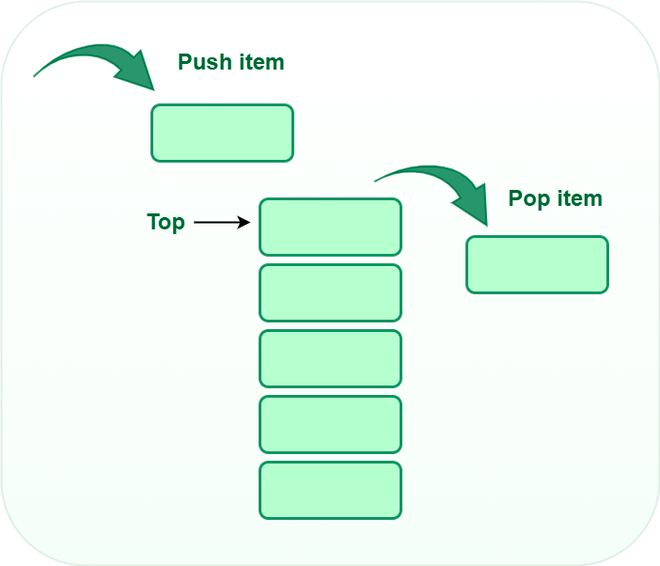
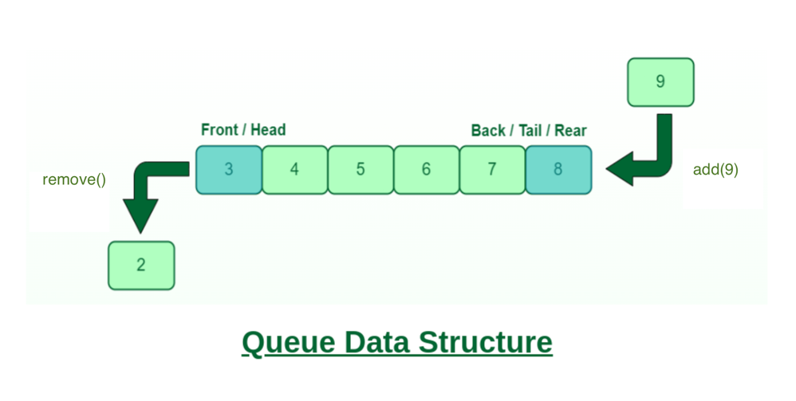

## Stack and Queue

English version

Stack

### What is Stack?
A stack is a linear data structure in which the insertion of a new element and removal of an existing element takes place at the same end represented as the top of the stack.

To implement the stack, it is required to maintain the pointer to the top of the stack, which is the last element to be inserted because we can access the elements only on the top of the stack.

#### LIFO( Last In First Out ):

This strategy states that the element that is inserted last will come out first. 
You can take a pile of plates kept on top of each other as a real-life example. The plate which we put last is on the 
top and since we remove the plate that is at the top, we can say that the plate that was put last comes out first.

### Basic Operations on Stack
In order to make manipulations in a stack, there are certain operations provided to us.

- `push()` to insert an element into the stack
- `pop()` to remove an element from the stack
- `peek()` Returns the top element of the stack.
- `isEmpty()` returns true if stack is empty else false.
- `size()` returns the size of stack.

### Push:
Adds an item to the stack. If the stack is full, then it is said to be an Overflow condition.

### Pop:
Removes an item from the stack. The items are popped in the reversed order in which they are pushed. If the stack is empty, then it is said to be an Underflow condition.

### peek:
Returns the top element of the stack.

### isEmpty:
Returns true if the stack is empty, else false.

### Understanding stack practically:
There are many real-life examples of a stack. Consider the simple example of plates stacked over one another in a canteen. The plate which is at the top is the first one to be removed, i.e. the plate which has been placed at the bottommost position remains in the stack for the longest period of time. So, it can be simply seen to follow the LIFO/FILO order.

### Complexity Analysis:  

| Operations | Complexity |
|------------|------------|
| push()     | O(1)       |
| pop()      | O(1)       |
| isEmpty()  | O(1)       |
| size()     | O(1)       |

Queue

### What is a Queue?

A queue is a linear data structure where the addition of a new element takes place at the end (via the `add()` method), and removal occurs from the beginning (via the `remove()` method).

The main principle of this structure is that the first added element will also be the first to be removed. This is the opposite of the stack concept.

FIFO (First In First Out):
This strategy implies that the element added first will be removed first. As an analogy, consider the queue at a store checkout or at a bus stop.

### Primary Queue Operations in Java
For manipulating a queue in Java, the following methods are provided:

- `add(E e)` - adds an element to the end of the queue.
- `remove()` - removes and returns the element from the beginning of the queue.
- `element()` - retrieves, but does not remove, the element from the beginning of the queue.
- `isEmpty()` - returns `true` if the queue is empty, otherwise `false`.
- `size()` - returns the size of the queue.

**add(E e)**:
Adds an element to the end of the queue. If the queue is full, an exception is thrown.

**remove()**:
Removes and returns the element from the beginning of the queue. If the queue is empty, an exception is thrown.

**element()**:
Retrieves, but does not remove, the element from the beginning of the queue. If the queue is empty, an exception is thrown.

**isEmpty()**:
Returns `true` if the queue is empty, otherwise `false`.

### Practical Understanding of Queue:
Queues are ubiquitous in real life. For instance, people waiting in line at a store checkout. The first person in the queue will be the first to leave, and so forth. This is a real-life example of the FIFO principle.

### Complexity Analysis:
Method       | Complexity
------------|----------
`add(E e)`  | O(1)
`remove()`  | O(1)
`element()` | O(1)
`isEmpty()` | O(1)
`size()`    | O(1)

Версия на русском

Stack, как структера данных

### Что такое Стек?

Стек — это линейная структура данных, в которой вставка нового элемента и удаление существующего элемента происходят с одного и того же конца, представленного вершиной стека.

Для реализации стека необходимо поддерживать указатель на вершину стека, который является последним вставленным элементом, так как мы можем получить доступ только к элементам на вершине стека.

#### LIFO (Last In First Out, "Последний пришел — первый ушел"):
Эта стратегия гласит, что элемент, который был вставлен последним, выйдет первым. В качестве примера из реальной жизни можно привести кучу тарелок, сложенных друг на друга. Тарелка, которую мы поставили последней, находится сверху, и так как мы убираем тарелку, которая находится сверху, мы можем сказать, что тарелка, поставленная последней, убирается первой.

### Основные операции со стеком
Чтобы производить манипуляции со стеком, нам предоставлены определенные операции.

- `push()` - вставить элемент в стек.
- `pop()` - удалить элемент из стека.
- `peek()` - возвращает верхний элемент стека.
- `isEmpty()` - возвращает `true`, если стек пуст, иначе `false`.
- `size()` - возвращает размер стека.

**Push**:
Добавляет элемент в стек. Если стек полон, говорят о состоянии переполнения.

**Pop**:
Удаляет элемент из стека. Элементы извлекаются в обратном порядке их добавления. Если стек пуст, говорят о состоянии недополнения.

**peek**:
Возвращает верхний элемент стека.

**isEmpty**:
Возвращает `true`, если стек пуст, иначе `false`.

### Понимание стека на практике:
Существует множество реальных примеров стека. Рассмотрим простой пример тарелок, сложенных друг на друга в столовой. Тарелка, которая находится сверху, первая, которую уберут, т.е. тарелка, которая была помещена на самое дно, остается в стеке наибольшее время. Таким образом, можно увидеть, что это следует принципу LIFO/FILO.

### Анализ сложности:
Операции  | Сложность
----------|----------
`push()`  | O(1)
`pop()`   | O(1)
`isEmpty()`| O(1)
`size()`  | O(1)

Очередь, как структера данных

### Что такое Очередь?

Очередь — это линейная структура данных, в которой добавление нового элемента происходит в конец (через метод `add()`), а удаление — из начала (через метод `remove()`).

Основная идея этой структуры заключается в том, что первый добавленный элемент также будет первым удаленным. Это противоположно концепции стека.

FIFO (First In First Out, "Первый пришел — первый ушел"):
Эта стратегия гласит, что элемент, который был добавлен первым, будет удален первым. В качестве примера можно рассмотреть очередь в магазине или на автобусной остановке.

### Основные операции с Очередью в Java
Для манипуляции очередью в Java предоставляются следующие методы:

- `add(E e)` - добавляет элемент в конец очереди.
- `remove()` - удаляет и возвращает элемент из начала очереди.
- `element()` - возвращает, но не удаляет, элемент из начала очереди.
- `isEmpty()` - возвращает `true`, если очередь пуста, иначе `false`.
- `size()` - возвращает размер очереди.

**add(E e)**:
Добавляет элемент в конец очереди. В случае переполнения генерируется исключение.

**remove()**:
Удаляет и возвращает элемент из начала очереди. Если очередь пуста, генерируется исключение.

**element()**:
Возвращает, но не удаляет, первый элемент очереди. Если очередь пуста, генерируется исключение.

**isEmpty()**:
Возвращает `true`, если очередь пуста, иначе `false`.

### Понимание очереди на практике:
Очереди присутствуют повсюду в реальной жизни. Например, люди, стоящие в очереди к кассе в магазине. Первый человек в этой очереди — первый, кто уйдет, и так далее. Это является примером принципа FIFO.

### Анализ сложности:
Метод       | Сложность
------------|----------
`add(E e)`  | O(1)
`remove()`  | O(1)
`element()` | O(1)
`isEmpty()` | O(1)
`size()`    | O(1)

