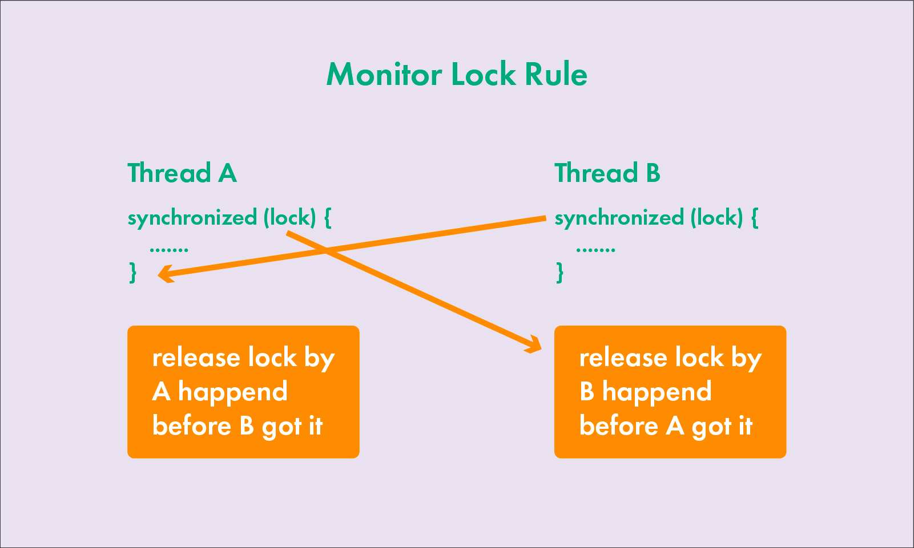

<details>
<summary>Multithreading</summary>
<details style="margin-left: 20px;">
      <summary>Multithreading in Java. Lecture 1. General information</summary>

# Multithreading in Java. Lecture 1. General information

## Introduction

One of the main elements in a computer is the processor. He, in fact, executes the computer commands that make up the
program. At the end of the XX and at the beginning of the XXI century, processors were mostly single-core. The clock
frequency of each new processor was higher than that of the previous model, due to this, the overall performance of the
systems increased. When users had a need to execute several programs simultaneously on a single-core processor (the core
of which can execute one instruction at each specific unit of time), a way was devised to achieve the visibility of a
solution to the problem. The trick is that the processor switches between executing commands from different programs.
Thus, the appearance is achieved that a single-core processor performs several actions or several programs
simultaneously, or several actions are performed within the same program.

However, the production of processors reached the technological limit when further reduction in the size of transistors
and increasing their clock frequency became impossible. Then processor manufacturers decided to increase the number of
cores in one processor in order to increase system performance.

## Brief description of the processor operation

Let's consider at the simplest level how the processor works. It consists of an ALU (arithmetic logic unit) - the main
element of the processor, registers, data buses and addresses, as well as a command decoder.

Initially, the ALU could perform only a few elementary operations: reading and writing to memory, addition, right shift,
left shift, logical AND, OR, NOT, XOR. It was not possible to subtract ALU, subtraction was carried out by adding in an
additional code, multiplication was carried out by adding and shifting to the left, division was carried out by shifting
to the right and subtracting. Later, hardware schemes were invented that support these operations and operations with
floating-point numbers. The most important conclusion to be drawn is that even the simplest operations, such as adding
or subtracting two numbers, are performed not for one processor command, but for several. Therefore, the operation can
be interrupted, and the processor can start executing commands from another program. I.e., the operations are NOT
ATOMIC, and can be interrupted by other commands.

## Support at the operating system level.

Operating systems can solve the problem of allocating processor time in different ways. Basic approaches:

1. Easy task switching. When the processes are simultaneously loaded into the system memory and the timer switches
   between processes. Processes don't have any priorities. The advantages of this system are that it can run programs
   that are designed to work in a single-threaded environment.

2. Cooperative multitasking. When the next task is executed, after the previous one explicitly indicates that it can
   give CPU time to another task. With cooperative multitasking, an application can actually capture as much CPU time as
   it sees fit. All applications share CPU time, periodically transferring control to the next task.

3. Preemptive multitasking. When the operating system itself transfers control from one running program to another in
   case of completion of I/O operations, occurrence of hardware interrupts or when certain signals are received from one
   program to another. In this kind of multitasking, the processor can be switched from executing one program to another
   without any desire of the first program, literally between any two instructions in its code. The allocation of
   processor time is carried out by the process scheduler. In addition, each task can be assigned a certain priority by
   the user or by the operating system itself. This type of multitasking provides a faster response to user actions.

## Processes and threads

Let's introduce the concepts of process and flow.

**Process** — a program running at the current time, and all its elements: address space, global variables, registers,
threads, open files, etc.

**Thread** — the smallest processing unit, the execution of which can be assigned by the operating system kernel. Or a
set of discrete processor time during which commands or code are executed for one logical part of the program.

The implementation of execution threads and processes in different operating systems differs from each other, but in
most cases the execution thread is inside the process. Multiple threads of execution can exist within the same process
and share resources such as memory, whereas processes do not share these resources.

Execution threads are different from processes:

- processes are usually independent, whereas execution threads exist as components of processes;
- processes carry significantly more information about the program, whereas several execution threads share this
  information within the process;
- processes have separate address spaces, whereas execution threads share process memory;
- switching between execution threads in a single process is usually faster than switching between processes.

When a processor has multiple cores, the code is actually executed in parallel on different cores, with each core
executing one thread at a specific unit of time. At the same time, two different cores cannot execute the same thread.
Having more cores does not guarantee an increase in the speed of program execution. If the program is single-threaded,
it will run on one core, and the other cores in the system will not be occupied. Some programming languages support the
ability to assign an execution thread to a specific processor core. This is called thread affinity, but there is no such
possibility in Java.

## Tools for working with multithreading in Java and multithreaded program models

In the first version of Java, there were few tools for working with multithreading. Fixed assets:
class `Thread', interface `Runnable', keyword `synchronized` and methods for synchronization `wait()`, `notify()`
and `notifyAll()` in the `Object` class. The Java 1.5 version already included the `java.util.concurrent` package, which
introduced many new classes and interfaces. Also in the Java 1.8 version, the `CompletableFuture` class was added, which
allows you to build chains of asynchronous tasks and combine them.

#### There are several approaches (models) in multithreaded programming:

- synchronization, locks and the volatile keyword;
- transactional memory — the layer between the JVM and the program API, recursive parallelism;
- actor model — when each object is a thread that exchanges messages with other threads.

Processors now support the concept of threads well. For example, akka (a framework for working with multithreading,
ported to different programming languages: Java, Scala, C#) is written on the basis of threads and locks.

#### Ways to organize multithreading in programs:

- threads do not interact with each other, they work by themselves;
- threads interact with each other;
- threads work by themselves, and then collect data into a single result.

## Properties of threads, starting threads, joining other threads

All methods of the program are executed in some thread. The thread that calls the `main` method is the main thread of
the application and is named main.

In `Java`, a thread is represented by the `Thread` class. There are two ways to create and start a stream:

1) Create an heir from the `Thread` class and override the `run()` method:

```java
public class MyThread extends Thread {
    public void run() {
        long sum = 0;
        for (int i = 0; i < 1000; ++i) {
            sum += i;
        }
        System.out.println(sum);
    }
}
```

`MyThread t = new MyThread();`

2) Implement the `Runnable` interface and pass the object of the resulting class to the constructor of the `Thread`
   class:

```java
   Runnable r=new MyRunnable(){()->
        System.out.println(“Hello!”);
        }
```

`Thread t = new Thread(r);`

### Starting threads

To start a thread, use the `Thread.start()` method. If you call the `run()` method, it will be executed in the calling
thread:  
`Thread t = new Thread(r);`

`t.run(); //r code is executed in the current thread`
`t.start(); //r code is executed in a new thread`

### The `sleep` method in Java streams

The `sleep` method in the `Thread` class in Java is used to suspend the execution of the current thread for a certain
period of time. This method takes a single parameter that specifies the number of milliseconds for which the thread
should be suspended. There is also an overloaded version of this method that takes two parameters: one for milliseconds
and one for nanoseconds. After the specified time period expires, the thread is put into a ready state and waits for the
thread scheduler to resume its execution.

The `sleep` method can be very useful for controlling execution time in a multithreaded environment, for example, to
create delays between repetitions in a loop or to wait for external conditions to change. It is important to note that
the `sleep` method does not guarantee an exact delay of up to a millisecond or nanosecond due to possible fluctuations
in system load and the time it takes for the thread scheduler to reactivate the thread. It is also worth noting that
when calling the `sleep` method, the thread does not release the locked monitors, and therefore other threads will not
be able to enter the synchronized blocks or methods blocked by this thread while it is sleeping.

```java
class SleeperRunnable implements Runnable {

    @Override
    public void run() {
        for (int i = 0; i < 5; i++) {
            try {
                // Приостанавливаем поток на 1 секунду (1000 миллисекунд)
                Thread.sleep(1000);
            } catch (InterruptedException e) {
                e.printStackTrace();
            }
            // Печатаем сообщение после каждого пробуждения
            System.out.println("Slept for 1 second, count: " + i);
        }
    }
}
```

### The `join` method in Java streams

The `join` method in the `Thread` class in Java is used to wait for the completion of another thread. When a thread
calls the `join` method on another thread, it is blocked and waits until the specified thread completes. This can be
useful in situations where one thread depends on the results of another thread.

The 'join` method has three overloads:

1. `join()` - waits indefinitely for the thread to finish.
2. `join(long millis)' - waits for the thread to finish within the specified number of milliseconds.
3. `join(long millis, int nanos)' - waits for the thread to finish within the specified number of milliseconds and
   nanoseconds.

If the thread on which the `join` method was called ends while waiting, the `join` method returns control. If the
timeout expires, the `join` method will also return control, even if the thread has not finished yet.

It is important to note that the `join` method can throw an `InterruptedException` exception if the current thread is
interrupted while waiting. This allows the thread to respond to an interrupt and possibly terminate its work ahead of
time, if necessary.

In this example, a new thread is created that prints a message, then sleeps for 2 seconds, and prints the message again.
The main thread waits for the new thread to finish using the join method before continuing execution and printing "Main
thread proceeding".

```java
public class JoinExample {

    public static void main(String[] args) {
        Thread thread = new Thread(() -> {
            try {
                System.out.println("Thread started");
                Thread.sleep(2000); // thread sleeps for 2 seconds
                System.out.println("Thread finished");
            } catch (InterruptedException e) {
                e.printStackTrace();
            }
        });

        thread.start(); // starting a thread

        try {
            thread.join(); // waiting for the thread to finish
        } catch (InterruptedException e) {
            e.printStackTrace();
        }

        System.out.println("Main thread proceeding");
    }
}
```

| Characteristic | `sleep()`                                    | `join()`                                    |
|---------------------|----------------------------------------------|--------------------------------------------|
| Assignment | Suspends the execution of the current thread for the specified number of milliseconds. | Blocks the current thread until the specified thread completes execution. |
| Return value | No | No |
| Exceptions | `InterruptedException`                          | `InterruptedException`                      |
| Example | `Thread.sleep(2000);` | `thread.join();`                            |
| Note | A thread may be awakened prematurely if another thread interrupts it. | If the thread is already completed, the `join()` method immediately returns control.        |
</details>


<details style="margin-left: 20px;">
<summary>Multithreading in Java. Lecture 2. Stopping and interrupting threads</summary>

# Multithreading in Java. Lecture 2. Stopping and interrupting threads

### Thread object. Thread names, thread priority

The object of the current thread can be obtained by calling the static method: `Thread.currentThread()`.

Thread names can be set via the `setName()` method or via a constructor parameter. It is recommended to give
meaningful names to threads, this will be useful when debugging. It is not recommended to give threads the same names, although thread names are not
validated by the JVM.

The standard format for the names of threads that were created singly is `thread-N', where `N` is the sequence number of the thread. For the pool
The standard name is `pool—N-thread-M`, where `N` denotes the sequential number of the pool (each time
you create a new pool, the global counter `N` increases), and `M` is the sequential number of the thread in the pool.

Threads have a priority that can be set as an integer from 1 to 10. The larger the number, the higher the priority of the thread.
The `main` thread has priority 5. And the priority of new threads is equal to the priority of the parent thread, it can be changed
using the 'setPriority(int)` method. A thread with a higher priority will have more CPU time to execute.
If two threads have the same priority, then the decision on which of them will be executed first depends on
the scheduler algorithm: (Round-Robin, First Come First Serve).

There are several constants for thread priority:

- `Thread.MIN_PRIORITY` — minimum priority, value 1;
- `Thread.NORM_PRIORITY` — default priority, value 5;
- `Thread.MAX_PRIORITY` — maximum thread priority, value 10

```java
public class Main {
    public static void main(String[] args) {
        System.out.println(Thread.currentThread().getName());
        Thread.currentThread().setPriority(8);
        Thread thread = new Thread() {
            public void run() {
                Thread.currentThread().setName("My name");
                System.out.println(Thread.currentThread().getName());
                System.out.println(Thread.currentThread().getPriority());
            }
        };
        thread.start();
    }
}
```

### Daemon threads

In Java, there is such a thing as a daemon thread. The work of the JVM ends when the last
non-daemon thread has finished executing, despite the daemon threads running. There are two methods to work with this property: `setDaemon()`
and `isDaemon()'.

<details style="margin-left: 20px;">
<summary>Code example:</summary>

```java
public class DaemonThreadExample {

    public static void main(String[] args) {
        Thread nonDaemonThread = new Thread(() -> {
            try {
                System.out.println("Non-daemon thread starting work.");
                // We emulate the long work of the stream, for example, data processing
                Thread.sleep(5000); // Waiting 5 seconds
                System.out.println("Non-daemon thread finished work.");
            } catch (InterruptedException e) {
                System.err.println("Non-daemon thread was interrupted.");
            }
        });

        Thread daemonThread = new Thread(() -> {
            try {
                System.out.println("Daemon thread starting work.");
                // Emulating a long-running thread
                while (true) {
                    System.out.println("Daemon thread is working...");
                    Thread.sleep(1000); // Waiting for 1 second
                }
            } catch (InterruptedException e) {
                System.err.println("Daemon thread was interrupted.");
            }
        });
        // Installing the thread as a daemon
        daemonThread.setDaemon(true);

        nonDaemonThread.start();
        daemonThread.start();
    }
}
```
</details>

**The `ThreadGroup` class**.

All threads are in groups represented by instances of the `ThreadGroup' class. The group is specified when creating
the stream. If no group has been specified, then the thread is placed in the same group as the parent thread.
The `activeCount()` and `enumerate()` methods return, respectively, the number and complete list of all active threads in
the group.

<details style="margin-left: 20px;">
<summary>Code example:</summary>

```java
public class ThreadGroupExample {

    public static void main(String[] args) {

        // Creating a new thread group
        ThreadGroup myGroup = new ThreadGroup("MyThreadGroup");

        // Creating threads and putting them in a group
        Thread thread1 = new Thread(myGroup, createRunnable(), "Thread1");
        Thread thread2 = new Thread(myGroup, createRunnable(), "Thread2");
        Thread thread3 = new Thread(myGroup, createRunnable(), "Thread3");

        // Starting Threads
        thread1.start();
        thread2.start();
        thread3.start();

        // Using the activeCount() method to get the number of active threads in a group
        System.out.println("Active threads in thread group " + myGroup.getName() + ": " + myGroup.activeCount());

        // Using the enumerate() method to get all active threads in a group
        Thread[] threads = new Thread[myGroup.activeCount()];
        myGroup.enumerate(threads);
        System.out.println("List of threads:");
        for (Thread thread : threads) {
            System.out.println(thread.getName());
        }
    }

    private static Runnable createRunnable() {
        return () -> {
            try {
                // The thread runs for 2 seconds
                Thread.sleep(2000);
            } catch (InterruptedException e) {
                e.printStackTrace();
            }
        };
    }
}

```
</details>


**Ways to suspend thread execution** for a specified amount of time: `Thread.sleep(long millis)`
and `TimeUnit.<UNIT>.sleep(long timeout)`. They suspend the execution of the current thread for a specified period of time.
Calling methods requires handling the `InterruptedException' exception.

<details style="margin-left: 20px;">
<summary>Code example:</summary>

```java
import java.util.concurrent.TimeUnit;

public class SleepExample {

    public static void main(String[] args) {
        // Create and start a thread using Thread.sleep() to pause
        Thread thread1 = new Thread(createSleepRunnable("Thread1", 2000));
        thread1.start();

        // Create and start a thread using TimeUnit.SECONDS.sleep() to pause
        Thread thread2 = new Thread(createTimeUnitSleepRunnable("Thread2", 3));
        thread2.start();
    }

    // A method that creates a Runnable that uses Thread.sleep() to suspend
    private static Runnable createSleepRunnable(String threadName, int sleepTimeMillis) {
        return () -> {
            System.out.println(threadName + " started");
            try {
                // Suspending the stream by sleepTimeMillis milliseconds
                Thread.sleep(sleepTimeMillis);
            } catch (InterruptedException e) {
                e.printStackTrace();
            }
            System.out.println(threadName + " woke up and finished");
        };
    }

    // Method that creates a Runnable that uses TimeUnit.SECONDS.sleep() to pause
    private static Runnable createTimeUnitSleepRunnable(String threadName, int sleepTimeSeconds) {
        return () -> {
            System.out.println(threadName + " started");
            try {
                // Suspending the stream for sleepTimeSeconds seconds
                TimeUnit.SECONDS.sleep(sleepTimeSeconds);
            } catch (InterruptedException e) {
                e.printStackTrace();
            }
            System.out.println(threadName + " woke up and finished");
        };
    }
}

```
</details>

The non-static `join()` method allows one thread to wait for the execution of another. If the current thread `t1` calls
another thread `t2h2t2.join()`, then the th2 thread stops until the thread `t2` completes its work.
You can also call the `join()` method with an argument indicating the timeout limit (in milliseconds or in
milliseconds with nano seconds). If the target thread `t2` does not finish working within the specified time period, the `join()` method
will still return control to the initiator `t1`.

<details style="margin-left: 20px;">
<summary>Code example:</summary>

```java
public class JoinExample {

    public static void main(String[] args) {
        // Creating two streams
        Thread t1 = new Thread(createRunnable("Thread1", 5000));
        Thread t2 = new Thread(createRunnable("Thread2", 2000));

        // Starting the first thread
        t1.start();

        // Starting the second thread
        t2.start();

        System.out.println("Started both threads");

        try {
            // The main thread will wait for the completion of the t1 thread for 7000 milliseconds
            t1.join(7000);
        } catch (InterruptedException e) {
            e.printStackTrace();
        }

        System.out.println("Thread1 has finished or 7 seconds have passed since we started waiting");

        try {
            // The main thread will wait for the completion of the t2 thread without waiting time, that is, until its completion
            t2.join();
        } catch (InterruptedException e) {
            e.printStackTrace();
        }

        System.out.println("Thread2 has finished");
    }

    private static Runnable createRunnable(String threadName, int sleepTime) {
        return () -> {
            System.out.println(threadName + " started");
            try {
                // The thread sleeps the specified number of milliseconds
                Thread.sleep(sleepTime);
            } catch (InterruptedException e) {
                e.printStackTrace();
            }
            System.out.println(threadName + " finished");
        };
    }
}
```
</details>

## Stopping and interrupting threads

To stop the stream in Java version 1, the 'stop()` method was used. However, in Java 1.1, this method
was made `deprecated` (obsolete), because using the `stop()` method does not guarantee the correct termination of
the thread and stable operation of the program as a whole. Therefore, it is strongly not recommended to use it when writing programs
.

Instead of the `stop()` method, the `interrupt()` method should be used. Unlike the 'stop()` method, which is forced
when stopping the thread, the `interrupt()` method prompts the thread to stop its execution by setting the `interrupted` flag
to `true' inside the thread. This flag displays the interrupt status and has an initial value of `false'. When a thread
is interrupted by another thread, one of two things happens:

- If the thread is waiting for the execution of an interrupted blocking method, such as `Thread.sleep()', `Thread.join()`
  or `Object.wait()`, then the wait is interrupted and the method generates an 'InterruptedException'. The `interrupted` flag
  set to `false'.
- The `interrupted` flag is set to `true'.

There are three methods for dealing with thread interrupts:

<details style="margin-left: 20px;">
<summary>Method 1:</summary>

```java
public class Thread {
    public void interrupt() { ...}

    public boolean isInterrupted() { ...}

    public static boolean interrupted() { ...}
...
}
```

```java
public class InterruptExample {

    public static void main(String[] args) {
        // Creating and starting a thread that can be interrupted
        Thread sleepingThread = new Thread(createSleepingRunnable());
        sleepingThread.start();

        // Wait 2 seconds and then interrupt sleepingThread
        try {
            Thread.sleep(2000);
        } catch (InterruptedException e) {
            e.printStackTrace();
        }
        sleepingThread.interrupt();
    }

    // A method that creates a Runnable that "sleeps" and handles the interrupt
    private static Runnable createSleepingRunnable() {
        return () -> {
            try {
                // The thread "sleeps" for 10 seconds or until it is interrupted
                System.out.println("Going to sleep");
                Thread.sleep(10000);
                System.out.println("Woke up naturally");
            } catch (InterruptedException e) {
                // If the stream was interrupted during sleep, it will enter here
                System.out.println("Was interrupted while sleeping");
            }
        };
    }
}

```
</details>

- `isInterrupted()` returns the flag value and does not change it.
- `interrupted()` returns the flag value and sets its value to false. If the interrupted flag is set to
  true and this method is called, the first time the method returns true, and subsequent calls return false.

There are two types of operations: blocking and non-blocking. Non-blocking operations do not suspend the execution of the thread.
Blocking operations include calls to the methods `sleep()`, `wait()`, `join()` and, for example, some methods of the class
`Socket`. If a thread was interrupted while it was performing non-blocking calculations, they will not be interrupted immediately.
However
, the thread is already marked as interrupted, so any next blocking operation will immediately abort and throw
`InterruptedException`.

<details style="margin-left: 20px;">
<summary>Method 2:</summary>

```java
public class Example {

    public static void main(String[] args) {
        // Create and run a thread that will perform a blocking operation
        Thread waitingThread = new Thread(() -> {
            try {
                // The thread waits 10 seconds
                System.out.println("Going to sleep");
                Thread.sleep(10000);
                System.out.println("Woke up naturally");
            } catch (InterruptedException e) {
                // If the stream is interrupted during sleep, it will enter here
                System.out.println("Was interrupted while sleeping");
            }
        });
        waitingThread.start();

        // Create and run a thread that performs a non-blocking operation
        Thread countingThread = new Thread(() -> {
            for (int i = 0; i < 1000000 && !Thread.currentThread().isInterrupted(); i++) {
// The thread just increments the counter
                if (i % 100000 == 0) {
                    System.out.println("Counting: " + i);
                }
            }
            System.out.println("Finished counting or was interrupted during counting");
        });
        countingThread.start();

        // Wait 2 seconds and then interrupt both threads
        try {
            Thread.sleep(2000);
        } catch (InterruptedException e) {
            e.printStackTrace();
        }
        waitingThread.interrupt();
        countingThread.interrupt();
    }
}
```

In this example:

`waitingThread': Instead of using `wait()`, the thread uses `Thread.sleep(10000)`, which is also a
blocking
operation. This thread tries to "sleep" for 10 seconds, but will be interrupted after 2 seconds of execution of the main
thread, which will cause an `InterruptedException'.

`countingThread`: Everything also performs a non-blocking operation, but in order to correctly handle the thread interruption in
this
context, a check is added `!Thread.currentThread().isInterrupted()` into a loop condition. Thus, if the thread
is
interrupted during the execution of the loop, the loop will end and the last output will be executed.

</details>

### Handling `InterruptedException`.

When there is an `InterruptedException` in the method signature, it once again reminds the programmer that this method is blocking.
`InterruptedException` signals that they want to terminate the thread. At the same time, they are not asked to do it
immediately.

The first way to handle an `InterruptedException` is to declare this exception in a higher—level method. Also, when intercepting
the `InterruptedException` method, you can perform some actions (for example, cleaning resources or variables) and re
-throw the `InterruptedException`.

In the second case, when `InterruptedException` cannot be declared, when generating and intercepting `InterruptedException`
flag
`interrupted` is set to `false`, and the calling methods will not see that the thread was interrupted. However
, you can
restore the interrupt flag by calling `Thread.currentThread().interrupt()` when processing the interrupt.

Also, restoring the `interrupted` flag can be useful when the first thread has a reference to the second thread, and the first
one wants to know the status of the second flag.

It is worth carefully monitoring the handling of this exception when the code is executed in the `threadpool'. `InterruptedException`
it may
be "interesting" not only to the code, but also to the thread that executes this code.

<details style="margin-left: 20px;">
<summary>Method 3:</summary>

```java
public class InterruptedExceptionExample {

    public static void main(String[] args) {
        Thread exampleThread = new Thread(() -> {
            try {
                System.out.println("Thread is going to sleep for 5 seconds");
                // The thread sleeps for 5 seconds, this is a blocking operation and may cause an InterruptedException
                Thread.sleep(5000);
                System.out.println("Thread woke up");
            } catch (InterruptedException e) {
                // Exception handling logic
                System.out.println("Thread was interrupted during sleep");

                // First processing method: clearing and re-throwing the exception (if allowed)
                // Performing some kind of cleaning
                // cleanUpResources();
                // throw new RuntimeException(e);

                // Second processing method: restoring the interrupt flag
                // The code can continue its execution, but the interrupt flag is restored for further checks
                Thread.currentThread().interrupt();
            }
        });

        exampleThread.start();

        // The main thread sleeps for 2 seconds to be sure that exampleThread has started its execution and "sleeps"
try {
            Thread.sleep(2000);
        } catch (InterruptedException e) {
            e.printStackTrace();
        }

        // Interrupting the exampleThread thread while it is "sleeping"
exampleThread.interrupt();
    }
}

```

Let's analyze the above code:

The first method of processing: In the `catch` block, we can perform the necessary cleanup, for example, close open resources or
clear the data, and then re-throw the exception wrapped in an unchecked exception if we can't declare
`InterruptedException` in the method signature.

The second method of processing: We can restore the interrupt flag by calling `Thread.currentThread().interrupt();` in the block
`catch`. Thus, if this thread continues its execution and checks its interrupt flag in subsequent
operations,
it will know that it was interrupted.

It is important to note that in scenarios with a thread pool, you need to pay special attention to handling `InterruptedException` in order to
avoid situations where pool threads remain in a suspended or incorrect state after an interrupt.

</details>

### Comparison of flow control methods: `sleep()`, `wait()`, and `join()`

| Parameter | `sleep()` | `wait()` | `join()` |
|----------|-----------|----------|----------|
| **Main purpose** | Suspends the current thread for a specified amount of time. | Releases the monitor and puts the thread in a waiting state until another thread calls `notify()`/`notifyAll()`. | Suspends the execution of the current thread until the target thread completes its work. |
| **Sync** | Not required | Required | Not required |
| **Exceptions** | Excites `InterruptedException` | Excites `InterruptedException` | Excites `InterruptedException' |
| **Effect on the object monitor** | Does not release the object monitor if the method is called in the `synchronized` block | Frees the object monitor | Not applicable |

</details>

<details style="margin-left: 20px;">
<summary>Multithreading in Java. Lecture 3. The race of resources. Synchronization of streams.</summary>

# Multithreading in Java. Lecture 3. The race of resources. Synchronization of streams.

## Resource race. (race condition)

If two threads execute code that modifies the same variable, the value in the variable will have
an unpredictable value.

A classic example of this behavior: two threads increment one value. Since the increment operation is not
if it is executed in one processor instruction, then two threads will change the value of the variable in an arbitrary way — this
is called race condition. The blocks of code in which a race condition may occur are called critical sections.
To avoid such a situation, Java provides ways to synchronize threads.

## Synchronization of streams

The simplest way to synchronize is the concept of "monitor" and the synchronized keyword. Initially, this concept was
introduced in the Pascal language. There is no such "monitor" class in Java, however, each object of the Object type has its own
"monitor". Since all classes have a common parent — Object, they all have their own "monitor".

The concept of "monitor" contains 4 fields within itself:

- `locked` of the `boolean` type, which shows whether the monitor is captured or not;
- `owner` of the `Thread` type — the thread that captured this monitor is recorded in this field;
- `blocked set` — this set includes threads that could not capture the lock, or a thread that exits the
  wait state;
- `wait set` — threads for which the wait method was called fall into this set.

<details style="margin-left: 20px;">
<summary> Figure 1. The internal structure of the "monitor" concept </summary>


</details>

`Blocked set`, like `wait set`, is an unordered set that does not allow duplicates. I.e ., in `wait set`
or `blocked set`, the same stream cannot be written twice.

The fields of the monitor cannot be obtained through reflection. Each object has methods `wait()`, `notify()` and `notifyAll()`,
which  this object inherited from the `Object` class. Using the synchronized keyword ensures that the code blocks will be
be executed by only one thread at each specific unit of time.

### Keyword `synchronized`

There are two ways to use the keyword `synchronized`:

Two threads execute code (the so-called critical section), which can only be executed
by one thread at a time.
One thread is waiting for some event. This behavior is provided by the methods `wait()`, `notify()` and `notifyAll()`.
Consider the first situation: a thread enters a `synchronized` block, executes a critical section, and exits the block
synchronization. The keyword `synchronized` is always used with the monitor object. First
, the variables `locked`
and `owner` are checked. If these fields are `false` and `null`, respectively, they are filled in. The `locked` field takes the value `true`, and in
the
`owner` records a link to the exciting stream. Once this has happened, it is assumed that the thread has executed the code that
corresponds to the opening curly brace of the `synchronized` block, and the thread has occupied this lock. After the stream
executed the code that corresponds to the closing curly brace of the synchronization block, the variables `locked` and owner in
the monitor are cleared.

Consider a situation where a thread is trying to capture an already occupied monitor. First, it is checked that the variable `locked ==
true`, then the `owner` variable is compared. If the `owner` variable is not equal to the thread that wants to capture
the monitor,
then the second thread is blocked and gets into the `blocked set` of the monitor. If comparing the owner variables gives the result `true`,
this is
it means that the same thread tries to capture the monitor again — in this case, the thread is not blocked. This
behavior is called reenternability. An example of such a situation is recursive methods. After the lock
is released, another thread leaves the `blocked set` and captures the monitor. There can be many threads in a `blocked
set'.
In this case, an arbitrary stream is selected, which can then capture the monitor.

The monitor can be a simple object, the keyword `this`, as well as an object of type `.class'.
<details style="margin-left: 20px;">
<summary> Code example: </summary>

```java
public class CounterExample {
    public static void main(String[] args) {
        Counter counter = new Counter();

        // Creating and running threads that increment the counter
        Thread thread1 = new Thread(() -> {
            for (int i = 0; i < 1000; i++) {
                counter.increment();
            }
        });

        Thread thread2 = new Thread(() -> {
            for (int i = 0; i < 1000; i++) {
                counter.increment();
            }
        });

        Thread thread3 = new Thread(() -> {
            for (int i = 0; i < 1000; i++) {
                counter.increment();
            }
        });

        thread1.start();
        thread2.start();
        thread3.start();

        try {
            thread1.join();
            thread2.join();
            thread3.join();
        } catch (InterruptedException e) {
            e.printStackTrace();
        }

        // Output the final value of the counter
        System.out.println("Final Counter Value: " + counter.getValue());
    }
}

class Counter {
    private int count = 0;

    // Synchronized method for increasing the counter
    public synchronized void increment() {
        count++;
    }

    // Synchronized method for getting the counter value
    public synchronized int getValue() {
        return count;
    }
}

```

Comments on the code:

1. Class `Counter`: contains the count field, a method for increasing the value of the counter `increment()` and a method for getting
   the value
   counter `getValue()`. Both methods are synchronized using the keyword `synchronized` to ensure
   thread safety.


3. In the `main` method:

- Three threads are created and run that perform counter increment.
- `thread1.join()', `thread2.join()`, `thread3.join()` are used to make the main thread (`main`) wait
  completions
  the work of all three threads before continuing its work.
- At the end, the final value of the counter is displayed, which, thanks to synchronization, will be correct even with
  simultaneous
  access from several threads.

Thus, using the synchronized keyword avoids the problem of data race (`race
condition`) when accessing a critical section of code from different threads.

</details>

When a method is declared with the keyword `synchronized`, it is equivalent to code when its entire body is wrapped in
the `synchronized` block and the lock is the `this` object. When a static method is used with
the keyword `synchronized`,
this is equivalent to when an object is used as a lock SomeClass.class . However, the best way is
to declare a `private final` constant, by which synchronization is performed. It is worth noting that the construction
using the keyword `synchronized` is syntactic and is checked by the compiler. I.e. it should always be
the opening curly brace and the corresponding closing curly brace of the synchronized block. `Synchronized` blocks
can be nested in each other

<details style="margin-left: 20px;">
<summary> Code example: </summary>

```java
final Object LOCK=new Object();

synchronized(LOCK){
// An external synchronized block locks the LOCK object
// At this point, no other thread can enter the synchronized blocks
// using LOCK as a monitor until the current thread exits this block

synchronized(LOCK){
// Middle synchronized block. Since we are already in a synchronized block
// using LOCK as a monitor (external block),
// the current thread already has a lock and can enter this block without waiting.
// This is an illustration of the reenternability of locks in Java:
// a thread can re-capture a lock that it already holds

synchronized(LOCK){
// The internal synchronized block is similar to the middle block.
        // A thread can also enter this block, since it already holds a LOCK.
        // Usually nested synchronized blocks with the same monitor 
        // are avoided as they increase complexity and may contribute to development
        // more complex and less understandable code. But technically , such a code is acceptable and 
        // can be used in certain cases.
        }
        }
        }

```

```java
public class SynchronizedExample {

    // Object to lock in the synchronized block example
    private final Object lockObject = new Object();

    // Simple counter
    private int count = 0;

    // Example of using the synchronized method
public synchronized void incrementSyncMethod() {
count++;
        System.out.println(Thread.currentThread().getName() + " - Sync Method, Count: " + count);
    }

    // Example of using a synchronized block with the this object
    public void incrementSyncThis() {
        synchronized (this) {
            count++;
            System.out.println(Thread.currentThread().getName() + " - Sync This, Count: " + count);
        }
    }

    // Example of using a synchronized block with a separate lock object
    public void incrementSyncObject() {
        synchronized (lockObject) {
            count++;
            System.out.println(Thread.currentThread().getName() + " - Sync Object, Count: " + count);
        }
    }

    // Example of using synchronized on a static method
    public static synchronized void staticSyncMethod() {
        System.out.println(Thread.currentThread().getName() + " - Static Sync Method");
    }

    public static void main(String[] args) {
        SynchronizedExample example = new SynchronizedExample();

        // Creating and running threads
        Thread thread1 = new Thread(() -> {
            for (int i = 0; i < 1000; i++) {
                example.incrementSyncMethod();
                example.incrementSyncThis();
                example.incrementSyncObject();
                SynchronizedExample.staticSyncMethod();
            }
        }, "Thread-1");

        Thread thread2 = new Thread(() -> {
            for (int i = 0; i < 1000; i++) {
                example.incrementSyncMethod();
                example.incrementSyncThis();
                example.incrementSyncObject();
                SynchronizedExample.staticSyncMethod();
            }
        }, "Thread-2");

        thread1.start();
        thread2.start();
    }
}
```

Explanations:

- `incrementSyncMethod()`: Uses method-level synchronization. Only one thread can execute this method in
  a specific instance of an object at the same time.

- `incrementSyncThis()': Uses synchronization at the level of the this object. Blocks the current object, and only one thread
  can execute this block of code in an instance of an object.

- `incrementSyncObject()`: Uses a separate lockObject object to synchronize a block of code. This can be useful
  for
  fine-tuning the competitiveness if you have different synchronized methods/blocks that should be
  independent of each other.

- `staticSyncMethod()`: Uses class-level synchronization for a static method. Only one thread can
  execute
  this method is all over the JVM, because the static method is associated with a class, not an instance of an object.

In the `main` method, two threads are created and run, which repeat calls to these methods, showing different types
of synchronization in action. It is always recommended to minimize the area that you synchronize in order to reduce
thread contention and improve the performance of your multithreaded program.
</details>

As shown in the example above, it is possible to capture a monitor on the same object several times. There is no way to determine,
how many times was the monitor captured, and it is not necessary to build such logic in the program. The monitor is released after
exiting the upper `synchronized` block. In the example below, the monitors `LOCK_A` are captured first, then `LOCK_B`
and `LOCK_C`, and
the monitors are released in reverse order:

```java
Object LOCK_A=new Object();
        Object LOCK_B=new Object();
        Object LOCK_C=new Object();
synchronized(LOCK_A){
synchronized(LOCK B){
synchronized(LOCK_C){
        }
        }
        }
```

### Methods for controlling thread blocking. `wait(),` `notify()` and `notifyAll()`

#### The `wait()` method

When a thread calls the `wait()` method on an object, it enters the waiting state and releases
the object lock belonging to it
(it is assumed that the `wait()` method is called from a synchronized block or method). Thus, other
threads can capture the lock of this object and synchronize on it. The thread remains in a waiting state until
another thread calls the `notify()` or `notifyAll()` method on the same object, or until the thread is interrupted.

#### The `notify()` method

The `notify() method` "wakes up" one of the threads waiting on the object on which the method was called. If there are multiple
threads waiting, then only one of them (undefined) will be woken up. The awakened thread will try
to capture the object lock again and will continue execution after calling the `wait()` method.

#### The `notifyAll()` method

The `notifyAll()` method is similar to `notify()`, but with a key difference: it "wakes up" all threads waiting on the object. All
the awakened threads will try to capture the lock of the object (returning to the "struggle" for resources) and continue execution by
the completion of the synchronized block.

These three methods (`wait()`, `notify()`, `notifyAll()`) are used for interaction and coordination of threads in Java and
are usually
used in scenarios where one thread has to wait until other threads do some work or
change some state. For example, one thread can produce elements, and another can consume them, and
the consumer thread must wait for the producer thread to produce something.


<details style="margin-left: 20px;">
<summary> Code example: </summary>

The example consists of two streams: `Producer` and `Consumer`. `Producer` generates data and
notifies `Consumer` about it using the `notify()` method. Consumer waits for the notification and, after receiving it,
processes the data. After processing the data, `Consumer` notifies `Producer` about it, and the cycle repeats.

```java
public class WaitNotifyExample {

    private static final Object lock = new Object();
    private static boolean dataAvailable = false;

    public static void main(String[] args) {
        Thread producerThread = new Thread(new Producer());
        Thread consumerThread = new Thread(new Consumer());

        producerThread.start();
        consumerThread.start();
    }

    static class Producer implements Runnable {
        @Override
        public void run() {
            try {
                while (true) {
                    synchronized (lock) {
// Waiting for the consumer to process the data
                        while (dataAvailable) {
                            lock.wait();
                        }

                        // Generating data
                        System.out.println("Producer: Data produced");
                        dataAvailable = true;

                        // Notifying the consumer
                        lock.notify();
                    }

                    // Delay Simulation
                    Thread.sleep(1000);
                }
            } catch (InterruptedException e) {
                Thread.currentThread().interrupt();
                throw new RuntimeException(e);
            }
        }
    }

    static class Consumer implements Runnable {
        @Override
        public void run() {
            try {
                while (true) {
                    synchronized (lock) {
// Waiting for the manufacturer to create the data
                        while (!dataAvailable) {
                            lock.wait();
                        }

                        // Processing data
                        System.out.println("Consumer: Data consumed");
                        dataAvailable = false;

                        // Notify the manufacturer
                        lock.notify();
                    }

                    // Delay Simulation
                    Thread.sleep(1000);
                }
            } catch (InterruptedException e) {
                Thread.currentThread().interrupt();
                throw new RuntimeException(e);
            }
        }
    }
}
```

Note that the methods `wait()`, `notify()`and `notifyAll()` are always called in synchronized
blocks (`synchronized` blocks or methods) to ensure the correct operation of multithreading.

In this example, `Producer` creates data and then notifies `Consumer` using the `notify() method`. `Consumer`
is waiting
after receiving the notification, it processes the data, then notifies the `Producer` and waits for the next data cycle.
The whole process repeats endlessly.
</details>

#### Comparison of wait(), notify(), and notifyAll() methods

| Method | Description | Usage Example |
|-----------|------------|----------------------|
| `wait()` | When calling the method, the thread releases the monitor of the object and goes into a waiting state until another thread calls `notify()` or `notifyAll()` for this object. | `obj.wait();` |
| `notify()` | When calling the method, the thread that called the method does not release the monitor. However, one of the threads waiting for the release of the monitor of this object will be selected and transferred to the "ready to start" state. | `obj.notify();` |
| `notifyAll()` | When calling the method, the thread that called the method does not release the monitor. All threads waiting for the release of the monitor of this object are transferred to the "ready to start" state. | `obj.notifyAll();` |

#### Notes

- Methods must be called from a synchronized context, otherwise an exception `IllegalMonitorStateException` will be thrown.
- The `wait()` method can also be called with a timeout, for example, `wait(1000)`, which will wait up to 1000 milliseconds before the thread automatically returns to the "ready to start" state.
- `notify()` selects an arbitrary thread from all the waiting threads of this object, while `notifyAll()` will wake up all the waiting threads.


### Flow States

Threads have the following states:

- `NEW` thread object was created but not started;
- The `RUNNABLE` thread is started and executes the code;
- The `WAITING` thread does not execute the code and is in the `wait` set of the monitor;
- The `BLOCKED` thread does not execute the code and is in the `blocked` set of the monitor;
- `TERMINATED` thread has completed its execution.

Thread states are represented in `enum Thread.State`

<details style="margin-left: 20px;">
<summary> Figure 2. Flow transition diagram from one state to another</summary>


</details>

### Keyword `volatile`

The keyword `volatile` indicates that interaction with a variable in memory should take place bypassing processor caches,

i.e. directly.

In a multithreaded application, when threads use non-`volatile` variables, they can copy the value of the variables
to the
processor cache to improve performance. If there are several cores in the processor and each thread is executed on
on a separate processor core, the same variable can have a different value on each processor core. As a result
, there will be several copies of the same variable: copies in the cache of each processor core and a copy of the variable in main
memory. When using non-`volatile` variables, it is impossible to know for sure when the JVM reads the value of a variable from
the main
memory and when the value of the variable is written to the main memory. This can lead to problems. Suppose there are two
threads that have access to a shared object that has a counter:

```java
public class SharedObject {
    public int counter = 0;
}
```

Assume that only the first thread increments the variable and both threads can read the variable. If
the counter variable is not `volatile`, then there is no guarantee when the variable will be written to the main memory so that the newly changed
value of the variable will be seen by the second thread. This problem is solved by declaring the counter variable as `volatile`:

```java
public class SharedObject {
    public volatile int counter = 0;
}
```

<details style="margin-left: 20px;">
<summary> Learn more about volatile</summary>
Declaring a variable as `volatile` ensures that any read and any write to this variable will immediately fall
into
the main memory. Declaring the counter variable as `volatile` is enough when one thread modifies the variable and another
thread reads its value. If two threads change a common variable, then using the keyword `volatile`
is not enough — it will be `race condition'. The keyword `volatile` guarantees the following:

If the first thread writes a variable to `volatile`, and then the second thread reads the value from this variable, then that's it
variables visible to thread `A` before writing to variable `volatile` will also be visible to thread `B` after it
has read
variable `volatile'.
If thread `A` reads the variable `volatile`, then all variables visible to thread `A` when reading the variable `volatile`
will also
be re-read from the main memory.

```java
public class MyClass {
    private int years;
    private int months;
    private volatile int days;

    public void update(int years, int months, int days) {
        this.years = years;
        this.months = months;
        this.days = days;
    }
}
```

When writing a value to the `volatile` variable `days`, it is guaranteed that writing the remaining variables `years` and `months`
it will also be
produced in the main memory. Reading can be done in the following way:

```java
public class MyClass {
    private int years;
    private int months;
    private volatile int days;

    public int totalDays() {
        int total = this.days;
        total += months * 30;
        total += years * 365;
        return total;
    }

    public void update(int years, int months, int days) {
        this.years = years;
        this.months = months;
        this.days = days;
    }
}
```

In the example above, in the `TotalDays` method, the `volatile` variable `days` is read first, and then

the rest of the variables are read. This reading is performed from the main memory of the program.

The JVM reserves the right to reorder instructions to increase performance without changing the semantics
of the program.:

```java
int a=1;
        int b=2;
        a++;
        b++;
//changes to
        int a=1;
        a++;
        int b=2;
        b++;
```

Consider the modified code:

````java
public void update(int years,int months,int days){
        this.days=days;
        this.months=months;
        this.years=years;
        }
````

In the example above, the order of writing to the `volatile` variable and to regular variables has been changed compared to the original
example. Java has a solution to the problem of permutation of instructions, which will be discussed in the next paragraph.

In programs that use multithreading, there are situations when using the volatile keyword
is not enough for the correct operation of the program as a whole. For example, there are two threads that simultaneously change the overall
counter. It is necessary to read the value from the variable, increase the value of the variable, and then write the value to the shared
memory. Suppose that two threads have read the same value, let's say equal to one. Each thread increased
the value by 1, and the first thread wrote the value 2 to the main memory, and then the second thread wrote the value 2 to the shared
memory. However, after writing the second stream to the shared memory, the value should be 3. This logic will lead to a race condition
and incorrect behavior of the program. In this case, you need to use the synchronized keyword, or atomic
variables that will be discussed in a subsequent article.

It should also be remembered that reading and writing to volatile variables takes longer than to regular variables, because
writing to the CPU core cache is much faster than writing to RAM.
</details>

## The relationship happens-before

The happens-before relationship ensures that the results of an operation in one thread will be visible in another action in another
thread. The happens-before relation defines a partial ordering of all actions within the program. To ensure
that the thread performing action Y can see the results of action X (regardless of whether X and Y occur in different
threads), there must be a happens-before relationship between X and Y. In the absence of a happens-before relationship between two
with actions, the JVM can rearrange operations as you like, this happens due to optimization of the JVM compiler.

<details style="margin-left: 20px;">
<summary> Figure 3. The relation happens-before</summary>


</details>

The happens-before relation is not only a redistribution of actions in time, but also a guarantee of the absence of permutations
of reading, as well as writing to memory. If there is no happens-before relationship, two threads that read and write
to the same memory space can be consistent in terms of time, but will not be able to consistently see
each other's changes.

The happens-before relationship is possible in the following cases.

- The relation happens-before in one thread — an action performed in one thread always happens-before another action,
  which is executed later in the same thread.

<details style="margin-left: 20px;">
<summary> Figure 4. The happens-before relationship in one thread.</summary>


</details>

- Capturing and releasing the monitor — releasing the monitor (exiting the synchronized method or exiting the block) always
  is in relation to the happens-before to the capture of the same monitor.

<details style="margin-left: 20px;">
<summary> Figure 5. The happens-before relationship when capturing and displaying the monitor.</summary>


</details>

- Read/write variables cannot be moved and set before reading `volatile` fields if they were initially
  located
  after him. At the same time, it is possible to move the reading of variables that were before reading the `volatile` field,
  so
  that they happen after him.
- Starting a thread — calling the `start()` method is always in relation to the happens-before to the first operation in the started thread.

<details style="margin-left: 20px;">
<summary> Figure 6. The happens-before relation when starting a thread.</summary>


</details>

- Execution of happens-before for the join() method:

<details style="margin-left: 20px;">
<summary> Figure 7. The happens-before relation when using the join method.</summary>


</details>

## Conclusion

In this lesson, we looked at the basics of multithreaded programs: stream properties, synchronization
of streams, states in which a stream can be located. The examples given demonstrate how to correctly use
the keyword `synchronized` and what consequences their incorrect use can lead to. At the end they told about
`volatile` variables and the relation happens-before. Such knowledge should become a good basis for further study,
understanding and writing multithreaded programs.

#### Comparison of volatile and synchronized keywords

| Keyword | Description | Usage Example | Features |
|----------------|----------|---------------------|-------------|
| `volatile` | A variable declared as `volatile` ensures that any thread reading the field sees its last change. `volatile` provides visibility of variable changes to all threads, but does not provide atomicity of operations. | `private volatile boolean flag = true;` | It is useful in situations where one thread changes the value of a variable, while others only read. |
| `synchronized` | Is used to provide access control to a resource or code block. Ensures that only one thread has access to a resource or code block at any given time. It provides both visibility of variable changes and atomicity of operations. | `synchronized (lock) { // critical section }` or `public synchronized void exampleMethod(){}` | Useful in situations where multiple threads can modify a shared resource or multiple resources, and data consistency needs to be ensured. |

#### Notes

- The keyword `volatile` does not block threads when reading/writing a variable, while `synchronized` blocks a thread when it enters a critical section.
- `synchronized` can lead to thread locks and therefore can affect performance, whereas `volatile` is less resource-intensive, but also provides fewer guarantees.
- The use of `synchronized` is more preferable when state change operations involve several steps that should be performed as a single operation.
- `volatile` is suitable for situations where updates from one thread are visible to other threads without the need for additional synchronization.


</details>

</details>


----------------------


<details>
<summary>Многопоточность</summary>
<details  style="margin-left: 20px;">
<summary>Многопоточность в Java. Лекция 1. Общие сведения</summary>

# Многопоточность в Java. Общие сведения

## Введение

Один из основных элементов в компьютере — процессор. Он, собственно, и выполняет компьютерные команды, которые
составляют программу. В конце XX и в начале XXI века процессоры в основном были одноядерными. Тактовая частота у каждого
нового процессора была больше, чем у предыдущей модели, за счет этого и возрастала общая производительность систем.
Когда у пользователей обозначилась потребность выполнять одновременно несколько программ на одноядерном процессоре (ядро
которого в каждую конкретную единицу времени может выполнять одну инструкцию), был придуман способ добиться видимости
решения проблемы. Трюк в том, что процессор переключается между выполнением команд из разных программ. Таким образом
достигается видимость, что одноядерный процессор выполняет несколько действий или несколько программ одновременно, или в
рамках одной программы выполняется несколько действий.

Однако производство процессоров достигло технологического предела, когда дальнейшее уменьшение размеров транзисторов и
повышение их тактовой частоты стало невозможно. Тогда производители процессоров, приняли решение об увеличении
количества ядер в одном процессоре, чтобы увеличить производительность систем.

## Краткое описание работы процессора

Рассмотрим на простейшем уровне, как работает процессор. Он состоит из АЛУ (арифметико-логического устройства) —
главного элемента процессора, регистров, шин данных и адреса, а также дешифратора команд.

Изначально АЛУ могло выполнять всего лишь несколько элементарных операций: чтение и запись в память, сложение, сдвиг
вправо, сдвиг влево, логические AND, OR, NOT, XOR. Вычитать АЛУ не умело, вычитание осуществлялось путем сложения в
дополнительном коде, умножение производилось путем сложения и сдвига влево, деление осуществлялось сдвигом вправо и
вычитанием. Позже придумали аппаратные схемы, которые поддерживают эти операции и операции с числами с плавающей
запятой. Самый главный вывод, который нужно сделать: даже самые простейшие операции как, например, сложение или
вычитание двух чисел производится не за одну команду процессора, а за несколько. Следовательно, операция может быть
прервана, и процессор может начать выполнять команды из другой программы. Т. е. операции НЕ АТОМАРНЫЕ, и могут быть
прерваны другими командами.

## Поддержка на уровне операционной системы.

Операционные системы могут решать задачу распределения процессорного времени разными способами. Основные подходы:

1. Простое переключение задач. Когда процессы одновременно загружены в память системы и по таймеру происходит
   переключение между процессами. У процессов нет никаких приоритетов. Преимущества этой системы в том, что в ней могут
   работать программы, которые предназначены для работы в однопоточной среде.

2. Кооперативная многозадачность. Когда следующая задача выполняется, после того как предыдущая явно укажет, что она
   может отдать процессорное время другой задаче. При кооперативной многозадачности приложение может захватить
   фактически столько процессорного времени, сколько оно считает нужным. Все приложения делят процессорное время,
   периодически передавая управление следующей задаче.

3. Вытесняющая многозадачность. Когда операционная система сама передает управление от одной выполняемой программы
   другой в случае завершения операций ввода-вывода, возникновения аппаратных прерываний или же при поступлении тех или
   иных сигналов от одной программы к другой. В этом виде многозадачности процессор может быть переключен с выполнения
   одной программы на другую безо всякого пожелания первой программы, буквально между любыми двумя инструкциями в её
   коде. Распределение процессорного времени осуществляется планировщиком процессов. К тому же, каждой задаче может быть
   назначен пользователем или самой операционной системой определенный приоритет. Этот вид многозадачности обеспечивает
   более быстрый отклик на действия пользователя.

## Процессы и потоки

Введем понятия процесса и потока.

**Процесс** — программа, выполняющаяся в текущий момент времени, и все её элементы: адресное пространство, глобальные
переменные, регистры, потоки, открытые файлы и т. д.

**Поток (thread)** — наименьшая единица обработки, исполнение которой может быть назначено ядром операционной системы.
Или совокупность дискретного процессорного времени, в течение которого выполняются команды, или код, для одной
логической части программы.

Реализация потоков выполнения и процессов в разных операционных системах отличается друг от друга, но в большинстве
случаев поток выполнения находится внутри процесса. Несколько потоков выполнения могут существовать в рамках одного и
того же процесса и совместно использовать ресурсы, такие как память, тогда как процессы не разделяют этих ресурсов.

Потоки выполнения отличаются от процессов:

- процессы, как правило, независимы, тогда как потоки выполнения существуют как составные элементы процессов;
- процессы несут значительно больше информации о программе, тогда как несколько потоков выполнения совместно используют
  эту информацию внутри процесса;
- процессы имеют отдельные адресные пространства, тогда как потоки выполнения совместно используют память процесса;
- переключение между потоками выполнения в одном процессе, как правило, быстрее, чем переключение между процессами.

Когда процессор имеет несколько ядер, код действительно выполняется параллельно на разных ядрах, при этом каждое ядро
выполняет один поток в конкретную единицу времени. При этом два разных ядра не могут выполнять один поток. Наличие
большего количества ядер не гарантирует увеличения скорости выполнения программ. Если программа однопоточная, она будет
выполняться на одном ядре, а остальные ядра в системе заняты не будут. Некоторые языки программирования поддерживают
возможность назначение потока выполнения конкретному ядру процессора. Это называется thread affinity, однако в Java нет
такой возможности.

## Средства для работы с многопоточностью в Java и модели многопоточных программ

В первой версии `Java` инструментов для работы с многопоточностью было немного. Основные средства: класс `Thread`,
интерфейс `Runnable`, ключевое слово `synchronized` и методы для синхронизации `wait()`, `notify()` и `notifyAll()` в
классе `Object`. В версию Java 1.5 уже был включен пакет `java.util.concurrent`, в котором появилось много новых классов
и интерфейсов. Также в версии Java 1.8 добавили класс `CompletableFuture`, который позволяет строить цепочки из
асинхронных задач и комбинировать их.

#### Существуют несколько подходов (моделей) в многопоточном программировании:

- синхронизация, блокировки и ключевое слово volatile;
- транзакционная память — прослойка между JVM и API программы, рекурсивный параллелизм;
- модель акторов — когда каждый объект это поток, который обмениваются сообщениями с другими потоками.

Сейчас процессоры хорошо поддерживают концепцию потоков. Например, akka (фрэймворк для работы с многопоточностью,
портированный на разные языки программирования: Java, Scala, C#) написан на основе потоков и блокировок.

#### Способы организации многопоточности в программах:

- потоки не взаимодействуют друг с другом, работают сами по себе;
- потоки взаимодействуют друг с другом;
- потоки работают сами по себе, а потом собирают данные в единый результат.

## Свойства потоков, запуск потоков, присоединение других потоков

Все методы программы выполняются в каком-либо потоке. Поток, который вызывает метод `main`, является главным потоком
приложения и имеет имя main.

В `Java` поток представлен классом `Thread`. Создать и запустить поток можно двумя способами:

1) Создать наследника от класса `Thread` и переопределить метод `run()`:

```java
public class MyThread extends Thread {
    public void run() {
        long sum = 0;
        for (int i = 0; i < 1000; ++i) {
            sum += i;
        }
        System.out.println(sum);
    }
}
```

`MyThread t = new MyThread();`

2) Реализовать интерфейс `Runnable` и передать объект полученного класса в конструктор класса `Thread`:

```java
Runnable r=new MyRunnable(){()->
        System.out.println(“Hello!”);
        }
```

`r.start();`

### Запуск потоков

Для запуска потока необходимо использовать метод `Thread.start()`. Если вызвать метод `run()`, то он выполнится в
вызывающем потоке:  
`Thread t = new Thread(r);`

`t.run(); //код r выполняется в текущем потоке`  
`t.start(); //код r выполняется в новом потоке`

### Метод `sleep` в потоках Java

Метод `sleep` в классе `Thread` в Java используется для приостановки выполнения текущего потока на определенный
промежуток времени. Этот метод принимает один параметр, который указывает количество миллисекунд, на которые следует
приостановить поток. Есть также перегруженная версия этого метода, которая принимает два параметра: один для миллисекунд
и один для наносекунд. После того как указанный период времени истекает, поток переводится в состояние готовности и
ждет, пока планировщик потоков возобновит его выполнение.

Метод `sleep` может быть очень полезным для контроля времени выполнения в многопоточной среде, например, для создания
задержек между повторениями в цикле или для ожидания изменения внешних условий. Важно отметить, что метод `sleep` не
гарантирует точную задержку до миллисекунды или наносекунды из-за возможных флуктуаций в загрузке системы и времени,
которое требуется планировщику потоков для реактивации потока. Также стоит отметить, что при вызове метода `sleep`,
поток не освобождает заблокированные мониторы, и, следовательно, другие потоки не смогут войти в синхронизированные
блоки или методы, заблокированные этим потоком, пока он спит.

```java
class SleeperRunnable implements Runnable {

    @Override
    public void run() {
        for (int i = 0; i < 5; i++) {
            try {
                // Приостанавливаем поток на 1 секунду (1000 миллисекунд)
                Thread.sleep(1000);
            } catch (InterruptedException e) {
                e.printStackTrace();
            }
            // Печатаем сообщение после каждого пробуждения
            System.out.println("Slept for 1 second, count: " + i);
        }
    }
}
```

### Метод `join` в потоках Java

Метод `join` в классе `Thread` в Java используется для того, чтобы ожидать завершения выполнения другого потока. Когда
поток вызывает метод `join` на другом потоке, он блокируется и ожидает, пока указанный поток не завершится. Это может
быть полезно в ситуациях, когда один поток зависит от результатов работы другого потока.

Метод `join` имеет три перегрузки:

1. `join()` - ожидает завершения потока неопределенно долго.
2. `join(long millis)` - ожидает завершения потока в течение указанного количества миллисекунд.
3. `join(long millis, int nanos)` - ожидает завершения потока в течение указанного количества миллисекунд и наносекунд.

Если поток, на котором был вызван метод `join`, завершится во время ожидания, метод `join` вернет управление. Если время
ожидания истекет, метод `join` также вернет управление, даже если поток еще не завершен.

Важно отметить, что метод `join` может бросить исключение `InterruptedException`, если текущий поток будет прерван во
время ожидания. Это позволяет потоку отреагировать на прерывание и возможно завершить свою работу раньше времени, если
это необходимо.

В этом примере создается новый поток, который печатает сообщение, затем спит на 2 секунды, и снова печатает сообщение.
Главный поток ожидает завершения нового потока с помощью метода join перед тем, как продолжить выполнение и напечатать "
Main thread proceeding".

```java
public class JoinExample {

    public static void main(String[] args) {
        Thread thread = new Thread(() -> {
            try {
                System.out.println("Thread started");
                Thread.sleep(2000);  // поток спит 2 секунды
                System.out.println("Thread finished");
            } catch (InterruptedException e) {
                e.printStackTrace();
            }
        });

        thread.start();  // запуск потока

        try {
            thread.join();  // ожидание завершения потока
        } catch (InterruptedException e) {
            e.printStackTrace();
        }

        System.out.println("Main thread proceeding");
    }
}
```

| Характеристика      | `sleep()`                                    | `join()`                                    |
|---------------------|----------------------------------------------|--------------------------------------------|
| Назначение          | Приостанавливает выполнение текущего потока на указанное количество миллисекунд. | Блокирует текущий поток до тех пор, пока указанный поток не завершит выполнение. |
| Возвращаемое значение | Нет                                           | Нет                                           |
| Исключения          | `InterruptedException`                          | `InterruptedException`                      |
| Пример              | `Thread.sleep(2000);`                         | `thread.join();`                            |
| Примечание          | Поток может быть пробужден преждевременно, если другой поток прерывает его. | Если поток уже завершен, метод `join()` немедленно возвращает управление.        |

</details>

<details style="margin-left: 20px;">
<summary>Многопоточность в Java. Лекция 2. Остановка и прерывание потоков</summary>

# Многопоточность в Java. Лекция 2. Остановка и прерывание потоков

### Объект Thread. Имена потоков, приоритет потоков

Объект текущего потока можно получить, вызвав статический метод: `Thread.currentThread()`.

Имена потокам можно задавать через метод `setName()` или через параметр конструктора. Рекомендуется давать потокам
осмысленные имена, это пригодится при отладке. Не рекомендуется давать потокам одинаковые имена, хотя имена потоков не
валидируются JVM.

Стандартный формат имен потоков, которые были созданы одиночно — `thread-N`, где `N` порядковый номер потока. Для пула
потоков, стандартное наименование — `pool-N-thread-M`, где `N` обозначает последовательный номер пула (каждый раз, когда
вы создаете новый пул, глобальный счетчик `N` увеличивается), а `M` — порядковый номер потока в пуле.

У потоков есть приоритет, который можно задать целым числом от 1 до 10. Чем больше число, тем выше приоритет потока.
Поток `main` имеет приоритет 5. А приоритет новых потоков равен приоритету потока-родителя, его можно изменить при
помощи метода `setPriority(int)`. Поток с большим приоритетом будет иметь больше процессорного времени на выполнение.
Если два потока имеют одинаковый приоритет, то решение о том, какой из них будет выполняться первым, зависит от
алгоритма планировщика: (Round-Robin, First Come First Serve).

Есть несколько констант для приоритета потоков:

- `Thread.MIN_PRIORITY` — минимальный приоритет, значение 1;
- `Thread.NORM_PRIORITY` — приоритет по умолчанию, значение 5;
- `Thread.MAX_PRIORITY` — максимальный приоритет потока, значение 10

```java
public class Main {
    public static void main(String[] args) {
        System.out.println(Thread.currentThread().getName());
        Thread.currentThread().setPriority(8);
        Thread thread = new Thread() {
            public void run() {
                Thread.currentThread().setName("My name");
                System.out.println(Thread.currentThread().getName());
                System.out.println(Thread.currentThread().getPriority());
            }
        };
        thread.start();
    }
}
```

### Потоки-демоны

В Java есть такое понятие, как поток-демон. Работа JVM заканчивается, когда закончил выполняться последний поток
не-демон, несмотря на работающие потоки-демоны. Для работы с этим свойством существуют два метода: `setDaemon()`
и `isDaemon()`.
<details style="margin-left: 20px;">
<summary>Пример кода:</summary>

```java
public class DaemonThreadExample {

    public static void main(String[] args) {
        Thread nonDaemonThread = new Thread(() -> {
            try {
                System.out.println("Non-daemon thread starting work.");
                // Эмулируем долгую работу потока, например, обработку данных
                Thread.sleep(5000); // Ожидаем 5 секунд
                System.out.println("Non-daemon thread finished work.");
            } catch (InterruptedException e) {
                System.err.println("Non-daemon thread was interrupted.");
            }
        });

        Thread daemonThread = new Thread(() -> {
            try {
                System.out.println("Daemon thread starting work.");
                // Эмулируем долгую работу потока
                while (true) {
                    System.out.println("Daemon thread is working...");
                    Thread.sleep(1000); // Ожидаем 1 секунду
                }
            } catch (InterruptedException e) {
                System.err.println("Daemon thread was interrupted.");
            }
        });
        // Устанавливаем поток как демон
        daemonThread.setDaemon(true);

        nonDaemonThread.start();
        daemonThread.start();
    }
}
```

</details>

**Класс `ThreadGroup`**.

Все потоки находятся в группах, представленных экземплярами класса `ThreadGroup`. Группа указывается при создании
потока. Если группа не была указана, то поток помещается в ту же группу, в которой находится поток-родитель.
Методы `activeCount()` и `enumerate()` возвращают, соответственно, количество и полный список всех активных потоков в
группе.
<details style="margin-left: 20px;">
<summary>Пример кода:</summary>

```java
public class ThreadGroupExample {

    public static void main(String[] args) {

        // Создание новой группы потоков
        ThreadGroup myGroup = new ThreadGroup("MyThreadGroup");

        // Создание потоков и помещение их в группу
        Thread thread1 = new Thread(myGroup, createRunnable(), "Thread1");
        Thread thread2 = new Thread(myGroup, createRunnable(), "Thread2");
        Thread thread3 = new Thread(myGroup, createRunnable(), "Thread3");

        // Запуск потоков
        thread1.start();
        thread2.start();
        thread3.start();

        // Использование метода activeCount() для получения количества активных потоков в группе
        System.out.println("Active threads in thread group " + myGroup.getName() + ": " + myGroup.activeCount());

        // Использование метода enumerate() для получения всех активных потоков в группе
        Thread[] threads = new Thread[myGroup.activeCount()];
        myGroup.enumerate(threads);
        System.out.println("List of threads:");
        for (Thread thread : threads) {
            System.out.println(thread.getName());
        }
    }

    private static Runnable createRunnable() {
        return () -> {
            try {
                // Поток выполняется в течение 2 секунд
                Thread.sleep(2000);
            } catch (InterruptedException e) {
                e.printStackTrace();
            }
        };
    }
}

```

</details>


**Способы приостановления выполнения потока** на указанное количество времени: `Thread.sleep(long millis)`
и `TimeUnit.<UNIT>.sleep(long timeout)`. Они приостанавливают выполнение текущего потока на указанный период времени.
Вызов методов требует обработки исключения `InterruptedException`.

<details style="margin-left: 20px;">
<summary>Пример кода:</summary>

```java
import java.util.concurrent.TimeUnit;

public class SleepExample {

    public static void main(String[] args) {
        // Создаем и запускаем поток, используя Thread.sleep() для приостановки
        Thread thread1 = new Thread(createSleepRunnable("Thread1", 2000));
        thread1.start();

        // Создаем и запускаем поток, используя TimeUnit.SECONDS.sleep() для приостановки
        Thread thread2 = new Thread(createTimeUnitSleepRunnable("Thread2", 3));
        thread2.start();
    }

    // Метод, создающий Runnable, использующий Thread.sleep() для приостановки
    private static Runnable createSleepRunnable(String threadName, int sleepTimeMillis) {
        return () -> {
            System.out.println(threadName + " started");
            try {
                // Приостановка потока на sleepTimeMillis миллисекунд
                Thread.sleep(sleepTimeMillis);
            } catch (InterruptedException e) {
                e.printStackTrace();
            }
            System.out.println(threadName + " woke up and finished");
        };
    }

    // Метод, создающий Runnable, использующий TimeUnit.SECONDS.sleep() для приостановки
    private static Runnable createTimeUnitSleepRunnable(String threadName, int sleepTimeSeconds) {
        return () -> {
            System.out.println(threadName + " started");
            try {
                // Приостановка потока на sleepTimeSeconds секунд
                TimeUnit.SECONDS.sleep(sleepTimeSeconds);
            } catch (InterruptedException e) {
                e.printStackTrace();
            }
            System.out.println(threadName + " woke up and finished");
        };
    }
}

```

</details>

Нестатический метод `join()` позволяет одному потоку дождаться выполнения другого. Если текущий поток `t1` вызывает у
другого потока `t2h2t2.join()`, то поток th2 останавливается до тех пор, пока поток `t2` не завершит свою работу.
Вызвать метод `join()` можно также и с аргументом, указывающим лимит времени ожидания (в миллисекундах или в
миллисекундах с нано секундами). Если целевой поток `t2` не закончит работу за указанный период времени, метод `join()`
все равно вернет управление инициатору `t1`.

<details style="margin-left: 20px;">
<summary>Пример кода:</summary>

```java
public class JoinExample {

    public static void main(String[] args) {
        // Создаем два потока
        Thread t1 = new Thread(createRunnable("Thread1", 5000));
        Thread t2 = new Thread(createRunnable("Thread2", 2000));

        // Запускаем первый поток
        t1.start();

        // Запускаем второй поток
        t2.start();

        System.out.println("Started both threads");

        try {
            // Поток main будет ждать завершения потока t1 в течение 7000 миллисекунд
            t1.join(7000);
        } catch (InterruptedException e) {
            e.printStackTrace();
        }

        System.out.println("Thread1 has finished or 7 seconds have passed since we started waiting");

        try {
            // Поток main будет ждать завершения потока t2 без времени ожидания, то есть до его завершения
            t2.join();
        } catch (InterruptedException e) {
            e.printStackTrace();
        }

        System.out.println("Thread2 has finished");
    }

    private static Runnable createRunnable(String threadName, int sleepTime) {
        return () -> {
            System.out.println(threadName + " started");
            try {
                // Поток спит указанное количество миллисекунд
                Thread.sleep(sleepTime);
            } catch (InterruptedException e) {
                e.printStackTrace();
            }
            System.out.println(threadName + " finished");
        };
    }
}
```

</details>

## Остановка и прерывание потоков

Для остановки потока в Java версии 1 использовался метод `stop()`. Однако в версии Java 1.1 этот метод
сделали `deprecated` (устаревший), потому что использование метода `stop()` не гарантирует корректного завершения работы
потока и стабильной работы программы в целом. Поэтому при написании программ использовать его настоятельно не
рекомендуется.

Вместо метода `stop()` следует использовать метод `interrupt()`. В отличие от метода `stop()`, который принудительно
останавливал поток, метод `interrupt()` предлагает потоку остановить свое выполнение путем установки флага `interrupted`
в `true` внутри потока. Этот флаг отображает статус прерывания и имеет начальное значение `false`. Когда поток
прерывается другим потоком, происходит одно из двух:

- Если поток ожидает выполнения прерываемого метода блокирования, таких как `Thread.sleep()`, `Thread.join()`
  или `Object.wait()`, то ожидание прерывается и метод генерирует `InterruptedException`. Флаг `interrupted`
  устанавливается в `false`.
- Флаг `interrupted` устанавливается в `true`.

Есть три метода для работы с прерыванием потока:
<details style="margin-left: 20px;">
<summary>Метод 1:</summary>

```java
public class Thread {
    public void interrupt() { ...}

    public boolean isInterrupted() { ...}

    public static boolean interrupted() { ...}
...
}
```

```java
public class InterruptExample {

    public static void main(String[] args) {
        // Создаем и запускаем поток, который может быть прерван
        Thread sleepingThread = new Thread(createSleepingRunnable());
        sleepingThread.start();

        // Ждем 2 секунды и затем прерываем sleepingThread
        try {
            Thread.sleep(2000);
        } catch (InterruptedException e) {
            e.printStackTrace();
        }
        sleepingThread.interrupt();
    }

    // Метод, создающий Runnable, который "спит" и обрабатывает прерывание
    private static Runnable createSleepingRunnable() {
        return () -> {
            try {
                // Поток "спит" 10 секунд или до тех пор, пока его не прервут
                System.out.println("Going to sleep");
                Thread.sleep(10000);
                System.out.println("Woke up naturally");
            } catch (InterruptedException e) {
                // Если поток был прерван во время сна, он войдет сюда
                System.out.println("Was interrupted while sleeping");
            }
        };
    }
}

```

</details>

- `isInterrupted()` возвращает значение флага и не изменяет его.
- `interrupted()` возвращает значение флага и устанавливает его значение в false. Если флаг interrupted установлен в
  true и вызывается этот метод, то первый раз метод вернет true, а последующие вызовы вернут false.

Существуют два вида операций: блокирующие и неблокирующие. Неблокирующие операции не приостанавливают выполнения потока.
К блокирующим операциям можно отнести вызовы методов `sleep()`, `wait()`, `join()` и, например, некоторые методы класса
`Socket`. Если поток был прерван, пока он выполнял неблокирующие вычисления, они не будут прерваны незамедлительно.
Однако
поток уже отмечен как прерванный, поэтому любая следующая блокирующая операция немедленно прервется и выбросит
`InterruptedException`.

<details style="margin-left: 20px;">
<summary>Метод 2:</summary>

```java
public class Example {

    public static void main(String[] args) {
        // Создаем и запускаем поток, который будет выполнять блокирующую операцию
        Thread waitingThread = new Thread(() -> {
            try {
                // Поток ожидает 10 секунд
                System.out.println("Going to sleep");
                Thread.sleep(10000);
                System.out.println("Woke up naturally");
            } catch (InterruptedException e) {
                // Если поток прерван во время сна, он войдет сюда
                System.out.println("Was interrupted while sleeping");
            }
        });
        waitingThread.start();

        // Создаем и запускаем поток, который выполняет неблокирующую операцию
        Thread countingThread = new Thread(() -> {
            for (int i = 0; i < 1000000 && !Thread.currentThread().isInterrupted(); i++) {
                // Поток просто увеличивает счетчик
                if (i % 100000 == 0) {
                    System.out.println("Counting: " + i);
                }
            }
            System.out.println("Finished counting or was interrupted during counting");
        });
        countingThread.start();

        // Ждем 2 секунды и затем прерываем оба потока
        try {
            Thread.sleep(2000);
        } catch (InterruptedException e) {
            e.printStackTrace();
        }
        waitingThread.interrupt();
        countingThread.interrupt();
    }
}
```

В этом примере:

`waitingThread`: Вместо использования `wait()`, поток использует `Thread.sleep(10000)`, который также является
блокирующей
операцией. Этот поток пытается "спать" в течение 10 секунд, но будет прерван через 2 секунды выполнения основного
потока, что вызовет `InterruptedException`.

`countingThread`: Всё также выполняет неблокирующую операцию, но, чтобы корректно обработать прерывание потока и в
данном
контексте, добавляется проверка `!Thread.currentThread().isInterrupted()` в условие цикла. Таким образом, если поток
будет
прерван во время выполнения цикла, цикл завершится, и последний вывод будет выполнен.

</details>

Обработка InterruptedException.

Когда в сигнатуре метода есть `InterruptedException`, это еще раз напоминает программисту, что этот метод блокирующий.
`InterruptedException` сигнализирует о том, что работу потока хотят завершить. При этом не просят сделать это
немедленно.

Первый способ обработки `InterruptedException` — объявление этого исключения в вышестоящем методе. Также при перехвате
метода `InterruptedException` можно произвести какие-то действия (например, очистку ресурсов или переменных) и повторно
пробросить `InterruptedException`.

Во втором случае, когда `InterruptedException` объявить невозможно, при генерации и перехвате `InterruptedException`
флаг
`interrupted` устанавливается в `false`, и вызывающие методы не увидят, что было совершено прерывание потока. Однако
можно
восстановить флаг прерывания, вызвав `Thread.currentThread().interrupt()` при обработке прерывания.

Также восстановление флага `interrupted` может быть полезным, когда первый поток имеет ссылку на второй поток, и первый
хочет узнать состояние флага второго.

Стоит внимательно следить за обработкой этого исключения когда код выполняется в `threadpool`. `InterruptedException`
может
быть «интересен» не только коду, но и потоку, который выполняет этот код.

<details style="margin-left: 20px;">
<summary>Метод 3:</summary>

```java
public class InterruptedExceptionExample {

    public static void main(String[] args) {
        Thread exampleThread = new Thread(() -> {
            try {
                System.out.println("Thread is going to sleep for 5 seconds");
                // Поток спит 5 секунд, это блокирующая операция и может вызвать InterruptedException
                Thread.sleep(5000);
                System.out.println("Thread woke up");
            } catch (InterruptedException e) {
                // Логика обработки исключения
                System.out.println("Thread was interrupted during sleep");

                // Первый способ обработки: очистка и повторное пробрасывание исключения (если это допустимо)
                // Выполняем какую-то очистку
                // cleanUpResources();
                // throw new RuntimeException(e);

                // Второй способ обработки: восстановление флага прерывания
                // Код может продолжать свое выполнение, но флаг прерывания восстанавливается для дальнейших проверок
                Thread.currentThread().interrupt();
            }
        });

        exampleThread.start();

        // Основной поток спит 2 секунды, чтобы быть уверенным, что exampleThread начал свое выполнение и "спит"
        try {
            Thread.sleep(2000);
        } catch (InterruptedException e) {
            e.printStackTrace();
        }

        // Прерываем поток exampleThread, пока он "спит"
        exampleThread.interrupt();
    }
}
```

Давайте разберем приведенный выше код:

Первый способ обработки: В блоке `catch` мы можем выполнить необходимую очистку, например, закрыть открытые ресурсы или
очистить данные, и затем повторно бросить исключение, обернутое в непроверяемое исключение, если не можем объявить
`InterruptedException` в сигнатуре метода.

Второй способ обработки: Мы можем восстановить флаг прерывания, вызвав `Thread.currentThread().interrupt();` в блоке
`catch`. Таким образом, если этот поток продолжит свое выполнение и проверит свой флаг прерывания в последующих
операциях,
он узнает, что был прерван.

Важно отметить, что в сценариях с пулом потоков нужно уделять особое внимание обработке `InterruptedException`, чтобы
избежать ситуаций, когда потоки пула остаются в подвешенном или неправильном состоянии после прерывания.

</details>


### Сравнение методов управления потоками: `sleep()`, `wait()`, и `join()`

| Параметр | `sleep()` | `wait()` | `join()` |
|----------|-----------|----------|----------|
| **Основное назначение** | Приостанавливает текущий поток на заданное количество времени. | Освобождает монитор и переводит поток в состояние ожидания до тех пор, пока другой поток не вызовет `notify()`/`notifyAll()`. | Приостанавливает выполнение текущего потока до тех пор, пока целевой поток не завершит свою работу. |
| **Синхронизация** | Не требуется | Требуется | Не требуется |
| **Исключения** | Возбуждает `InterruptedException` | Возбуждает `InterruptedException` | Возбуждает `InterruptedException` |
| **Влияние на монитор объекта** | Не освобождает монитор объекта, если метод вызван в блоке `synchronized` | Освобождает монитор объекта | Не применимо |
| **Управление** | Не предоставляет механизмов уведомлений от других потоков | Может быть возобновлен досрочно через `notify()`/`notifyAll()` другим потоком | Нельзя прервать, пока целевой поток не завершит выполнение (за исключением `interrupt()`) |
| **Применение** | Используется для временной приостановки выполнения | Используется для реализации сценариев по производителю-потребителю | Используется, чтобы дождаться завершения работы другого потока |

#### Примечания
- Метод `sleep()` является статическим и всегда вызывает приостановку текущего потока.
- Метод `wait()` требует, чтобы поток держал монитор объекта (обычно через блок `synchronized`), на котором он вызывается.
- Метод `join()` вызывается на экземпляре потока, выполнение которого мы хотим дождаться.


</details>

<details style="margin-left: 20px;">
<summary>Многопоточность в Java. Лекция 3. Гонка ресурсов. Синхронизация потоков.</summary>

# Многопоточность в Java. Лекция 3. Гонка ресурсов. Синхронизация потоков.

## Гонка ресурсов. (race condition)

Если два потока будут выполнять код, который изменяет одну и ту же переменную, значение в переменной будет иметь
непредсказуемое значение.

Классический пример такого поведения: два потока инкрементируют одно значение. Так как операция инкремента не
выполняется за одну инструкцию процессора, то два потока изменят значение переменной произвольным образом — это
называется race condition. Блоки кода, в которых может возникнуть race condition, называются критическими секциями.
Чтобы избежать такой ситуации в Java предусмотрены способы синхронизации потоков.

## Синхронизация потоков

Простейший способ синхронизации — концепция «монитора» и ключевое слово synchronized. Изначально эта концепция была
введена в языке Pascal. В Java такого класса «монитор», нет, однако у каждого объекта типа Object есть свой собственный
«монитор». Так как у всех классов общий родитель — Object, все они имеют свой собственный «монитор».

Концепция «монитор» внутри себя содержит 4 поля:

- `locked` типа `boolean`, которое показывает, захвачен монитор или нет;
- `owner` типа `Thread` — в это поле записывается поток, который захватил данный монитор;
- `blocked set` — в это множество попадают потоки, которые не смогли захватить блокировку, или поток, который выходит из
  состояния wait;
- `wait set` — в это множество попадают потоки, для которых был вызван метод wait.

<details style="margin-left: 20px;">
<summary> Рис 1. Внутреннее устройство концепции «монитора» </summary>


</details>

`Blocked set`, как и `wait set`, представляет собой неупорядоченное множество, не допускающее дубликатов. Т. е.
в `wait set`
или `blocked set` один и тот же поток не может быть записан два раза.

Поля монитора невозможно получить через рефлексию. У каждого объекта есть методы `wait()`, `notify()` и `notifyAll()`,
которые
этот объект унаследовал от класса `Object`. Использование ключевого слова synchronized гарантирует, что блоки кода будут
выполняться только одним потоком в каждую конкретную единицу времени.

### Ключевое слово `synchronized`

Есть два варианта использования ключевого слова `synchronized`:

Два потока выполняют код (так называемая критическая секция), который в каждый момент времени может выполнять только
один поток.
Один поток ожидает какое-то событие. Это поведение обеспечивается методами `wait()`, `notify()` и `notifyAll()`.
Рассмотрим первую ситуацию: поток попадает в `synchronized` блок, выполняет критическую секцию и выходит из блока
синхронизации. Ключевое слово `synchronized` всегда используется с объектом монитор. Сперва проверяются
переменные `locked`
и `owner`. Если эти поля `false` и `null`, соответственно, они заполняются. Поле `locked` принимает значение `true`, а в
поле
`owner` записывается ссылка на захватывающий поток. Как только это произошло, считается, что поток выполнил код, который
соответствует открывающей фигурной скобке `synchronized` блока, и поток занял эту блокировку. После того как поток
выполнил код, который соответствует закрывающейся фигурной скобке блока синхронизации, переменные `locked` и owner в
мониторе очищаются.

Рассмотрим ситуацию, когда поток пытается захватить уже занятый монитор. Сначала проверяется, что переменная `locked ==
true`, затем сравнивается переменная `owner`. Если переменная `owner` не равна тому потоку, который хочет захватить
монитор,
то второй поток блокируется и попадает в `blocked set` монитора. Если сравнение переменных owner дает результат `true`,
это
значит, что один и тот же поток пытается захватить монитор повторно — в этом случае поток не блокируется. Такое
поведение называется реентернабельностью. Пример такой ситуации — рекурсивные методы. После того, как блокировка
освободилась, другой поток покидает `blocked set` и захватывает монитор. В `blocked set`может находится множество
потоков.
В этом случае выбирается произвольный поток, который далее может захватить монитор.

Монитором может выступать простой объект, ключевое слово `this`, а также объект типа `.class`.
<details style="margin-left: 20px;">
<summary> Пример кода: </summary>

```java
public class CounterExample {
    public static void main(String[] args) {
        Counter counter = new Counter();

        // Создаем и запускаем потоки, которые увеличивают счетчик
        Thread thread1 = new Thread(() -> {
            for (int i = 0; i < 1000; i++) {
                counter.increment();
            }
        });

        Thread thread2 = new Thread(() -> {
            for (int i = 0; i < 1000; i++) {
                counter.increment();
            }
        });

        Thread thread3 = new Thread(() -> {
            for (int i = 0; i < 1000; i++) {
                counter.increment();
            }
        });

        thread1.start();
        thread2.start();
        thread3.start();

        try {
            thread1.join();
            thread2.join();
            thread3.join();
        } catch (InterruptedException e) {
            e.printStackTrace();
        }

        // Выводим итоговое значение счетчика
        System.out.println("Final Counter Value: " + counter.getValue());
    }
}

class Counter {
    private int count = 0;

    // Синхронизированный метод для увеличения счетчика
    public synchronized void increment() {
        count++;
    }

    // Синхронизированный метод для получения значения счетчика
    public synchronized int getValue() {
        return count;
    }
}

```

Комментарии к коду:

1. Класс `Counter`: содержит поле count, метод для увеличения значения счетчика `increment()` и метод для получения
   значения
   счетчика `getValue()`. Оба метода синхронизированы с помощью ключевого слова `synchronized` для обеспечения
   потокобезопасности.


3. В `main` методе:

- Создаются и запускаются три потока, которые выполняют увеличение счетчика.
- `thread1.join()`, `thread2.join()`, `thread3.join()` используются для того, чтобы главный поток (`main`) подождал
  завершения
  работы всех трех потоков перед тем, как продолжит свою работу.
- В конце выводится итоговое значение счетчика, которое, благодаря синхронизации, будет корректным даже при
  одновременном
  доступе из нескольких потоков.

Таким образом, использование ключевого слова synchronized позволяет избежать возникновения проблемы гонки данных (`race
condition`) при обращении к критической секции кода из разных потоков.

</details>

Когда метод объявляется с ключевым словом `synchronized`, это эквивалентно коду, когда всё его тело обернуто в
`synchronized` блок и блокировкой служит объект `this`. Когда статический метод используется с ключевым
словом `synchronized`,
это эквивалентно тому, когда в качестве блокировки используется объект SomeClass.class. Однако самый лучший способ —
объявить `private final` константу, по которой и производится синхронизация. Стоит заметить, что конструкция с
использованием ключевого слова `synchronized` — синтаксическая и проверяется компилятором. Т. е. всегда должна быть
открывающая фигурная скобка и соответствующая ей закрывающая фигурная скобка synchronized блока. `Synchronized` блоки
могут быть вложенными друг в друга


<details style="margin-left: 20px;">
<summary> Пример кода: </summary>

```java
final Object LOCK=new Object();

synchronized(LOCK){
// Внешний synchronized блок, блокирует объект LOCK
// В этот момент ни один другой поток не может войти в синхронизированные блоки, 
// использующие LOCK в качестве монитора, пока текущий поток не выйдет из этого блока

synchronized(LOCK){
// Средний synchronized блок. Поскольку мы уже находимся в синхронизированном блоке, 
// использующем LOCK в качестве монитора (внешний блок), 
// текущий поток уже имеет блокировку и может войти в этот блок без ожидания.
// Это иллюстрация реентернабельности блокировок в Java: 
// поток может повторно захватывать блокировку, которую он уже держит

synchronized(LOCK){
        // Внутренний synchronized блок, аналогичен среднему блоку.
        // Поток также может войти в этот блок, поскольку он уже держит блокировку LOCK.
        // Обычно вложенные синхронизированные блоки с одним и тем же монитором 
        // избегают, так как они увеличивают сложность и могут способствовать разработке
        // более сложного и менее понятного кода. Но технически такой код допустим и 
        // может быть использован в определенных случаях.
        }
        }
        }

```

```java
public class SynchronizedExample {

    // Объект для блокировки в примере synchronized блока
    private final Object lockObject = new Object();

    // Простой счетчик
    private int count = 0;

    // Пример использования synchronized метода
    public synchronized void incrementSyncMethod() {
        count++;
        System.out.println(Thread.currentThread().getName() + " - Sync Method, Count: " + count);
    }

    // Пример использования synchronized блока с объектом this
    public void incrementSyncThis() {
        synchronized (this) {
            count++;
            System.out.println(Thread.currentThread().getName() + " - Sync This, Count: " + count);
        }
    }

    // Пример использования synchronized блока с отдельным объектом блокировки
    public void incrementSyncObject() {
        synchronized (lockObject) {
            count++;
            System.out.println(Thread.currentThread().getName() + " - Sync Object, Count: " + count);
        }
    }

    // Пример использования synchronized на статическом методе
    public static synchronized void staticSyncMethod() {
        System.out.println(Thread.currentThread().getName() + " - Static Sync Method");
    }

    public static void main(String[] args) {
        SynchronizedExample example = new SynchronizedExample();

        // Создаем и запускаем потоки
        Thread thread1 = new Thread(() -> {
            for (int i = 0; i < 1000; i++) {
                example.incrementSyncMethod();
                example.incrementSyncThis();
                example.incrementSyncObject();
                SynchronizedExample.staticSyncMethod();
            }
        }, "Thread-1");

        Thread thread2 = new Thread(() -> {
            for (int i = 0; i < 1000; i++) {
                example.incrementSyncMethod();
                example.incrementSyncThis();
                example.incrementSyncObject();
                SynchronizedExample.staticSyncMethod();
            }
        }, "Thread-2");

        thread1.start();
        thread2.start();
    }
}
```

Объяснения:

- `incrementSyncMethod()`: Использует синхронизацию на уровне метода. Только один поток может выполнять этот метод в
  конкретном экземпляре объекта в одно и то же время.

- `incrementSyncThis()`: Использует синхронизацию на уровне объекта this. Блокирует текущий объект, и только один поток
  может выполнять этот блок кода в экземпляре объекта.

- `incrementSyncObject()`: Использует отдельный объект lockObject для синхронизации блока кода. Это может быть полезно
  для
  более тонкой настройки конкурентности, если у вас есть разные синхронизированные методы/блоки, которые должны быть
  независимы друг от друга.

- `staticSyncMethod()`: Использует синхронизацию на уровне класса для статического метода. Только один поток может
  выполнять
  этот метод во всей JVM, поскольку статический метод связан с классом, а не с экземпляром объекта.

В `main` методе создаются и запускаются два потока, которые повторяют вызовы этих методов, показывая различные виды
синхронизации в действии. Всегда рекомендуется минимизировать область, которую вы синхронизируете, чтобы уменьшить
контентцию потоков и улучшить производительность вашей многопоточной программы.
</details>

Как показано в примере выше, можно несколько раз захватить монитор на одном и том же объекте. Нет способа определить,
сколько раз был захвачен монитор, и не стоит строить такую логику в программе. Освобождение монитора происходит после
выхода из верхнего `synchronized` блока. В примере ниже сначала захватываются мониторы `LOCK_A`, затем `LOCK_B`
и `LOCK_С`, а
освобождаются мониторы в обратном порядке:

```java
Object LOCK_A=new Object();
        Object LOCK_B=new Object();
        Object LOCK_C=new Object();
synchronized(LOCK_A){
synchronized(LOCK B){
synchronized(LOCK_C){
        }
        }
        }
```

### Методы управления блокировкой потоков. `wait(),` `notify()` и `notifyAll()`

#### Метод `wait()`

Когда поток вызывает метод `wait()` на объекте, он входит в состояние ожидания и освобождает принадлежащую ему
блокировку
объекта (предполагается, что метод `wait()` вызывается из синхронизированного блока или метода). Таким образом, другие
потоки могут захватить блокировку этого объекта и синхронизироваться на нем. Поток остается в состоянии ожидания, пока
другой поток не вызовет метод `notify()` или `notifyAll()` на том же объекте, или пока не произойдет прерывание потока.

#### Метод `notify()`

Метод `notify()` "пробуждает" один из потоков, ожидающих на объекте, на котором был вызван метод. Если есть несколько
ожидающих потоков, то только один из них (неопределенный) будет разбужен. Разбуженный поток будет пытаться снова
захватить блокировку объекта и продолжит выполнение после вызова метода `wait()`.

#### Метод `notifyAll()`

Метод `notifyAll()` похож на `notify()`, но с ключевым отличием: он "пробуждает" все потоки, ожидающие на объекте. Все
разбуженные потоки попробуют захватить блокировку объекта (возвращаясь к "борьбе" за ресурсы) и продолжат выполнение по
завершении блока synchronized.

Эти три метода (`wait()`, `notify()`, `notifyAll()`) используются для взаимодействия и координации потоков в Java и
обычно
используются в сценариях, где один поток должен подождать, пока другие потоки не выполнят некоторую работу или не
изменят некоторое состояние. Например, один поток может производить элементы, а другой - потреблять их, причем
поток-потребитель должен ждать, пока поток-производитель что-то произведет.


<details style="margin-left: 20px;">
<summary> Пример кода: </summary>

Пример состоит из двух потоков: `Producer` (производитель) и `Consumer` (потребитель). `Producer` генерирует данные и
уведомляет `Consumer` об этом с использованием метода `notify()`. Consumer ожидает уведомления и, после его получения,
обрабатывает данные. После обработки данных `Consumer` уведомляет `Producer` об этом, и цикл повторяется.

```java
public class WaitNotifyExample {

    private static final Object lock = new Object();
    private static boolean dataAvailable = false;

    public static void main(String[] args) {
        Thread producerThread = new Thread(new Producer());
        Thread consumerThread = new Thread(new Consumer());

        producerThread.start();
        consumerThread.start();
    }

    static class Producer implements Runnable {
        @Override
        public void run() {
            try {
                while (true) {
                    synchronized (lock) {
                        // Ждем, пока потребитель не обработает данные
                        while (dataAvailable) {
                            lock.wait();
                        }

                        // Генерируем данные
                        System.out.println("Producer: Data produced");
                        dataAvailable = true;

                        // Уведомляем потребителя
                        lock.notify();
                    }

                    // Имитация задержки
                    Thread.sleep(1000);
                }
            } catch (InterruptedException e) {
                Thread.currentThread().interrupt();
                throw new RuntimeException(e);
            }
        }
    }

    static class Consumer implements Runnable {
        @Override
        public void run() {
            try {
                while (true) {
                    synchronized (lock) {
                        // Ждем, пока производитель не создаст данные
                        while (!dataAvailable) {
                            lock.wait();
                        }

                        // Обрабатываем данные
                        System.out.println("Consumer: Data consumed");
                        dataAvailable = false;

                        // Уведомляем производителя
                        lock.notify();
                    }

                    // Имитация задержки
                    Thread.sleep(1000);
                }
            } catch (InterruptedException e) {
                Thread.currentThread().interrupt();
                throw new RuntimeException(e);
            }
        }
    }
}
```

Обратите внимание, что методы `wait()`, `notify()` и `notifyAll()` всегда вызываются в синхронизированных
блоках (`synchronized`
блоки или методы), чтобы обеспечить корректную работу многопоточности.

В этом примере `Producer` создает данные и затем уведомляет `Consumer` с использованием метода `notify()`. `Consumer`
ждет
уведомления и после его получения обрабатывает данные, после чего уведомляет `Producer` и ждет следующего цикла данных.
Весь процесс повторяется бесконечно.
</details>

#### Сравнение методов wait(), notify(), и notifyAll()

| Метод     | Описание   | Пример использования |
|-----------|------------|----------------------|
| `wait()`  | При вызове метода поток освобождает монитор объекта и переходит в состояние ожидания, пока другой поток не вызовет `notify()` или `notifyAll()` для данного объекта. | `obj.wait();` |
| `notify()` | При вызове метода поток, вызвавший метод, не освобождает монитор. Однако, один из потоков, ожидающих освобождения монитора данного объекта, будет выбран и переведен в состояние "подготовлен к запуску". | `obj.notify();` |
| `notifyAll()` | При вызове метода поток, вызвавший метод, не освобождает монитор. Все потоки, ожидающие освобождения монитора данного объекта, переводятся в состояние "подготовлен к запуску". | `obj.notifyAll();` |

#### Примечания

- Методы должны вызываться из синхронизированного контекста, иначе будет выброшено исключение `IllegalMonitorStateException`.
- Метод `wait()` также может быть вызван с временем ожидания, например, `wait(1000)`, который будет ждать до 1000 миллисекунд, прежде чем поток автоматически вернется в состояние "подготовлен к запуску".
- `notify()` выбирает произвольный поток из всех ожидающих потоков данного объекта, в то время как `notifyAll()` разбудит все ожидающие потоки.


### Состояния потока

У потоков есть следующие состояния:

- `NEW` объект потока был создан, но не запущен;
- `RUNNABLE` поток запущен и выполняет код;
- `WAITING` поток не выполняет код и находится в `wait` set монитора;
- `BLOCKED` поток не выполняет код и находится в `blocked` set монитора;
- `TERMINATED` поток завершил свое выполнение.

Состояния потоков представлены в `enum Thread.State`


<details style="margin-left: 20px;">
<summary> Рис 2. Схема переходов потока из одного состояния в другое</summary>


</details>

### Ключевое слово `volatile`

Ключевое слово `volatile` указывает, что взаимодействие с переменной в памяти должно происходить минуя кэши процессора,
т.
е. напрямую.

В многопоточном приложении, когда потоки используют не `volatile` переменные, они могут скопировать значение переменных
в
кэш процессора для улучшения производительности. Если в процессоре несколько ядер и каждый поток выполняется на
отдельном ядре процессора, одна и та же переменная может иметь разное значение на каждом ядре процессора. В результате
будет несколько копии одной и той же переменной: копии в кэше каждого ядра процессора и копия переменной в основной
памяти. При использовании не `volatile` переменных нельзя знать наверняка, когда JVM читает значение переменной из
главной
памяти и когда записывается значение переменной в главную память. Это может привести к проблемам. Предположим, есть два
потока, имеющих доступ к общему объекту, у которого есть счетчик:

```java
public class SharedObject {
    public int counter = 0;
}
```

Предположим, что только первый поток инкрементирует переменную и оба потока могут читать переменную. Если переменная
counter не `volatile`, то нет никакой гарантии, когда переменная будет записана в основную память, чтоб вновь измененное
значение переменной увидел второй поток. Эта проблема решается путем объявления переменной counter как `volatile`:

```java
public class SharedObject {
    public volatile int counter = 0;
}
```

<details style="margin-left: 20px;">
<summary> Подробнее о volatile</summary>
Объявление переменной как `volatile` гарантирует, что любое чтение и любая запись в эту переменную сразу будет попадать
в
главную память. Объявления переменной counter как `volatile` достаточно, когда один поток изменяет переменную, а другой
поток читает ее значение. Если два потока изменяют общую переменную, то использования ключевого слова `volatile`
недостаточно — будет `race condition`. Ключевое слово `volatile` гарантирует следующее:

Если первый поток записывает в `volatile` переменную, а затем второй поток читает значение из этой переменной, тогда все
переменные, видимые потоку `A` перед записью в переменную `volatile`, также будут видны потоку `B`, после того как он
прочитал
переменную `volatile`.
Если поток `A` считывает переменную `volatile`, то все переменные, видимые потоку `A` при чтении переменной `volatile`,
также
будут перечитаны из основной памяти.

```java
public class MyClass {
    private int years;
    private int months;
    private volatile int days;

    public void update(int years, int months, int days) {
        this.years = years;
        this.months = months;
        this.days = days;
    }
}
```

При записи значения в `volatile` переменную `days` гарантируется, что запись остальных переменных `years` и `months`
тоже будет
произведена в главную память. Чтение можно выполнить следующим способом:

```java
public class MyClass {
    private int years;
    private int months;
    private volatile int days;

    public int totalDays() {
        int total = this.days;
        total += months * 30;
        total += years * 365;
        return total;
    }

    public void update(int years, int months, int days) {
        this.years = years;
        this.months = months;
        this.days = days;
    }
}
```

В примере выше в методе `totalDays` сначала производится чтение `volatile` переменной `days`, а затем производится
чтение
остальных переменных. Это чтение производится с главной памяти программы.

JVM оставляет за собой право переупорядочить инструкции для увеличения производительности, не меняя при этом семантики
программы:

```java
int a=1;
        int b=2;
        a++;
        b++;
//changes to
        int a=1;
        a++;
        int b=2;
        b++;
```

Рассмотрим модифицированный код:

````java
public void update(int years,int months,int days){
        this.days=days;
        this.months=months;
        this.years=years;
        }
````

В примере выше изменен порядок записи в `volatile` переменную и в обычные переменные по сравнению с изначальным
примером. В Java есть решение проблемы перестановки инструкций, которое будет рассмотрено в следующем пункте.

В программах, которые используют многопоточность, встречаются ситуации, когда использование ключевого слова volatile
недостаточно для корректной работы программы в целом. Например, есть два потока, которые одновременно изменяют общий
счетчик. Необходимо прочитать значение из переменной, увеличить значение переменной, а затем записать значение в общую
память. Предположим, что два потока прочитали одно и то же значение, допустим, равное единице. Каждый поток увеличил
значение на 1, и первый поток записал значение 2 в главную память, а затем и второй поток записал значение 2 в общую
память. Однако после записи второго потока в общую память значение должно быть 3. Такая логика приведет к race condition
и некорректному поведению программы. В этом случае надо использовать ключевое слово synchronized, либо атомарные
переменные, которые будут рассмотрены в последующей статье.

Также следует помнить, что чтение и запись в volatile переменные происходит дольше, чем в обычные переменные, потому что
запись в кэш ядра процессора происходит намного быстрее чем в оперативную память.
</details>

## Отношение happens-before

Отношение happens-before гарантирует, что результаты операции в одном потоке будут видны в другом действии в другом
потоке. Отношение happens-before определяет частичное упорядочение всех действий внутри программы. Чтобы гарантировать,
что поток, выполняющий действие Y, может видеть результаты действия X (независимо от того, происходят ли X и Y в разных
потоках), между X и Y должно существовать отношение happens-before. При отсутствии отношения happens-before между двумя
действиями JVM может переставить операции как угодно, это происходит за счёт оптимизации компилятора JVM.

<details style="margin-left: 20px;">
<summary> Рис 3. Отношение happens-before</summary>


</details>

Отношение happens-before это не только перераспределение действий во времени, но и гарантия отсутствия перестановок
чтения, а также записи в память. Если отношения happens-before не будет, два потока, которые читают и пишут в одно и
тоже пространство памяти, могут быть последовательны в терминах времени, но не смогут последовательно увидеть изменения
друг друга.

Отношение happens-before возможно в следующих случаях.

- Отношение happens-before в одном потоке — действие, выполняемое в одном потоке всегда happens-before другого действия,
  которое выполняется позже в этом же потоке.

<details style="margin-left: 20px;">
<summary> Рис 4. Отношение happens-before в одном потоке.</summary>


</details>

- Захват и освобождение монитора — отпускание монитора (выход из синхронизированного метода или выход из блока) всегда
  находится в отношении happens-before к захвату этого же монитора.

<details style="margin-left: 20px;">
<summary> Рис 5. Отношение happens-before при захвате и отображения монитора.</summary>


</details>

- Чтение/запись переменных не могут быть перемещены и поставлены до чтения `volatile` поля, если изначально они
  находились
  после него. При этом есть возможность переместить чтение переменных, которые находились до чтения `volatile` поля,
  чтобы
  они произошли после него.
- Запуск потока — вызов метода `start()` всегда в отношении happens-before к первой операции в запускаемом потоке.

<details style="margin-left: 20px;">
<summary> Рис 6. Отношение happens-before при запуске потока.</summary>


</details>

- Выполнение happens-before для метода join():

<details style="margin-left: 20px;">
<summary> Рис 7. Отношение happens-before при использовании метода join.</summary>


</details>

## Заключение

В этом уроке мы рассмотрели основы многопоточных программ:  свойства потока, синхронизация
потоков, состояния, в которых может находится поток. Приведенные примеры демонстрируют, как корректно использовать
ключевое слово `synchronized` и к каким последствиям может привести их неправильное использование. В конце рассказали о
`volatile` переменных и отношении happens-before. Такие знания должны стать хорошей основой для дальнейшего изучения,
понимания и написания многопоточных программ.

#### Сравнение ключевых слов volatile и synchronized

| Ключевое слово | Описание | Пример использования | Особенности |
|----------------|----------|---------------------|-------------|
| `volatile` | Переменная, объявленная как `volatile`, гарантирует, что любой поток, читающий поле, видит его последнее изменение. `volatile` обеспечивает видимость изменений переменной всем потокам, но не обеспечивает атомарности операций. | `private volatile boolean flag = true;` | Полезно в ситуациях, где один поток изменяет значение переменной, а другие - только читают. |
| `synchronized` | Используется для обеспечения контроля доступа к ресурсу или блоку кода. Гарантирует, что в любой момент времени к ресурсу или блоку кода имеет доступ только один поток. Он обеспечивает как видимость изменений переменной, так и атомарность операций. | `synchronized (lock) { // critical section }` или `public synchronized void exampleMethod() {}` | Полезно в ситуациях, где несколько потоков могут изменять общий ресурс или несколько ресурсов, и необходимо обеспечить консистентность данных. |

#### Примечания

- Ключевое слово `volatile` не блокирует потоки при чтении/записи переменной, в то время как `synchronized` блокирует поток, когда он входит в критическую секцию.
- `synchronized` может привести к блокировкам потоков и следовательно, может влиять на производительность, тогда как `volatile` менее ресурсоемкое, но и предоставляет меньше гарантий.
- Использование `synchronized` более предпочтительно, когда операции изменения состояния включают в себя несколько шагов, которые должны выполняться как единичная операция.
- `volatile` подходит для ситуаций, когда обновления от одного потока видны другим потокам без необходимости в дополнительной синхронизации.


</details>

</details>

