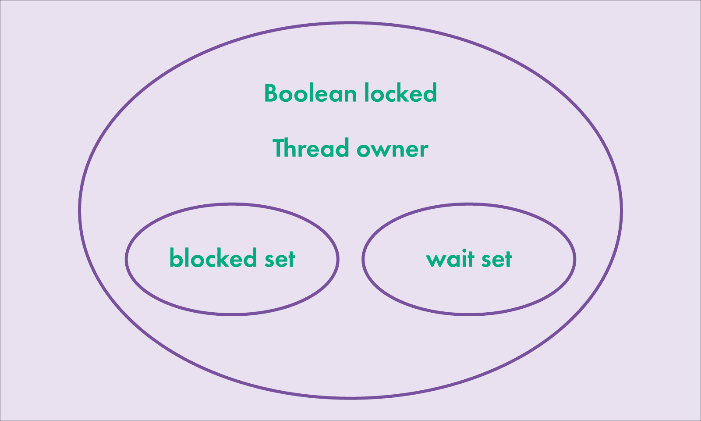
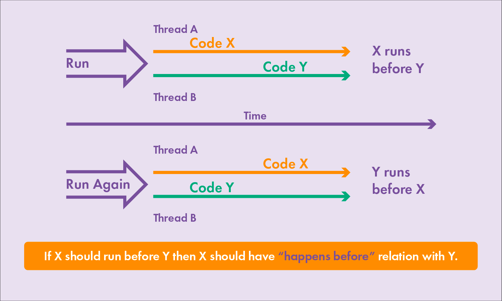
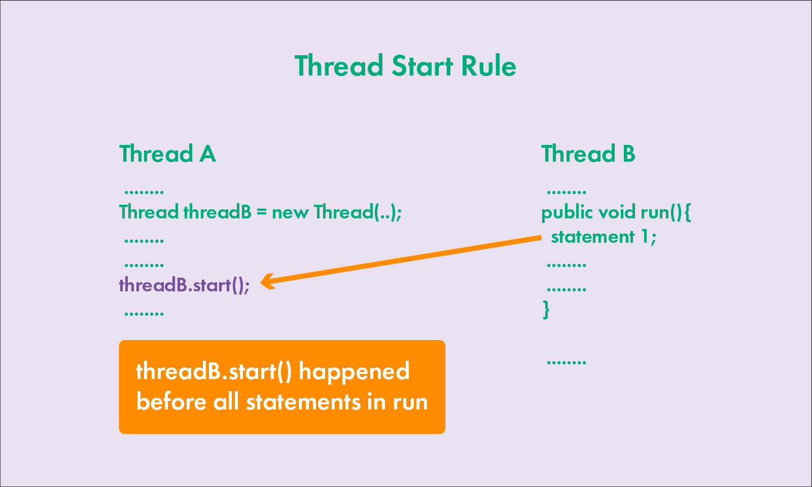

<details>
<summary>Multithreading</summary>
<details style="margin-left: 20px;">
      <summary>Multithreading in Java. Lecture 1. General information</summary>

# Multithreading in Java. Lecture 1. General information

## Introduction

One of the main elements in a computer is the processor. He, in fact, executes the computer commands that make up the
program. At the end of the XX and at the beginning of the XXI century, processors were mostly single-core. The clock
frequency of each new processor was higher than that of the previous model, due to this, the overall performance of the
systems increased. When users had a need to execute several programs simultaneously on a single-core processor (the core
of which can execute one instruction at each specific unit of time), a way was devised to achieve the visibility of a
solution to the problem. The trick is that the processor switches between executing commands from different programs.
Thus, the appearance is achieved that a single-core processor performs several actions or several programs
simultaneously, or several actions are performed within the same program.

However, the production of processors reached the technological limit when further reduction in the size of transistors
and increasing their clock frequency became impossible. Then processor manufacturers decided to increase the number of
cores in one processor in order to increase system performance.

## Brief description of the processor operation

Let's consider at the simplest level how the processor works. It consists of an ALU (arithmetic logic unit) - the main
element of the processor, registers, data buses and addresses, as well as a command decoder.

Initially, the ALU could perform only a few elementary operations: reading and writing to memory, addition, right shift,
left shift, logical AND, OR, NOT, XOR. It was not possible to subtract ALU, subtraction was carried out by adding in an
additional code, multiplication was carried out by adding and shifting to the left, division was carried out by shifting
to the right and subtracting. Later, hardware schemes were invented that support these operations and operations with
floating-point numbers. The most important conclusion to be drawn is that even the simplest operations, such as adding
or subtracting two numbers, are performed not for one processor command, but for several. Therefore, the operation can
be interrupted, and the processor can start executing commands from another program. I.e., the operations are NOT
ATOMIC, and can be interrupted by other commands.

## Support at the operating system level.

Operating systems can solve the problem of allocating processor time in different ways. Basic approaches:

1. Easy task switching. When the processes are simultaneously loaded into the system memory and the timer switches
   between processes. Processes don't have any priorities. The advantages of this system are that it can run programs
   that are designed to work in a single-threaded environment.

2. Cooperative multitasking. When the next task is executed, after the previous one explicitly indicates that it can
   give CPU time to another task. With cooperative multitasking, an application can actually capture as much CPU time as
   it sees fit. All applications share CPU time, periodically transferring control to the next task.

3. Preemptive multitasking. When the operating system itself transfers control from one running program to another in
   case of completion of I/O operations, occurrence of hardware interrupts or when certain signals are received from one
   program to another. In this kind of multitasking, the processor can be switched from executing one program to another
   without any desire of the first program, literally between any two instructions in its code. The allocation of
   processor time is carried out by the process scheduler. In addition, each task can be assigned a certain priority by
   the user or by the operating system itself. This type of multitasking provides a faster response to user actions.

## Processes and threads

Let's introduce the concepts of process and flow.

**Process** — a program running at the current time, and all its elements: address space, global variables, registers,
threads, open files, etc.

**Thread** — the smallest processing unit, the execution of which can be assigned by the operating system kernel. Or a
set of discrete processor time during which commands or code are executed for one logical part of the program.

The implementation of execution threads and processes in different operating systems differs from each other, but in
most cases the execution thread is inside the process. Multiple threads of execution can exist within the same process
and share resources such as memory, whereas processes do not share these resources.

Execution threads are different from processes:

- processes are usually independent, whereas execution threads exist as components of processes;
- processes carry significantly more information about the program, whereas several execution threads share this
  information within the process;
- processes have separate address spaces, whereas execution threads share process memory;
- switching between execution threads in a single process is usually faster than switching between processes.

When a processor has multiple cores, the code is actually executed in parallel on different cores, with each core
executing one thread at a specific unit of time. At the same time, two different cores cannot execute the same thread.
Having more cores does not guarantee an increase in the speed of program execution. If the program is single-threaded,
it will run on one core, and the other cores in the system will not be occupied. Some programming languages support the
ability to assign an execution thread to a specific processor core. This is called thread affinity, but there is no such
possibility in Java.

## Tools for working with multithreading in Java and multithreaded program models

In the first version of Java, there were few tools for working with multithreading. Fixed assets:
class `Thread', interface `Runnable', keyword `synchronized` and methods for synchronization `wait()`, `notify()`
and `notifyAll()` in the `Object` class. The Java 1.5 version already included the `java.util.concurrent` package, which
introduced many new classes and interfaces. Also in the Java 1.8 version, the `CompletableFuture` class was added, which
allows you to build chains of asynchronous tasks and combine them.

#### There are several approaches (models) in multithreaded programming:

- synchronization, locks and the volatile keyword;
- transactional memory — the layer between the JVM and the program API, recursive parallelism;
- actor model — when each object is a thread that exchanges messages with other threads.

Processors now support the concept of threads well. For example, akka (a framework for working with multithreading,
ported to different programming languages: Java, Scala, C#) is written on the basis of threads and locks.

#### Ways to organize multithreading in programs:

- threads do not interact with each other, they work by themselves;
- threads interact with each other;
- threads work by themselves, and then collect data into a single result.

## Properties of threads, starting threads, joining other threads

All methods of the program are executed in some thread. The thread that calls the `main` method is the main thread of
the application and is named main.

In `Java`, a thread is represented by the `Thread` class. There are two ways to create and start a stream:

1) Create an heir from the `Thread` class and override the `run()` method:

```java
public class MyThread extends Thread {
    public void run() {
        long sum = 0;
        for (int i = 0; i < 1000; ++i) {
            sum += i;
        }
        System.out.println(sum);
    }
}
```

`MyThread t = new MyThread();`

2) Implement the `Runnable` interface and pass the object of the resulting class to the constructor of the `Thread`
   class:

```java
   Runnable r=new MyRunnable(){()->
        System.out.println(“Hello!”);
        }
```

`Thread t = new Thread(r);`

### Starting threads

To start a thread, use the `Thread.start()` method. If you call the `run()` method, it will be executed in the calling
thread:  
`Thread t = new Thread(r);`

`t.run(); //r code is executed in the current thread`
`t.start(); //r code is executed in a new thread`

### The `sleep` method in Java streams

The `sleep` method in the `Thread` class in Java is used to suspend the execution of the current thread for a certain
period of time. This method takes a single parameter that specifies the number of milliseconds for which the thread
should be suspended. There is also an overloaded version of this method that takes two parameters: one for milliseconds
and one for nanoseconds. After the specified time period expires, the thread is put into a ready state and waits for the
thread scheduler to resume its execution.

The `sleep` method can be very useful for controlling execution time in a multithreaded environment, for example, to
create delays between repetitions in a loop or to wait for external conditions to change. It is important to note that
the `sleep` method does not guarantee an exact delay of up to a millisecond or nanosecond due to possible fluctuations
in system load and the time it takes for the thread scheduler to reactivate the thread. It is also worth noting that
when calling the `sleep` method, the thread does not release the locked monitors, and therefore other threads will not
be able to enter the synchronized blocks or methods blocked by this thread while it is sleeping.

```java
class SleeperRunnable implements Runnable {

    @Override
    public void run() {
        for (int i = 0; i < 5; i++) {
            try {
                // Приостанавливаем поток на 1 секунду (1000 миллисекунд)
                Thread.sleep(1000);
            } catch (InterruptedException e) {
                e.printStackTrace();
            }
            // Печатаем сообщение после каждого пробуждения
            System.out.println("Slept for 1 second, count: " + i);
        }
    }
}
```

### The `join` method in Java streams

The `join` method in the `Thread` class in Java is used to wait for the completion of another thread. When a thread
calls the `join` method on another thread, it is blocked and waits until the specified thread completes. This can be
useful in situations where one thread depends on the results of another thread.

The 'join` method has three overloads:

1. `join()` - waits indefinitely for the thread to finish.
2. `join(long millis)' - waits for the thread to finish within the specified number of milliseconds.
3. `join(long millis, int nanos)' - waits for the thread to finish within the specified number of milliseconds and
   nanoseconds.

If the thread on which the `join` method was called ends while waiting, the `join` method returns control. If the
timeout expires, the `join` method will also return control, even if the thread has not finished yet.

It is important to note that the `join` method can throw an `InterruptedException` exception if the current thread is
interrupted while waiting. This allows the thread to respond to an interrupt and possibly terminate its work ahead of
time, if necessary.

In this example, a new thread is created that prints a message, then sleeps for 2 seconds, and prints the message again.
The main thread waits for the new thread to finish using the join method before continuing execution and printing "Main
thread proceeding".

```java
public class JoinExample {

    public static void main(String[] args) {
        Thread thread = new Thread(() -> {
            try {
                System.out.println("Thread started");
                Thread.sleep(2000); // thread sleeps for 2 seconds
                System.out.println("Thread finished");
            } catch (InterruptedException e) {
                e.printStackTrace();
            }
        });

        thread.start(); // starting a thread

        try {
            thread.join(); // waiting for the thread to finish
        } catch (InterruptedException e) {
            e.printStackTrace();
        }

        System.out.println("Main thread proceeding");
    }
}
```

| Characteristic | `sleep()`                                    | `join()`                                    |
|---------------------|----------------------------------------------|--------------------------------------------|
| Assignment | Suspends the execution of the current thread for the specified number of milliseconds. | Blocks the current thread until the specified thread completes execution. |
| Return value | No | No |
| Exceptions | `InterruptedException`                          | `InterruptedException`                      |
| Example | `Thread.sleep(2000);` | `thread.join();`                            |
| Note | A thread may be awakened prematurely if another thread interrupts it. | If the thread is already completed, the `join()` method immediately returns control.        |

</details>


<details style="margin-left: 20px;">
<summary>Multithreading in Java. Lecture 2. Stopping and interrupting threads</summary>

# Multithreading in Java. Lecture 2. Stopping and interrupting threads

### Thread object. Thread names, thread priority

The object of the current thread can be obtained by calling the static method: `Thread.currentThread()`.

Thread names can be set via the `setName()` method or via a constructor parameter. It is recommended to give
meaningful names to threads, this will be useful when debugging. It is not recommended to give threads the same names,
although thread names are not
validated by the JVM.

The standard format for the names of threads that were created singly is `thread-N', where `
N` is the sequence number of the thread. For the pool
The standard name is `pool—N-thread-M`, where `N` denotes the sequential number of the pool (each time
you create a new pool, the global counter `N` increases), and `M` is the sequential number of the thread in the pool.

Threads have a priority that can be set as an integer from 1 to 10. The larger the number, the higher the priority of
the thread.
The `main` thread has priority 5. And the priority of new threads is equal to the priority of the parent thread, it can
be changed
using the 'setPriority(int)` method. A thread with a higher priority will have more CPU time to execute.
If two threads have the same priority, then the decision on which of them will be executed first depends on
the scheduler algorithm: (Round-Robin, First Come First Serve).

There are several constants for thread priority:

- `Thread.MIN_PRIORITY` — minimum priority, value 1;
- `Thread.NORM_PRIORITY` — default priority, value 5;
- `Thread.MAX_PRIORITY` — maximum thread priority, value 10

```java
public class Main {
    public static void main(String[] args) {
        System.out.println(Thread.currentThread().getName());
        Thread.currentThread().setPriority(8);
        Thread thread = new Thread() {
            public void run() {
                Thread.currentThread().setName("My name");
                System.out.println(Thread.currentThread().getName());
                System.out.println(Thread.currentThread().getPriority());
            }
        };
        thread.start();
    }
}
```

### Daemon threads

In Java, there is such a thing as a daemon thread. The work of the JVM ends when the last
non-daemon thread has finished executing, despite the daemon threads running. There are two methods to work with this
property: `setDaemon()`
and `isDaemon()'.

<details style="margin-left: 20px;">
<summary>Code example:</summary>

```java
public class DaemonThreadExample {

    public static void main(String[] args) {
        Thread nonDaemonThread = new Thread(() -> {
            try {
                System.out.println("Non-daemon thread starting work.");
                // We emulate the long work of the stream, for example, data processing
                Thread.sleep(5000); // Waiting 5 seconds
                System.out.println("Non-daemon thread finished work.");
            } catch (InterruptedException e) {
                System.err.println("Non-daemon thread was interrupted.");
            }
        });

        Thread daemonThread = new Thread(() -> {
            try {
                System.out.println("Daemon thread starting work.");
                // Emulating a long-running thread
                while (true) {
                    System.out.println("Daemon thread is working...");
                    Thread.sleep(1000); // Waiting for 1 second
                }
            } catch (InterruptedException e) {
                System.err.println("Daemon thread was interrupted.");
            }
        });
        // Installing the thread as a daemon
        daemonThread.setDaemon(true);

        nonDaemonThread.start();
        daemonThread.start();
    }
}
```

</details>

**The `ThreadGroup` class**.

All threads are in groups represented by instances of the `ThreadGroup' class. The group is specified when creating
the stream. If no group has been specified, then the thread is placed in the same group as the parent thread.
The `activeCount()` and `enumerate()` methods return, respectively, the number and complete list of all active threads
in
the group.

<details style="margin-left: 20px;">
<summary>Code example:</summary>

```java
public class ThreadGroupExample {

    public static void main(String[] args) {

        // Creating a new thread group
        ThreadGroup myGroup = new ThreadGroup("MyThreadGroup");

        // Creating threads and putting them in a group
        Thread thread1 = new Thread(myGroup, createRunnable(), "Thread1");
        Thread thread2 = new Thread(myGroup, createRunnable(), "Thread2");
        Thread thread3 = new Thread(myGroup, createRunnable(), "Thread3");

        // Starting Threads
        thread1.start();
        thread2.start();
        thread3.start();

        // Using the activeCount() method to get the number of active threads in a group
        System.out.println("Active threads in thread group " + myGroup.getName() + ": " + myGroup.activeCount());

        // Using the enumerate() method to get all active threads in a group
        Thread[] threads = new Thread[myGroup.activeCount()];
        myGroup.enumerate(threads);
        System.out.println("List of threads:");
        for (Thread thread : threads) {
            System.out.println(thread.getName());
        }
    }

    private static Runnable createRunnable() {
        return () -> {
            try {
                // The thread runs for 2 seconds
                Thread.sleep(2000);
            } catch (InterruptedException e) {
                e.printStackTrace();
            }
        };
    }
}

```

</details>


**Ways to suspend thread execution** for a specified amount of time: `Thread.sleep(long millis)`
and `TimeUnit.<UNIT>.sleep(long timeout)`. They suspend the execution of the current thread for a specified period of
time.
Calling methods requires handling the `InterruptedException' exception.

<details style="margin-left: 20px;">
<summary>Code example:</summary>

```java
import java.util.concurrent.TimeUnit;

public class SleepExample {

    public static void main(String[] args) {
        // Create and start a thread using Thread.sleep() to pause
        Thread thread1 = new Thread(createSleepRunnable("Thread1", 2000));
        thread1.start();

        // Create and start a thread using TimeUnit.SECONDS.sleep() to pause
        Thread thread2 = new Thread(createTimeUnitSleepRunnable("Thread2", 3));
        thread2.start();
    }

    // A method that creates a Runnable that uses Thread.sleep() to suspend
    private static Runnable createSleepRunnable(String threadName, int sleepTimeMillis) {
        return () -> {
            System.out.println(threadName + " started");
            try {
                // Suspending the stream by sleepTimeMillis milliseconds
                Thread.sleep(sleepTimeMillis);
            } catch (InterruptedException e) {
                e.printStackTrace();
            }
            System.out.println(threadName + " woke up and finished");
        };
    }

    // Method that creates a Runnable that uses TimeUnit.SECONDS.sleep() to pause
    private static Runnable createTimeUnitSleepRunnable(String threadName, int sleepTimeSeconds) {
        return () -> {
            System.out.println(threadName + " started");
            try {
                // Suspending the stream for sleepTimeSeconds seconds
                TimeUnit.SECONDS.sleep(sleepTimeSeconds);
            } catch (InterruptedException e) {
                e.printStackTrace();
            }
            System.out.println(threadName + " woke up and finished");
        };
    }
}

```

</details>

The non-static `join()` method allows one thread to wait for the execution of another. If the current thread `t1` calls
another thread `t2h2t2.join()`, then the th2 thread stops until the thread `t2` completes its work.
You can also call the `join()` method with an argument indicating the timeout limit (in milliseconds or in
milliseconds with nano seconds). If the target thread `t2` does not finish working within the specified time period,
the `join()` method
will still return control to the initiator `t1`.

<details style="margin-left: 20px;">
<summary>Code example:</summary>

```java
public class JoinExample {

    public static void main(String[] args) {
        // Creating two streams
        Thread t1 = new Thread(createRunnable("Thread1", 5000));
        Thread t2 = new Thread(createRunnable("Thread2", 2000));

        // Starting the first thread
        t1.start();

        // Starting the second thread
        t2.start();

        System.out.println("Started both threads");

        try {
            // The main thread will wait for the completion of the t1 thread for 7000 milliseconds
            t1.join(7000);
        } catch (InterruptedException e) {
            e.printStackTrace();
        }

        System.out.println("Thread1 has finished or 7 seconds have passed since we started waiting");

        try {
            // The main thread will wait for the completion of the t2 thread without waiting time, that is, until its completion
            t2.join();
        } catch (InterruptedException e) {
            e.printStackTrace();
        }

        System.out.println("Thread2 has finished");
    }

    private static Runnable createRunnable(String threadName, int sleepTime) {
        return () -> {
            System.out.println(threadName + " started");
            try {
                // The thread sleeps the specified number of milliseconds
                Thread.sleep(sleepTime);
            } catch (InterruptedException e) {
                e.printStackTrace();
            }
            System.out.println(threadName + " finished");
        };
    }
}
```

</details>

## Stopping and interrupting threads

To stop the stream in Java version 1, the 'stop()` method was used. However, in Java 1.1, this method
was made `deprecated` (obsolete), because using the `stop()` method does not guarantee the correct termination of
the thread and stable operation of the program as a whole. Therefore, it is strongly not recommended to use it when
writing programs
.

Instead of the `stop()` method, the `interrupt()` method should be used. Unlike the 'stop()` method, which is forced
when stopping the thread, the `interrupt()` method prompts the thread to stop its execution by setting the `
interrupted` flag
to `true' inside the thread. This flag displays the interrupt status and has an initial value of `false'. When a thread
is interrupted by another thread, one of two things happens:

- If the thread is waiting for the execution of an interrupted blocking method, such as `Thread.sleep()', `
  Thread.join()`
  or `Object.wait()`, then the wait is interrupted and the method generates an 'InterruptedException'. The `
  interrupted` flag
  set to `false'.
- The `interrupted` flag is set to `true'.

There are three methods for dealing with thread interrupts:

<details style="margin-left: 20px;">
<summary>Method 1:</summary>

```java
public class Thread {
    public void interrupt() { ...}

    public boolean isInterrupted() { ...}

    public static boolean interrupted() { ...}
...
}
```

```java
public class InterruptExample {

    public static void main(String[] args) {
        // Creating and starting a thread that can be interrupted
        Thread sleepingThread = new Thread(createSleepingRunnable());
        sleepingThread.start();

        // Wait 2 seconds and then interrupt sleepingThread
        try {
            Thread.sleep(2000);
        } catch (InterruptedException e) {
            e.printStackTrace();
        }
        sleepingThread.interrupt();
    }

    // A method that creates a Runnable that "sleeps" and handles the interrupt
    private static Runnable createSleepingRunnable() {
        return () -> {
            try {
                // The thread "sleeps" for 10 seconds or until it is interrupted
                System.out.println("Going to sleep");
                Thread.sleep(10000);
                System.out.println("Woke up naturally");
            } catch (InterruptedException e) {
                // If the stream was interrupted during sleep, it will enter here
                System.out.println("Was interrupted while sleeping");
            }
        };
    }
}

```

</details>

- `isInterrupted()` returns the flag value and does not change it.
- `interrupted()` returns the flag value and sets its value to false. If the interrupted flag is set to
  true and this method is called, the first time the method returns true, and subsequent calls return false.

There are two types of operations: blocking and non-blocking. Non-blocking operations do not suspend the execution of
the thread.
Blocking operations include calls to the methods `sleep()`, `wait()`, `join()` and, for example, some methods of the
class
`Socket`. If a thread was interrupted while it was performing non-blocking calculations, they will not be interrupted
immediately.
However
, the thread is already marked as interrupted, so any next blocking operation will immediately abort and throw
`InterruptedException`.

<details style="margin-left: 20px;">
<summary>Method 2:</summary>

```java
public class Example {

    public static void main(String[] args) {
        // Create and run a thread that will perform a blocking operation
        Thread waitingThread = new Thread(() -> {
            try {
                // The thread waits 10 seconds
                System.out.println("Going to sleep");
                Thread.sleep(10000);
                System.out.println("Woke up naturally");
            } catch (InterruptedException e) {
                // If the stream is interrupted during sleep, it will enter here
                System.out.println("Was interrupted while sleeping");
            }
        });
        waitingThread.start();

        // Create and run a thread that performs a non-blocking operation
        Thread countingThread = new Thread(() -> {
            for (int i = 0; i < 1000000 && !Thread.currentThread().isInterrupted(); i++) {
// The thread just increments the counter
                if (i % 100000 == 0) {
                    System.out.println("Counting: " + i);
                }
            }
            System.out.println("Finished counting or was interrupted during counting");
        });
        countingThread.start();

        // Wait 2 seconds and then interrupt both threads
        try {
            Thread.sleep(2000);
        } catch (InterruptedException e) {
            e.printStackTrace();
        }
        waitingThread.interrupt();
        countingThread.interrupt();
    }
}
```

In this example:

`waitingThread': Instead of using `wait()`, the thread uses `Thread.sleep(10000)`, which is also a
blocking
operation. This thread tries to "sleep" for 10 seconds, but will be interrupted after 2 seconds of execution of the main
thread, which will cause an `InterruptedException'.

`countingThread`: Everything also performs a non-blocking operation, but in order to correctly handle the thread
interruption in
this
context, a check is added `!Thread.currentThread().isInterrupted()` into a loop condition. Thus, if the thread
is
interrupted during the execution of the loop, the loop will end and the last output will be executed.

</details>

### Handling `InterruptedException`.

When there is an `InterruptedException` in the method signature, it once again reminds the programmer that this method
is blocking.
`InterruptedException` signals that they want to terminate the thread. At the same time, they are not asked to do it
immediately.

The first way to handle an `InterruptedException` is to declare this exception in a higher—level method. Also, when
intercepting
the `InterruptedException` method, you can perform some actions (for example, cleaning resources or variables) and re
-throw the `InterruptedException`.

In the second case, when `InterruptedException` cannot be declared, when generating and
intercepting `InterruptedException`
flag
`interrupted` is set to `false`, and the calling methods will not see that the thread was interrupted. However
, you can
restore the interrupt flag by calling `Thread.currentThread().interrupt()` when processing the interrupt.

Also, restoring the `interrupted` flag can be useful when the first thread has a reference to the second thread, and the
first
one wants to know the status of the second flag.

It is worth carefully monitoring the handling of this exception when the code is executed in the `threadpool'. `
InterruptedException`
it may
be "interesting" not only to the code, but also to the thread that executes this code.

<details style="margin-left: 20px;">
<summary>Method 3:</summary>

```java
public class InterruptedExceptionExample {

    public static void main(String[] args) {
        Thread exampleThread = new Thread(() -> {
            try {
                System.out.println("Thread is going to sleep for 5 seconds");
                // The thread sleeps for 5 seconds, this is a blocking operation and may cause an InterruptedException
                Thread.sleep(5000);
                System.out.println("Thread woke up");
            } catch (InterruptedException e) {
                // Exception handling logic
                System.out.println("Thread was interrupted during sleep");

                // First processing method: clearing and re-throwing the exception (if allowed)
                // Performing some kind of cleaning
                // cleanUpResources();
                // throw new RuntimeException(e);

                // Second processing method: restoring the interrupt flag
                // The code can continue its execution, but the interrupt flag is restored for further checks
                Thread.currentThread().interrupt();
            }
        });

        exampleThread.start();

        // The main thread sleeps for 2 seconds to be sure that exampleThread has started its execution and "sleeps"
        try {
            Thread.sleep(2000);
        } catch (InterruptedException e) {
            e.printStackTrace();
        }

        // Interrupting the exampleThread thread while it is "sleeping"
        exampleThread.interrupt();
    }
}

```

Let's analyze the above code:

The first method of processing: In the `catch` block, we can perform the necessary cleanup, for example, close open
resources or
clear the data, and then re-throw the exception wrapped in an unchecked exception if we can't declare
`InterruptedException` in the method signature.

The second method of processing: We can restore the interrupt flag by calling `Thread.currentThread().interrupt();` in
the block
`catch`. Thus, if this thread continues its execution and checks its interrupt flag in subsequent
operations,
it will know that it was interrupted.

It is important to note that in scenarios with a thread pool, you need to pay special attention to
handling `InterruptedException` in order to
avoid situations where pool threads remain in a suspended or incorrect state after an interrupt.

</details>

### Comparison of flow control methods: `sleep()`, `wait()`, and `join()`

| Parameter | `sleep()` | `wait()` | `join()` |
|----------|-----------|----------|----------|
| **Main
purpose** | Suspends the current thread for a specified amount of time. | Releases the monitor and puts the thread in a waiting state until another thread calls `notify()`/`notifyAll()`. | Suspends the execution of the current thread until the target thread completes its work. |
| **Sync** | Not required | Required | Not required |
| **Exceptions** | Excites `InterruptedException` | Excites `InterruptedException` | Excites `InterruptedException' |
| **Effect on the object
monitor** | Does not release the object monitor if the method is called in the `synchronized` block | Frees the object monitor | Not applicable |

</details>

<details style="margin-left: 20px;">
<summary>Multithreading in Java. Lecture 3. The race of resources. Synchronization of streams.</summary>

# Multithreading in Java. Lecture 3. The race of resources. Synchronization of streams.

## Resource race. (race condition)

If two threads execute code that modifies the same variable, the value in the variable will have
an unpredictable value.

A classic example of this behavior: two threads increment one value. Since the increment operation is not
if it is executed in one processor instruction, then two threads will change the value of the variable in an arbitrary
way — this
is called race condition. The blocks of code in which a race condition may occur are called critical sections.
To avoid such a situation, Java provides ways to synchronize threads.

## Synchronization of streams

The simplest way to synchronize is the concept of "monitor" and the synchronized keyword. Initially, this concept was
introduced in the Pascal language. There is no such "monitor" class in Java, however, each object of the Object type has
its own
"monitor". Since all classes have a common parent — Object, they all have their own "monitor".

The concept of "monitor" contains 4 fields within itself:

- `locked` of the `boolean` type, which shows whether the monitor is captured or not;
- `owner` of the `Thread` type — the thread that captured this monitor is recorded in this field;
- `blocked set` — this set includes threads that could not capture the lock, or a thread that exits the
  wait state;
- `wait set` — threads for which the wait method was called fall into this set.

<details style="margin-left: 20px;">
<summary> Figure 1. The internal structure of the "monitor" concept </summary>


</details>

`Blocked set`, like `wait set`, is an unordered set that does not allow duplicates. I.e ., in `wait set`
or `blocked set`, the same stream cannot be written twice.

The fields of the monitor cannot be obtained through reflection. Each object has methods `wait()`, `notify()`
and `notifyAll()`,
which this object inherited from the `Object` class. Using the synchronized keyword ensures that the code blocks will be
be executed by only one thread at each specific unit of time.

### Keyword `synchronized`

There are two ways to use the keyword `synchronized`:

Two threads execute code (the so-called critical section), which can only be executed
by one thread at a time.
One thread is waiting for some event. This behavior is provided by the methods `wait()`, `notify()` and `notifyAll()`.
Consider the first situation: a thread enters a `synchronized` block, executes a critical section, and exits the block
synchronization. The keyword `synchronized` is always used with the monitor object. First
, the variables `locked`
and `owner` are checked. If these fields are `false` and `null`, respectively, they are filled in. The `locked` field
takes the value `true`, and in
the
`owner` records a link to the exciting stream. Once this has happened, it is assumed that the thread has executed the
code that
corresponds to the opening curly brace of the `synchronized` block, and the thread has occupied this lock. After the
stream
executed the code that corresponds to the closing curly brace of the synchronization block, the variables `locked` and
owner in
the monitor are cleared.

Consider a situation where a thread is trying to capture an already occupied monitor. First, it is checked that the
variable `locked ==
true`, then the `owner` variable is compared. If the `owner` variable is not equal to the thread that wants to capture
the monitor,
then the second thread is blocked and gets into the `blocked set` of the monitor. If comparing the owner variables gives
the result `true`,
this is
it means that the same thread tries to capture the monitor again — in this case, the thread is not blocked. This
behavior is called reenternability. An example of such a situation is recursive methods. After the lock
is released, another thread leaves the `blocked set` and captures the monitor. There can be many threads in a `blocked
set'.
In this case, an arbitrary stream is selected, which can then capture the monitor.

The monitor can be a simple object, the keyword `this`, as well as an object of type `.class'.
<details style="margin-left: 20px;">
<summary> Code example: </summary>

```java
public class CounterExample {
    public static void main(String[] args) {
        Counter counter = new Counter();

        // Creating and running threads that increment the counter
        Thread thread1 = new Thread(() -> {
            for (int i = 0; i < 1000; i++) {
                counter.increment();
            }
        });

        Thread thread2 = new Thread(() -> {
            for (int i = 0; i < 1000; i++) {
                counter.increment();
            }
        });

        Thread thread3 = new Thread(() -> {
            for (int i = 0; i < 1000; i++) {
                counter.increment();
            }
        });

        thread1.start();
        thread2.start();
        thread3.start();

        try {
            thread1.join();
            thread2.join();
            thread3.join();
        } catch (InterruptedException e) {
            e.printStackTrace();
        }

        // Output the final value of the counter
        System.out.println("Final Counter Value: " + counter.getValue());
    }
}

class Counter {
    private int count = 0;

    // Synchronized method for increasing the counter
    public synchronized void increment() {
        count++;
    }

    // Synchronized method for getting the counter value
    public synchronized int getValue() {
        return count;
    }
}

```

Comments on the code:

1. Class `Counter`: contains the count field, a method for increasing the value of the counter `increment()` and a
   method for getting
   the value
   counter `getValue()`. Both methods are synchronized using the keyword `synchronized` to ensure
   thread safety.


3. In the `main` method:

- Three threads are created and run that perform counter increment.
- `thread1.join()', `thread2.join()`, `thread3.join()` are used to make the main thread (`main`) wait
  completions
  the work of all three threads before continuing its work.
- At the end, the final value of the counter is displayed, which, thanks to synchronization, will be correct even with
  simultaneous
  access from several threads.

Thus, using the synchronized keyword avoids the problem of data race (`race
condition`) when accessing a critical section of code from different threads.

</details>

When a method is declared with the keyword `synchronized`, it is equivalent to code when its entire body is wrapped in
the `synchronized` block and the lock is the `this` object. When a static method is used with
the keyword `synchronized`,
this is equivalent to when an object is used as a lock SomeClass.class . However, the best way is
to declare a `private final` constant, by which synchronization is performed. It is worth noting that the construction
using the keyword `synchronized` is syntactic and is checked by the compiler. I.e. it should always be
the opening curly brace and the corresponding closing curly brace of the synchronized block. `Synchronized` blocks
can be nested in each other

<details style="margin-left: 20px;">
<summary> Code example: </summary>

```java
final Object LOCK=new Object();

synchronized(LOCK){
// An external synchronized block locks the LOCK object
// At this point, no other thread can enter the synchronized blocks
// using LOCK as a monitor until the current thread exits this block

synchronized(LOCK){
// Middle synchronized block. Since we are already in a synchronized block
// using LOCK as a monitor (external block),
// the current thread already has a lock and can enter this block without waiting.
// This is an illustration of the reenternability of locks in Java:
// a thread can re-capture a lock that it already holds

synchronized(LOCK){
// The internal synchronized block is similar to the middle block.
        // A thread can also enter this block, since it already holds a LOCK.
        // Usually nested synchronized blocks with the same monitor 
        // are avoided as they increase complexity and may contribute to development
        // more complex and less understandable code. But technically , such a code is acceptable and 
        // can be used in certain cases.
        }
        }
        }

```

```java
public class SynchronizedExample {

    // Object to lock in the synchronized block example
    private final Object lockObject = new Object();

    // Simple counter
    private int count = 0;

    // Example of using the synchronized method
    public synchronized void incrementSyncMethod() {
        count++;
        System.out.println(Thread.currentThread().getName() + " - Sync Method, Count: " + count);
    }

    // Example of using a synchronized block with the this object
    public void incrementSyncThis() {
        synchronized (this) {
            count++;
            System.out.println(Thread.currentThread().getName() + " - Sync This, Count: " + count);
        }
    }

    // Example of using a synchronized block with a separate lock object
    public void incrementSyncObject() {
        synchronized (lockObject) {
            count++;
            System.out.println(Thread.currentThread().getName() + " - Sync Object, Count: " + count);
        }
    }

    // Example of using synchronized on a static method
    public static synchronized void staticSyncMethod() {
        System.out.println(Thread.currentThread().getName() + " - Static Sync Method");
    }

    public static void main(String[] args) {
        SynchronizedExample example = new SynchronizedExample();

        // Creating and running threads
        Thread thread1 = new Thread(() -> {
            for (int i = 0; i < 1000; i++) {
                example.incrementSyncMethod();
                example.incrementSyncThis();
                example.incrementSyncObject();
                SynchronizedExample.staticSyncMethod();
            }
        }, "Thread-1");

        Thread thread2 = new Thread(() -> {
            for (int i = 0; i < 1000; i++) {
                example.incrementSyncMethod();
                example.incrementSyncThis();
                example.incrementSyncObject();
                SynchronizedExample.staticSyncMethod();
            }
        }, "Thread-2");

        thread1.start();
        thread2.start();
    }
}
```

Explanations:

- `incrementSyncMethod()`: Uses method-level synchronization. Only one thread can execute this method in
  a specific instance of an object at the same time.

- `incrementSyncThis()': Uses synchronization at the level of the this object. Blocks the current object, and only one
  thread
  can execute this block of code in an instance of an object.

- `incrementSyncObject()`: Uses a separate lockObject object to synchronize a block of code. This can be useful
  for
  fine-tuning the competitiveness if you have different synchronized methods/blocks that should be
  independent of each other.

- `staticSyncMethod()`: Uses class-level synchronization for a static method. Only one thread can
  execute
  this method is all over the JVM, because the static method is associated with a class, not an instance of an object.

In the `main` method, two threads are created and run, which repeat calls to these methods, showing different types
of synchronization in action. It is always recommended to minimize the area that you synchronize in order to reduce
thread contention and improve the performance of your multithreaded program.
</details>

As shown in the example above, it is possible to capture a monitor on the same object several times. There is no way to
determine,
how many times was the monitor captured, and it is not necessary to build such logic in the program. The monitor is
released after
exiting the upper `synchronized` block. In the example below, the monitors `LOCK_A` are captured first, then `LOCK_B`
and `LOCK_C`, and
the monitors are released in reverse order:

```java
Object LOCK_A=new Object();
        Object LOCK_B=new Object();
        Object LOCK_C=new Object();
synchronized(LOCK_A){
synchronized(LOCK B){
synchronized(LOCK_C){
        }
        }
        }
```

### Methods for controlling thread blocking. `wait(),` `notify()` and `notifyAll()`

#### The `wait()` method

When a thread calls the `wait()` method on an object, it enters the waiting state and releases
the object lock belonging to it
(it is assumed that the `wait()` method is called from a synchronized block or method). Thus, other
threads can capture the lock of this object and synchronize on it. The thread remains in a waiting state until
another thread calls the `notify()` or `notifyAll()` method on the same object, or until the thread is interrupted.

#### The `notify()` method

The `notify() method` "wakes up" one of the threads waiting on the object on which the method was called. If there are
multiple
threads waiting, then only one of them (undefined) will be woken up. The awakened thread will try
to capture the object lock again and will continue execution after calling the `wait()` method.

#### The `notifyAll()` method

The `notifyAll()` method is similar to `notify()`, but with a key difference: it "wakes up" all threads waiting on the
object. All
the awakened threads will try to capture the lock of the object (returning to the "struggle" for resources) and continue
execution by
the completion of the synchronized block.

These three methods (`wait()`, `notify()`, `notifyAll()`) are used for interaction and coordination of threads in Java
and
are usually
used in scenarios where one thread has to wait until other threads do some work or
change some state. For example, one thread can produce elements, and another can consume them, and
the consumer thread must wait for the producer thread to produce something.


<details style="margin-left: 20px;">
<summary> Code example: </summary>

The example consists of two streams: `Producer` and `Consumer`. `Producer` generates data and
notifies `Consumer` about it using the `notify()` method. Consumer waits for the notification and, after receiving it,
processes the data. After processing the data, `Consumer` notifies `Producer` about it, and the cycle repeats.

```java
public class WaitNotifyExample {

    private static final Object lock = new Object();
    private static boolean dataAvailable = false;

    public static void main(String[] args) {
        Thread producerThread = new Thread(new Producer());
        Thread consumerThread = new Thread(new Consumer());

        producerThread.start();
        consumerThread.start();
    }

    static class Producer implements Runnable {
        @Override
        public void run() {
            try {
                while (true) {
                    synchronized (lock) {
// Waiting for the consumer to process the data
                        while (dataAvailable) {
                            lock.wait();
                        }

                        // Generating data
                        System.out.println("Producer: Data produced");
                        dataAvailable = true;

                        // Notifying the consumer
                        lock.notify();
                    }

                    // Delay Simulation
                    Thread.sleep(1000);
                }
            } catch (InterruptedException e) {
                Thread.currentThread().interrupt();
                throw new RuntimeException(e);
            }
        }
    }

    static class Consumer implements Runnable {
        @Override
        public void run() {
            try {
                while (true) {
                    synchronized (lock) {
// Waiting for the manufacturer to create the data
                        while (!dataAvailable) {
                            lock.wait();
                        }

                        // Processing data
                        System.out.println("Consumer: Data consumed");
                        dataAvailable = false;

                        // Notify the manufacturer
                        lock.notify();
                    }

                    // Delay Simulation
                    Thread.sleep(1000);
                }
            } catch (InterruptedException e) {
                Thread.currentThread().interrupt();
                throw new RuntimeException(e);
            }
        }
    }
}
```

Note that the methods `wait()`, `notify()`and `notifyAll()` are always called in synchronized
blocks (`synchronized` blocks or methods) to ensure the correct operation of multithreading.

In this example, `Producer` creates data and then notifies `Consumer` using the `notify() method`. `Consumer`
is waiting
after receiving the notification, it processes the data, then notifies the `Producer` and waits for the next data cycle.
The whole process repeats endlessly.
</details>

#### Comparison of wait(), notify(), and notifyAll() methods

| Method | Description | Usage Example |
|-----------|------------|----------------------|
| `wait()` | When calling the method, the thread releases the monitor of the object and goes into a waiting state until another thread calls `notify()` or `notifyAll()` for this object. | `obj.wait();` |
| `notify()` | When calling the method, the thread that called the method does not release the monitor. However, one of the threads waiting for the release of the monitor of this object will be selected and transferred to the "ready to start" state. | `obj.notify();` |
| `notifyAll()` | When calling the method, the thread that called the method does not release the monitor. All threads waiting for the release of the monitor of this object are transferred to the "ready to start" state. | `obj.notifyAll();` |

#### Notes

- Methods must be called from a synchronized context, otherwise an exception `IllegalMonitorStateException` will be
  thrown.
- The `wait()` method can also be called with a timeout, for example, `wait(1000)`, which will wait up to 1000
  milliseconds before the thread automatically returns to the "ready to start" state.
- `notify()` selects an arbitrary thread from all the waiting threads of this object, while `notifyAll()` will wake up
  all the waiting threads.

### Flow States

Threads have the following states:

- `NEW` thread object was created but not started;
- The `RUNNABLE` thread is started and executes the code;
- The `WAITING` thread does not execute the code and is in the `wait` set of the monitor;
- The `BLOCKED` thread does not execute the code and is in the `blocked` set of the monitor;
- `TERMINATED` thread has completed its execution.

Thread states are represented in `enum Thread.State`

<details style="margin-left: 20px;">
<summary> Figure 2. Flow transition diagram from one state to another</summary>


</details>

### Keyword `volatile`

The keyword `volatile` indicates that interaction with a variable in memory should take place bypassing processor
caches,

i.e. directly.

In a multithreaded application, when threads use non-`volatile` variables, they can copy the value of the variables
to the
processor cache to improve performance. If there are several cores in the processor and each thread is executed on
on a separate processor core, the same variable can have a different value on each processor core. As a result
, there will be several copies of the same variable: copies in the cache of each processor core and a copy of the
variable in main
memory. When using non-`volatile` variables, it is impossible to know for sure when the JVM reads the value of a
variable from
the main
memory and when the value of the variable is written to the main memory. This can lead to problems. Suppose there are
two
threads that have access to a shared object that has a counter:

```java
public class SharedObject {
    public int counter = 0;
}
```

Assume that only the first thread increments the variable and both threads can read the variable. If
the counter variable is not `volatile`, then there is no guarantee when the variable will be written to the main memory
so that the newly changed
value of the variable will be seen by the second thread. This problem is solved by declaring the counter variable
as `volatile`:

```java
public class SharedObject {
    public volatile int counter = 0;
}
```

<details style="margin-left: 20px;">
<summary> Learn more about volatile</summary>
Declaring a variable as `volatile` ensures that any read and any write to this variable will immediately fall
into
the main memory. Declaring the counter variable as `volatile` is enough when one thread modifies the variable and another
thread reads its value. If two threads change a common variable, then using the keyword `volatile`
is not enough — it will be `race condition'. The keyword `volatile` guarantees the following:

If the first thread writes a variable to `volatile`, and then the second thread reads the value from this variable, then
that's it
variables visible to thread `A` before writing to variable `volatile` will also be visible to thread `B` after it
has read
variable `volatile'.
If thread `A` reads the variable `volatile`, then all variables visible to thread `A` when reading the variable `
volatile`
will also
be re-read from the main memory.

```java
public class MyClass {
    private int years;
    private int months;
    private volatile int days;

    public void update(int years, int months, int days) {
        this.years = years;
        this.months = months;
        this.days = days;
    }
}
```

When writing a value to the `volatile` variable `days`, it is guaranteed that writing the remaining variables `years`
and `months`
it will also be
produced in the main memory. Reading can be done in the following way:

```java
public class MyClass {
    private int years;
    private int months;
    private volatile int days;

    public int totalDays() {
        int total = this.days;
        total += months * 30;
        total += years * 365;
        return total;
    }

    public void update(int years, int months, int days) {
        this.years = years;
        this.months = months;
        this.days = days;
    }
}
```

In the example above, in the `TotalDays` method, the `volatile` variable `days` is read first, and then

the rest of the variables are read. This reading is performed from the main memory of the program.

The JVM reserves the right to reorder instructions to increase performance without changing the semantics
of the program.:

```java
int a=1;
        int b=2;
        a++;
        b++;
//changes to
        int a=1;
        a++;
        int b=2;
        b++;
```

Consider the modified code:

````java
public void update(int years,int months,int days){
        this.days=days;
        this.months=months;
        this.years=years;
        }
````

In the example above, the order of writing to the `volatile` variable and to regular variables has been changed compared
to the original
example. Java has a solution to the problem of permutation of instructions, which will be discussed in the next
paragraph.

In programs that use multithreading, there are situations when using the volatile keyword
is not enough for the correct operation of the program as a whole. For example, there are two threads that
simultaneously change the overall
counter. It is necessary to read the value from the variable, increase the value of the variable, and then write the
value to the shared
memory. Suppose that two threads have read the same value, let's say equal to one. Each thread increased
the value by 1, and the first thread wrote the value 2 to the main memory, and then the second thread wrote the value 2
to the shared
memory. However, after writing the second stream to the shared memory, the value should be 3. This logic will lead to a
race condition
and incorrect behavior of the program. In this case, you need to use the synchronized keyword, or atomic
variables that will be discussed in a subsequent article.

It should also be remembered that reading and writing to volatile variables takes longer than to regular variables,
because
writing to the CPU core cache is much faster than writing to RAM.
</details>

## The relationship happens-before

The happens-before relationship ensures that the results of an operation in one thread will be visible in another action
in another
thread. The happens-before relation defines a partial ordering of all actions within the program. To ensure
that the thread performing action Y can see the results of action X (regardless of whether X and Y occur in different
threads), there must be a happens-before relationship between X and Y. In the absence of a happens-before relationship
between two
with actions, the JVM can rearrange operations as you like, this happens due to optimization of the JVM compiler.

<details style="margin-left: 20px;">
<summary> Figure 3. The relation happens-before</summary>


</details>

The happens-before relation is not only a redistribution of actions in time, but also a guarantee of the absence of
permutations
of reading, as well as writing to memory. If there is no happens-before relationship, two threads that read and write
to the same memory space can be consistent in terms of time, but will not be able to consistently see
each other's changes.

The happens-before relationship is possible in the following cases.

- The relation happens-before in one thread — an action performed in one thread always happens-before another action,
  which is executed later in the same thread.

<details style="margin-left: 20px;">
<summary> Figure 4. The happens-before relationship in one thread.</summary>


</details>

- Capturing and releasing the monitor — releasing the monitor (exiting the synchronized method or exiting the block)
  always
  is in relation to the happens-before to the capture of the same monitor.

<details style="margin-left: 20px;">
<summary> Figure 5. The happens-before relationship when capturing and displaying the monitor.</summary>


</details>

- Read/write variables cannot be moved and set before reading `volatile` fields if they were initially
  located
  after him. At the same time, it is possible to move the reading of variables that were before reading the `volatile`
  field,
  so
  that they happen after him.
- Starting a thread — calling the `start()` method is always in relation to the happens-before to the first operation in
  the started thread.

<details style="margin-left: 20px;">
<summary> Figure 6. The happens-before relation when starting a thread.</summary>


</details>

- Execution of happens-before for the join() method:

<details style="margin-left: 20px;">
<summary> Figure 7. The happens-before relation when using the join method.</summary>


</details>

## Conclusion

In this lesson, we looked at the basics of multithreaded programs: stream properties, synchronization
of streams, states in which a stream can be located. The examples given demonstrate how to correctly use
the keyword `synchronized` and what consequences their incorrect use can lead to. At the end they told about
`volatile` variables and the relation happens-before. Such knowledge should become a good basis for further study,
understanding and writing multithreaded programs.

#### Comparison of volatile and synchronized keywords

| Keyword | Description | Usage Example | Features |
|----------------|----------|---------------------|-------------|
| `volatile` | A variable declared as `volatile` ensures that any thread reading the field sees its last change. `volatile` provides visibility of variable changes to all threads, but does not provide atomicity of operations. | `private volatile boolean flag = true;` | It is useful in situations where one thread changes the value of a variable, while others only read. |
| `synchronized` | Is used to provide access control to a resource or code block. Ensures that only one thread has access to a resource or code block at any given time. It provides both visibility of variable changes and atomicity of operations. | `synchronized (lock) { // critical section }` or `public synchronized void exampleMethod(){}` | Useful in situations where multiple threads can modify a shared resource or multiple resources, and data consistency needs to be ensured. |

#### Notes

- The keyword `volatile` does not block threads when reading/writing a variable, while `synchronized` blocks a thread
  when it enters a critical section.
- `synchronized` can lead to thread locks and therefore can affect performance, whereas `volatile` is less
  resource-intensive, but also provides fewer guarantees.
- The use of `synchronized` is more preferable when state change operations involve several steps that should be
  performed as a single operation.
- `volatile` is suitable for situations where updates from one thread are visible to other threads without the need for
  additional synchronization.

</details>

<details style="margin-left: 20px;">
<summary>Multithreading in Java. Lecture 4. Atomic variables and multithreaded collections</summary>

# Multithreading in Java. Lecture 4. Atomic variables and multithreaded collections

## Atomic variables

Consider a situation where two or more threads are trying to change a shared shared resource: simultaneously perform
read or write operations. To avoid the race condition situation, you need to use `synchronized` methods,
`synchronized`-blocks or corresponding locks. If this is not done, the shared resource will be in a non-consistent
state.
state, and the value will not make any sense. However, using the `synchronized` or `synchronized` methods

- code blocks are a very expensive operation, because getting and blocking a stream is not cheap. Also, this method
  is blocking, it greatly reduces the performance of the system as a whole.

To solve this problem, so—called non-blocking algorithms were invented - `non blocking thread safe algorithms`. These
algorithms are called `compare and swap` (`CAS`) and are based on the fact that modern processors support such
operations
at the level of machine instructions. With the release of Java 1.5, classes of atomic variables
appeared: `AtomicInteger`, `AtomicLong`,
`AtomicBoolean`, `AtomicReference`. They are in the package `java.util.concurrent.atomic`. The `compare and swap`
algorithm
works
as follows: there is a memory cell, the current value in it and the value that we want to write to this cell.
First, the memory cell is read and the current value is stored, then the read value is compared with the one that
is already in the memory cell, and if the value read earlier matches the current one, a new value is written.
It should be mentioned that the value of the variable after reading can be changed by another thread, because `CAS` is
not a
blocking operation.

## ABA problem or lost update

There are two streams. Thread `A` read the value from memory, after which suppose the thread scheduler interrupted the
execution
of thread `A`. Then the value from memory reads the stream `B`, and then changes it to ANOTHER one several times.
Suppose that
initially the value of the atomic variable was 5, then 4, at the end it became 5 again. It turned out that the
stream `B`
in
the last time I wrote the same value as it was originally, i.e. the value that was read by thread `A`. Then
the scheduler resumes the work of thread `A`, which compares the value that it initially read (5) with what is in
memory now (also 5). These values are equal — the `CAS` operation is performed. There is a situation when new to
the system
the value set by thread `B` (which, by the way, was equal to the original value that we observed before
threads `A` and `B` started working) is overwritten by the old value that thread `A` was supposed to set. There is a
natural
question: why is the value lost? After all, thread `A` did not write to memory the values that it was trying to write,
but when
the thread scheduler resumed the work of thread `A`, the value was finally recorded?

Suppose that a memory cell displays some kind of global state of the system, or, for example, some kind of cyclic
address or a repeating entity. In this case, such behavior is simply unacceptable. A counter of the number of changes
can solve the `CAS` problem
. In the first operation, when reading a value from memory, the counter is also read. When executing
The `CAS` operation compares the current memory value with the old value read earlier, and
compares the current counter value with the counter value that was read in the previous step. If
the result `true` is obtained in both comparison operations, the `CAS` operation is performed and a new value is
written. It is also worth
noting that when writing a new value using the `CAS` operation, the counter value increases. Moreover
, the counter value increases only when writing!

Returning to the example about `lost update`: when thread `A` gets control and tries to perform a `CAS` operation,

the memory values will be equal, and the counter values will not be equal. Therefore, thread `A` will again read the
value from memory and
the counter value — and again try to perform a CAS operation. This will happen until the `CAS` operation

succeeds. However, even when using the counter, certain problems arise, the consideration of which is beyond the scope
of our series of articles. In practice, the `safe memory reclamation` (`SMR`) algorithm is now used.

<details style="margin-left: 20px;">
<summary>Let's look at how the AtomicLong class works:</summary>

```java
import java.util.concurrent.atomic.AtomicLong;

class Counter {
    private final AtomicLong value = new AtomicLong(5); // Initial value

    public void increment() {
        long oldValue, newValue;
        do {
            oldValue = value.get(); // Getting the current value
            newValue = oldValue + 1; // Increasing it by 1
        } while (!value.compareAndSet(oldValue, newValue)); // Trying to set a new value. If the current value is not equal to oldValue, start over
    }

    public long getValue() {
        return value.get();
    }
}

public class Main {
    public static void main(String[] args) throws InterruptedException {
        Counter counter = new Counter();

        Thread thread1 = new Thread(() -> {
            for (int i = 0; i < 1000; i++) {
                counter.increment();
            }
        });

        Thread thread2 = new Thread(() -> {
            for (int i = 0; i < 1000; i++) {
                counter.increment();
            }
        });

        thread1.start();
        thread2.start();

        thread1.join();
        thread2.join();

        System.out.println("Final counter value: " + counter.getValue()); // Outputs 2000 if all increments were successful
    }
}

```

In this example, we are creating a counter that is incremented in two threads. We use `compareAndSet()`
from `AtomicLong`
for
the atomic increment of the value, which ensures that the update of the value occurs correctly even with simultaneous
changes from different streams. Both threads are trying to increase the counter value by 1000, so that eventually it
should become equal to 2000. When using `compareAndSet()`, we don't need to explicitly synchronize access to the
variable
`value`, because `compareAndSet()` provides the necessary atomicity and visibility guarantees.
</details>

<details style="margin-left: 20px;">
<summary>Basic operations using the AtomicInteger example:</summary>

```java
import java.util.concurrent.atomic.AtomicInteger;

public class AtomicIntegerExample {

    private static final AtomicInteger atomicInt = new AtomicInteger(0);

    public static void main(String[] args) {
        // Example of using the get() method:
        System.out.println("Initial Value: " + atomicInt.get());

        // Example of using the addAndGet(int delta) method:
        System.out.println("Add 5: " + atomicInt.addAndGet(5));

        // Example of using the getAndAdd(int delta) method:
        System.out.println("Add 3 and get old value: " + atomicInt.getAndAdd(3));

        // Example of using the incrementAndGet() method:
        System.out.println("Increment and get new value: " + atomicInt.incrementAndGet());

        // Example of using the getAndIncrement() method:
        System.out.println("Increment and get old value: " + atomicInt.getAndIncrement());

        // Example of using the compareAndSet(int expect, int update) method:
        boolean isSet = atomicInt.compareAndSet(9, 10); // Compares the current value with the expected one and, if they are equal, sets a new value
        System.out.println("Compare and set successful: " + isSet + " | Value: " + atomicInt.get());

        // Example of using the decrementAndGet() method:
        System.out.println("Decrement and get new value: " + atomicInt.decrementAndGet());

        // Example of using the getAndDecrement() method:
        System.out.println("Decrement and get old value: " + atomicInt.getAndDecrement());

        // Example of using the getAndSet(int newValue) method:
        System.out.println("Set to 100 and get old value: " + atomicInt.getAndSet(100));

        // Final value:
        System.out.println("Final Value: " + atomicInt.get());
    }
}

```

Explanation of the methods used:

- `get()`: returns the current value.
- `addAndGet(int delta)`: adds the passed value to the current one and returns a new one.
- `getAndAdd(int delta)`: adds the passed value to the current one and returns the old one.
- `incrementAndGet()`: increases the current value by 1 and returns a new one.
- `getAndIncrement()`: increments the current value by 1 and returns the old one.
- `compareAndSet(int expect, int update)`: if the current value is equal to the expected value, sets a new value and
  returns
  `true`, otherwise - `false`.
- `decrementAndGet()`: reduces the current value by 1 and returns a new one.
- `getAndDecrement()`: reduces the current value by 1 and returns the old one.
- `getAndSet(int newValue)`: sets a new value and returns the old one.

In this example, the atomic value is changed at each step and the result of each method is output, which helps
to better understand how these methods work and how they change the value of `AtomicInteger`.
</details>

## Multithreaded collections

Regular collections in Java are not synchronized and cannot be safely used in a multithreaded environment.
Except when accessing these collections comes from synchronized code blocks. Improper
use of collections can lead to data inconsistency or `ConcurrentModificationException'.

Java has collections that are designed to be used in a multithreaded environment. They implement different
data synchronization mechanisms. Before the release of Java 1.5, the following multithreaded collections were
available: `Stack`, `Vector`
, `HashTable`. All
methods of these classes are `synchronized`. This means that when any method of these classes is called, another thread
will
be blocked, even if the called method is a read method. These collections appeared with the Java 1 version and
should not be used in modern development. With the release of Java 1.2, the utility class `Collections` appeared, which
provides
static methods for wrapping standard collections into their synchronized representations. This is done for
compatibility with Java version 1.

After the release of Java 1.5, 1.6 and 1.7, it became possible to use the following collection classes, which are
designed and
optimized to work in a multithreaded environment:

- `CopyOnWriteArrayList <E>`
- `CopyOnWriteArraySet <E>`
- `ConcurrentSkipListSet <E>`
- `ConcurrentHashMap <K, V>`
- `ConcurrentSkipListMap <K, V>`
- `ConcurrentLinkedQueue <E>`
- `ConcurrentLinkedDeque <E>`
- `ArrayBlockingQueue <E>`
- `DelayQueue <E extends Delayed>`
- `LinkedBlockingQueue <E>`
- `PriorityBlockingQueue <E>`
- `SynchronousQueue <E>`
- `LinkedBlockingDeque <E>`
- `LinkedTransferQueue <E>`

The first two collections are `copy on write` structures. The third collection is the `skip list` structure. The
following two collections are
classes
`Map` intended for use in multithreaded programs. Using the classes of these collections allows
you to increase the performance of the program compared to using outdated classes from Java 1. Consider
the static methods of the utilitarian class `Collections'.

### Static methods from the Collections class

Static methods for working with multithreading in the `Collections` class:

- `synchronizedCollection()`
- `synchronizedList()`
- `synchronizedMap()`
- `synchronizedSet()`
- `synchronizedSortedSet()`
- `synchronizedSortedMap()`
  Apply a decorator to a regular collection that wraps each method in a `synchronized` block, resulting in
  every time the wrapped collection is read or modified, all other operations are blocked. Since the listed
  methods were added for backward compatibility, it is better to use multithreaded ones in new multithreaded programs
  collections that we will consider next.

### Copy On Write data structures

`CopyOnWriteArrayList` is used when there are many threads that read items from the collection, and several
threads
that rarely write data to the collection. The copy on write structure creates a new copy of the data when writing to
this
structure. This allows multiple threads to read data at the same time, and one thread to write items to the collection
at any given time. Inside, the data structure contains a `volatile` array of elements and EACH
time the collection changes: adding, deleting or replacing elements, a new local copy of the array is created for
changes. After
modifications the modified copy of the array becomes the current one. An array of elements is used with the
keyword `volatile`
so that all threads immediately see changes in the array. Such an algorithm for working with data ensures that reading
threads will read data that does not change over time, and a `ConcurrentModificationException` will not be generated
when the array is changed in parallel. If an `Iterator` is used to read the collection,
an `UnsupportedOperationException`
will be generated when trying to call `remove()` while
traversing
the collection, because the current copy of the collection cannot be changed.
For write operations inside the `CopyOnWriteArrayList` class, a lock is created so that at a particular time only
one thread can change the copy on write data structure.

Without blocking, the presence of multiple threads changing the data structure can lead to the loss of data written
by threads. Several threads make a copy of the original data array, make changes and write them. Some of the threads
are shutting down faster, some are slower. The thread that finishes its work last will delete the changes,
made by other threads. With the use of the `ReentrantLock` lock, this problem disappears. Consider the program from
the example below, which shows that reading elements from the `CopyOnWriteArrayList` is faster than reading from
a fully
synchronized collection, or a collection that is wrapped by the corresponding static method from the class
`Collections`.

<details style="margin-left: 20px;">
<summary>Code example:</summary>

```java
import java.util.ArrayList;
import java.util.Collections;
import java.util.List;
import java.util.concurrent.CopyOnWriteArrayList;
import java.util.concurrent.locks.ReentrantLock;

public class ThreadSafeExample {

    private final ReentrantLock lock = new ReentrantLock();
    private final List<Integer> syncList = Collections.synchronizedList(new ArrayList<>());
    private final CopyOnWriteArrayList<Integer> copyOnWriteList = new CopyOnWriteArrayList<>();

    public void performAction() {
        Thread writeThread1 = new Thread(() -> writeData(syncList, "Thread-1"));
        Thread writeThread2 = new Thread(() -> writeData(copyOnWriteList, "Thread-2"));

        Thread readThread1 = new Thread(() -> readData(syncList, "Thread-3"));
        Thread readThread2 = new Thread(() -> readData(copyOnWriteList, "Thread-4"));

        writeThread1.start();
        writeThread2.start();
        readThread1.start();
        readThread2.start();
    }

    private void writeData(List<Integer> list, String threadName) {
        for (int i = 0; i < 1000; i++) {
            lock.lock();
            try {
                list.add(i);
            } finally {
                lock.unlock();
            }
        }
        System.out.println(threadName + " write completed");
    }

    private void readData(List<Integer> list, String threadName) {
        for (int i = 0; i < 1000; i++) {
            lock.lock();
            try {
                int data = list.size() > i ? list.get(i) : -1;
            } finally {
                lock.unlock();
            }
        }
        System.out.println(threadName + " read completed");
    }

    public static void main(String[] args) {
        new ThreadSafeExample().performAction();
    }
}
```

Notes on the code:

- `ReentrantLock` is used to ensure synchronization of writing and reading data between different threads.
- `syncList` is a synchronized list created using `Collections.synchronizedList`.
  `copyOnWriteList` is a thread-safe collection that creates a copy of the data at each modification, making
  reading data is faster than synchronized collections.
- The `writeData` and `ReadData` methods use the `ReentrantLock` locking mechanism in order to ensure safe
  reading/writing of data, despite the fact that `CopyOnWriteArrayList` is a thread-safe collection.

This code is written with thread safety in mind for reading and writing data in both collections, and it
demonstrates how `ReentrantLock` can be used to synchronize between different threads and prevent

data loss, especially when working with multiple threads.
</details>

### Skip List data structure

If you need to have a sorted set of elements, you should use the `ConcurrentSkipListSet`, which
implements
the `SortedSet` and `NavigableSet` interfaces.
<details style="margin-left: 20px;">
<summary>Fig. 1. SkipList:</summary>


</details>

The implementation of `ConcurrentSkipListSet` is based on `ConcurrentSkipListMap`, the structure
of `ConcurrentSkipListSet` is similar to the
structure of `LinkedHashMap`. Each element of the skip list structure, except for the value, contains a reference to
neighboring elements.
Also
there are higher-order links that point to elements that are ahead of the current one, to an arbitrary number in
a certain range specified for this link level. For the next link level, this number is greater than for
the previous one.

The advantage of this data structure is that the search for the desired element is very fast due to the use of higher
—order links. The search performance in this data structure is comparable to searching for elements in a binary tree. To
insert
changes to this data structure, you do not need to completely block the structure, it is enough to find an element that
will
deleted, and block two adjacent elements to change the links pointing to the element to be changed.

### BlockingQueue interface

`BlockingQueue` is an interface for thread—safe queues into which multiple threads can write data and read it
from there. This is achieved by the queue's ability to block a thread that adds or reads items from the queue.
For example, when a thread tries to get an item from the queue, but the queue is empty, the thread is blocked. Or when a
thread
tries to put an object in a queue that is already full, the thread is blocked too.

Blocking queues are used when some threads add items to the queue and others read them from there. This
the pattern is known as `producer` `consumer`. Threads that add objects to the queue are called producer (
Manufacturer)
. You can add items to the queue until it is full. Threads that read values are called
`consumer' (Consumer). You can read from the queue only in cases when there are elements in it.

`BlockingQueue` stores its elements according to the `FIFO` principle. The items are sorted by the time they are in the
queue, and
the head
is there longer than all the others.

`BlockingQueue` does not support the `null` value, a `NullPointerException` is generated when trying to insert it.

The `BlockingQueue` interface supports four sets of methods that support different behavior when adding or
receiving items from a queue.

| Action | Exception Generation | Special Value | Thread Blocking | Timeout |
|-----------------|----------------------|---------------------|---------------------|---------------------|
| **Adding**  | `add(o)`             | `offer(o)`          | `put(o)`            | `offer(o, timeout)` |
| **Delete**    | `remove(o)`          | `poll()`            | `take()`            | `poll(timeout)`     |
| **Check**    | `element()`          | `peek()`            |                     |                     |

The four types of behavior mean the following:

1. If an operation cannot be performed immediately, an exception is thrown.
2. If the operation cannot be performed immediately, the value is returned — mostly `true` or `false'.
3. If the immediate execution of the operation is impossible, then the thread performing this operation is blocked.
4. If the operation cannot be performed immediately, the thread that called this method is blocked for no more than a
   while,
   the methods specified in the method, depending on the success of the termination, return `true` or `false`.

Classes that implement the `BlockingQueue` interface: `ArrayBlockingQueue`, `DelayQueue`, `LinkedBlockingQueue`,
`PriopityBlockingQueue`, `SynchronousQueue`.

The `ArrayBlockingQueue` queue has a finite size. The items in this queue are stored in an array. The number of items in
the queue is set in the constructor and cannot be changed after it is created.
<details style="margin-left: 20px;">
<summary>DelayQueue</summary>

`DelayQueue` — a queue with a delay. When a thread wants to get an item from the queue, the item is returned after the
delay for a particular item has expired. Each element that will be placed in the `DelayQueue` queue must
implement the `Delayed` interface, where there is a single `long getDelay()` method. This method should return
the remaining
delay time for this element in the correct TimeUnit units. When the method of getting an item from the queue is called,
`DelayQueue` calls the `getDelay()` method to determine which item should be returned from the queue. If this
method
returned a value close to zero, zero, or a negative value, this item can be returned from the queue. Also
, the element that should be placed in the `DelayQueue` should implement the `compareTo()` method, because the elements
in the queue
are sorted. The element whose delay time will expire the fastest is placed at the head of the queue.

You can put elements in the `DelayQueue` for which the call to the `getDelay()` method returns a zero or negative
number.
A thread that reads items from the queue will receive this item immediately.

<details style="margin-left: 20px;">
<summary>Code example:</summary>

```java
import java.util.concurrent.DelayQueue;
import java.util.concurrent.Delayed;
import java.util.concurrent.TimeUnit;

class DelayedElement implements Delayed {
    private final long startTime;
    private final String name;

    public DelayedElement(long delayInSeconds, String name) {
        this.startTime = System.currentTimeMillis() + delayInSeconds * 1000;
        this.name = name;
    }

    @Override
    public long getDelay(TimeUnit unit) {
        long diff = startTime - System.currentTimeMillis();
        return unit.convert(diff, TimeUnit.MILLISECONDS);
    }

    @Override
    public int compareTo(Delayed o) {
        if (this.startTime < ((DelayedElement) o).startTime) {
            return -1;
        }
        if (this.startTime > ((DelayedElement) o).startTime) {
            return 1;
        }
        return 0;
    }

    @Override
    public String toString() {
        return name + " with delay: " + startTime;
    }
}

public class DelayQueueExample {
    public static void main(String[] args) throws InterruptedException {
        DelayQueue<DelayedElement> queue = new DelayQueue<>();

        queue.put(new DelayedElement(3, "Element1")); // delay 3 seconds
        queue.put(new DelayedElement(5, "Element2")); // delay of 5 seconds
        queue.put(new DelayedElement(1, "Element3")); // delay 1 second

        while (!queue.isEmpty()) {
            DelayedElement element = queue.take();
            System.out.println("Removed element: " + element);
        }
    }
}
```

In this example, `DelayedElement` implements the `Delayed` interface, which allows it to be used in `DelayQueue`
. `getDelay()`
returns the remaining delay time, and `compareTo()` is used to sort items in the queue.

In `main()` we create a `DelayQueue` and add three elements with different delays to it. The `take()` method is blocked
until

until the delay time of the first item in the queue expires. After the delay time expires, the item can be removed
from the queue.

Note that the delay time is passed when creating the `DelayedElement` and is used to calculate the remaining
time before the element is activated. Items are output to the console as they are "activated" (or available for
retrieval from
the queue).
</details>
</details>

<details style="margin-left: 20px;">
<summary>PriorityBlockingQueue</summary>

The `PriorityBlockingQueue` class is a dimensionless queue. All elements that are inserted into
the `PriorityBlockingQueue`
must
implement the `java.langinterface.Comparable` or allow sorting by `natural ordering`. The iterator obtained for
this
collections, does not guarantee iteration by elements in order of priority. If the items to be added to the
queue do not implement the `Comparable` interface, you can pass a comparator when creating the `PriorityBlockingQueue`
object.

The `SynchronousQueue` class calls the `put()` method to add an item to the queue. When calling this method, the calling
thread
is blocked until another thread calls the `take()` method. Also, the `SynchronousQueue` class can be represented as
a synchronization point between two threads, when one thread gives an element and the second receives it. Also
about `SynchronousQueue`
they say that this is a queue without a single element.

Since `SynchronousQueue` is a queue without elements, this collection behaves specifically: the `isEmpty() method`
always
returns
`true`, the `iterator()` method returns an empty iterator, the `hasNext()` method always returns `false`,
`peek()` always returns `null', `size()` always returns 0.

<details style="margin-left: 20px;">
<summary>Code example:</summary>

```java
import java.util.concurrent.*;

public class PriorityExample {

    public static void main(String[] args) {
        // Creating a queue using natural ordering
        PriorityBlockingQueue<Integer> queue = new PriorityBlockingQueue<>();

        // Adding Elements
        queue.put(3);
        queue.put(1);
        queue.put(2);

        // Getting items in order of priority
        System.out.println(queue.poll()); // 1
        System.out.println(queue.poll()); // 2
        System.out.println(queue.poll()); // 3
    }
}

```

`PriorityBlockingQueue`: Items are retrieved from the queue in the order of their priority, which is determined by
their `natural
ordering` (if they implement the `Comparable` interface) or using a comparator that can be provided when
creating a queue. In the example above, the numbers are extracted in ascending order.

```java
import java.util.concurrent.*;

public class SynchronousExample {

    public static void main(String[] args) {
        SynchronousQueue<Integer> queue = new SynchronousQueue<>();

        // The thread that adds an item to the queue
        new Thread(() -> {
            try {
                System.out.println("Adding to queue");
                queue.put(1);
                System.out.println("Item added");
            } catch (InterruptedException e) {
                e.printStackTrace();
            }
        }).start();

        // The thread that removes an item from the queue
        new Thread(() -> {
            try {
                System.out.println("Getting from queue");
                Integer item = queue.take();
                System.out.println("Item received: " + item);
            } catch (InterruptedException e) {
                e.printStackTrace();
            }
        }).start();
    }
}
```

`SynchronousQueue`: This queue does not store items, it transfers them directly between threads. One thread must wait
until another thread inserts or extracts an element. In the example above, one thread tries to add an item to the queue,
and
another thread takes an item from the queue. Both threads are blocked until the other thread performs the corresponding
action.
</details>
</details>

<details style="margin-left: 20px;">
<summary>Multithreaded implementations of the Map interface</summary>
There are three implementations of the Map interface for working in multithreaded collections: `HashTable`, `ConcurrentHashMap' and
`ConcurrentSkipListMap`. In the `HashTable` class, all methods are `synchronized`, and this data structure can
be used in
multithreaded programs. However, this class is already outdated, and its use is not recommended. During a read or
write operation, all other threads that want to either change or read this data structure are blocked. Obviously,
the performance of `HashTable` is very low. In modern programs in critical sections it is recommended to use
`ConcurrentHashMap` or `ConcurrentSkipListMap'. Let's look at the work of these classes in more detail.

`ConcurrentHashMap`. First of all, let's turn to the structure of the `HashMap` class. There is an array of buckets,
inside each of
which
there is either a linked list or a binary tree. Inside, the `ConcurrentHashMap` consists of an array of segments, each
of
which contains a separate `HashMap` with an array of buckets.

<details style="margin-left: 20px;">
<summary>Fig. 2. ConcurrentHashMap:</summary>


</details>

When a key—value pair is added to such a data structure, a separate segment is blocked, and after
adding a key—value pair, everything happens as in a normal map. If a read occurs, the segment is not blocked, and
multiple threads can read data at the same time. Map modification operations can occur simultaneously
when threads access different segments. Two threads cannot modify the same segment at the same time.
However, one thread can make changes in a segment, and another thread can read the same segment in parallel
. This is possible due to the fact that the segment is not blocked when reading data. When reading and
modifying data at the same time, the last modified value will be returned as a result of reading. In
the `ConcurrentHashMap` for each
segment
there is its own lock. By default, the number of segments is 16. The number of segments is calculated
based on the `int concurrencyLevel` parameter. This is an additional parameter that can be passed to the constructor
when
creating
class. The default number of segments means that 16 threads can be written to the card. The number of segments
is calculated based on the `concurrencyLevel'. The number two is raised to a power starting from 1, and the result must
be
greater than or equal to the `concurrencyLevel` parameter. For example:
`Number of segments = 2 ^ 1 = 2 >= 10 ( False)`

`Number of segments = 2 ^ 2 = 4 >= 10 ( False)`

`Number of segments = 2 ^ 3 = 8 >= 10 ( False)`

`Number of segments = 2 ^ 4 = 16 >= 10 ( True)`

With `concurrencyLevel` equal to 10, the number of segments is 16. The number of buckets in each segment is calculated
using the
following
formula:

`2^x >= (initialCapacity/concurrencyLevel)`, where X will be taken as the number of buckets in the segment.

<details style="margin-left: 20px;">
<summary>Fig. 3. Calculation of segments in ConcurrentHashMap:</summary>


</details>

Rehashing in `ConcurrentHashMap` occurs separately in each segment, so it can be performed
simultaneously with writing to another segment.

`ConcurrentSkipListMap`. This class uses the `skipList` principle, which was discussed earlier. `ConcurrentSkipListMap`
sorts
keys according to `natural sort` or with the logic of the comparator that is passed to the constructor. The class
implements
the interfaces `SortedMap`, `NavigableMap', `ConcurrentMap', `ConcurrentNavigableMap'. `
ConcurrentSkipListMap` guarantees
execution
of all basic operations in `O(log(n))'.

`ConcurrentSkipListMap` supports the navigation methods `lowerEntry`, `floorEntry`, `ceilingEntry`, and `higherEntry',
which
return the `
Map.Entry` objects "less than", "less than or equal to", "greater than or equal to" and "greater than" the passed key.
Methods
`lowerKey', `floorKey', `Ceiling Key` and `higherKey` return only keys. `ConcurrentSkipListMap` does not
support `null` values
in either keys or values.

<details style="margin-left: 20px;">
<summary>Code example:</summary>

```java
import java.util.concurrent.*;

public class ConcurrentSkipListMapExample {

    public static void main(String[] args) {
        // Creating a map that sorts keys according to natural ordering
        ConcurrentSkipListMap<Integer, String> map = new ConcurrentSkipListMap<>();

        // Adding elements
        map.put(3, "Three");
        map.put(1, "One");
        map.put(2, "Two");

        // Get and print all keys and values
        map.entrySet().forEach(entry -> {
            System.out.println(entry.getKey() + " => " + entry.getValue());
        });

        // Examples of using navigation methods
        System.out.println("First key: " + map.firstKey());
        System.out.println("Last key: " + map.lastKey());
        System.out.println("First entry: " + map.firstEntry());
        System.out.println("Last entry: " + map.lastEntry());

        // Using the lowerEntry, floorEntry, ceilingEntry and higherEntry methods
        System.out.println("Lower entry than 2: " + map.lowerEntry(2)); // less than
        System.out.println("Floor entry than 2: " + map.floorEntry(2)); // less than or equal to
        System.out.println("Ceiling entry than 2: " + map.Ceiling entry(2)); // greater than or equal to
        System.out.println("Higher entry than 2: " + map.Higher entry(2)); // more than

        // Using the lowerKey, floorKey, Ceiling Key and higherKey methods
        System.out.println("Lower key than 2: " + map.lowerKey(2)); // less than
        System.out.println("Floor key than 2: " + map.floorKey(2)); // less than or equal to
        System.out.println("Ceiling key than 2: " + map.Ceiling key(2)); // greater than or equal to
        System.out.println("Higher key than 2: " + map.higherKey(2)); // more than
    }
}
```

**Explanation:**

- In this example, a `ConcurrentSkipListMap` is created that sorts keys (integers) according to their `natural ordering'
  .
- Some elements are added to the map.
- Then methods are used to print all keys and values.
- Next, navigation methods such as `lowerEntry`, `floorEntry`, `ceilingEntry`, and `higherEntry` are used to
  find records that are strictly less than, less than/equal to, greater than/equal to, and strictly greater than the
  given key, respectively.
  Similar methods are also used for keys only.
- Keep in mind that `null` values or keys are not allowed in the `ConcurrentSkipListMap'.

  This code illustrates the basic usage of `ConcurrentSkipListMap', showing how elements are ordered and how
  use the various navigation methods that the map provides.

</details>
</details>
</details>

<details style="margin-left: 20px;">
<summary>Multithreading in Java. Lecture 5. Thread pools.</summary>

# Multithreading in Java. Lecture 5. Thread pools.

## `Runnable` and `Callable` thread pools

Creating threads to perform a large number of tasks is very time—consuming: creating a thread and freeing resources are
expensive operations. To solve the problem, thread pools and task queues were introduced, from which tasks for
pools are taken.

**Thread pool** is a kind of container that contains threads that can perform tasks, and after execution
one can independently move on to the next.

The second reason for creating thread pools is the ability to separate the object that executes the code and directly
the code of the task
that needs to be performed. Using a thread pool provides better control over thread creation and saves
thread creation resources. Also, using a thread pool simplifies the development of multithreaded programs, simplifying
the creation
and manipulation of threads. Several classes and interfaces are responsible for creating and managing the thread pool,
which
are called the Executor Framework in Java.

<details style="margin-left: 20px;">
<summary>Figure 1. Simplified schematic representation of classes responsible for the thread pool</summary>


This is not a class inheritance scheme or a UML diagram, but a simple block diagram that shows who
uses what, what methods there are and what results.
</details>

Let's look at the main interfaces and classes included in this framework. Its main interfaces are `Executor`
, `ExecutorService` and
the 'Executors` factory. Objects that implement the 'Executor` interface can perform a `runnable` task.
The `Executor` interface
has one method `void execute(Runnable command)'. After calling this method and passing the task for execution, the task
will be executed asynchronously in the future. Also, this interface separates who will perform the task and what will be performed
— unlike the `Thread` class.

The 'ExecutorService` interface inherits from the `Executor` interface and provides opportunities for performing tasks
`Callable`, for interrupting an ongoing task and shutting down the thread pool. To perform tasks that return
As a result, there is a `submit()` method that returns an object that implements the `Future<T>` interface. Using this
object, you can find out if there is a result by calling the `isDone()` method. Using the 'get()` method, you can get
the result
of the task, if there is one. You can also cancel a task by using the `cancel()` method.

The 'Executors` class is a utility class, such as the `Collections' class. The 'Executors` class creates classes that
implement
the `Executor` and `
ExecutorService` interfaces. The main implementations of the thread pool, i.e. implementations of the `
Executor` interfaces and
`ExecutorServcie`:

- `ThreadPoolExecutor` is a thread pool that contains a fixed number of threads. Also, this pool can be created
  using the constructor via the keyword `new'.
- `Executors.newCachedThreadPool()` returns a thread pool, if there are not enough threads in the pool, a new one will
  be created in it
  flow.
- `Executors.newSingleThreadExecutor()` — a thread pool with only one thread.
- `ScheduledThreadPoolExecutor` — this thread pool allows you to run tasks with a certain frequency or one
  once after a period of time.

<details style="margin-left: 20px;">
<summary>Code example:</summary>

<details style="margin-left: 20px;">
<summary>Executor:</summary>

```java
import java.util.concurrent.Executor;

public class ExecutorExample {

    public static void main(String[] args) {
        Executor executor = command -> new Thread(command).start();

        executor.execute(() -> System.out.println("Task is executed asynchronously by Executor!"));
    }
}
```

**Explanations**:   
Here we create a simple `Executor` that starts the passed task in a new thread. This example
shows how the `Executor` can asynchronously perform the transferred tasks (in this case, printing a line to the console)
.
</details>

<details style="margin-left: 20px;">
<summary>ExecutorService:</summary>

```java
import java.util.concurrent.*;

public class ExecutorServiceExample {

    public static void main(String[] args) {
        ExecutorService executorService = Executors.newSingleThreadExecutor();

        Future<String> future = executorService.submit(() -> {
            Thread.sleep(1000);  // Imitating some work
            return "Task's result";
        });

        try {
            System.out.println("Waiting for the task to complete...");
            String result = future.get();
            System.out.println("Result: " + result);
        } catch (InterruptedException | ExecutionException e) {
            e.printStackTrace();
        } finally {
            executorService.shutdown();
        }
    }
}
```

**Explanations**:   
Here `ExecutorService` is used to asynchronously execute a task that returns a result. We
use `Future` to get the result of the task, which will be available after its completion.
</details>

<details style="margin-left: 20px;">
<summary>ThreadPoolExecutor:</summary>

```java
import java.util.concurrent.*;

public class ThreadPoolExecutorExample {

    public static void main(String[] args) {
        ThreadPoolExecutor executor = new ThreadPoolExecutor(2, 4,
                60L, TimeUnit.SECONDS, new ArrayBlockingQueue<>(2));

        executor.execute(() -> System.out.println("Task 1 is executed"));
        executor.execute(() -> System.out.println("Task 2 is executed"));

        executor.shutdown();
    }
}
```

**Explanations**:  
Here `ThreadPoolExecutor` is used to create a thread pool with 2 main threads, maximum 4 threads,
60 seconds of waiting time and a blocking queue for 2 items.
</details>

<details style="margin-left: 20px;">
<summary>ScheduledExecutorService:</summary>

```java
import java.util.concurrent.*;

public class ScheduledThreadPoolExecutorExample {

    public static void main(String[] args) {
        ScheduledExecutorService scheduledExecutorService = Executors.newScheduledThreadPool(2);

        scheduledExecutorService.scheduleAtFixedRate(
                () -> System.out.println("Periodic task execution"),
                0,
                1,
                TimeUnit.SECONDS
        );

        // Allow the periodic task to execute a few times before shutdown
        try {
            Thread.sleep(5000);
        } catch (InterruptedException e) {
            e.printStackTrace();
        } finally {
            scheduledExecutorService.shutdown();
        }
    }
}
```

**Explanations**:  
In this example `ScheduledThreadPoolExecutor` is used for periodic task execution (in this case
in the case of a message output to the console) with a fixed interval of 1 second. The task will start running
immediately after
the start (0 start delay).

<details style="margin-left: 20px;">
<summary>Creating a thread pool the size of the number of cores:</summary>

```java
import java.util.concurrent.ExecutorService;
import java.util.concurrent.Executors;

public class ThreadPoolExample {

    public static void main(String[] args) {
        // Get the number of available processor cores
        int coreCount = Runtime.getRuntime().availableProcessors();

        // Creating a thread pool in which the number of threads is equal to the number of processor cores
        ExecutorService executorService = Executors.newFixedThreadPool(coreCount);

        // Sending tasks to the thread pool for execution
        for (int i = 0; i < 10; i++) {
            executorService.execute(new Task());
        }

        // Stopping the thread pool when all tasks are completed
        executorService.shutdown();
    }

    // Example of a task to complete
    static class Task implements Runnable {
        @Override
        public void run() {
            System.out.println("Task executed by " + Thread.currentThread().getName());
        }
    }
}
```

In this example, we are creating a thread pool, the number of threads in which is equal to the number of available
processor cores. Then
we send 10 tasks for execution to the thread pool. Each task simply outputs the name of the thread that executes it. At
the end, we call `ExecutorService.shutdown()` in order for the thread pool to be stopped after all tasks are completed.
</details>
</details>

| Class/Interface | Description | Key methods and properties | Usage features |
|-------------------------------|----------------------------------------------------------------------------------------------------------|-----------------------------------------|------------------------------------------------------------|
| `Executor`                    | Interface for objects that can perform tasks.                                                  | `execute(Runnable command)`              | Simplicity, asynchronous task execution.                       |
| `ExecutorService`             | Extends the `Executor' by adding methods to manage the lifecycle and tasks that return the result. | `submit(Callable<T> task)`, `shutdown()`, `invokeAll(...)`, `invokeAny(...)` | Lifecycle management, support for execution results. |
| `Executors`                   | Factory for creating various types of performers.                                                      | `newFixedThreadPool(int)`, `newSingleThreadExecutor()`, `newCachedThreadPool()` | Convenience of creating standard types of performers.             |
| `ThreadPoolExecutor`          | Implementation of a thread pool that can be used directly to create customized thread pools. | Designer for customization | Flexibility, the ability to fine-tune.                       |
| `ScheduledThreadPoolExecutor` | Allows you to execute commands with a delay or periodicity.                                              | `schedule(...)`, `scheduleAtFixedRate(...)` | Task scheduling, support for periodic execution.     |

</details>

## ThreadFactory

The thread pool uses a class that implements the `ThreadFactory` interface to create threads so that a single thread can
execute multiple `Runnable-` or `Callable-` objects. A thread that executes multiple `Runnable` objects
is called
`Worker`. The execution chain is as follows: `ThreadPoolExecutor` -> `Thread` -> `Worker' -> `YourRunnable'. By default

, the `Executors$DefaultThreadFactory` class is used. `ThreadFactory' is an interface with one method `Thread newThread(
Runnable r)'.
Standard
naming threads in the thread pool pool-n-thread-m. The class that implements `ThreadFactory` is used to
configure
a thread for a thread pool. For example, set a thread name or priority, set an `ExceptionHandler` for a thread, or
make threads inside an `Executor' daemons.

<details style="margin-left: 20px;">
<summary>Code example:</summary>

```java
import java.util.concurrent.*;
import java.util.concurrent.atomic.AtomicInteger;

public class CustomThreadFactoryExample {
    public static void main(String[] args) {
        // Creating a thread factory with a custom configuration
        ThreadFactory customThreadFactory = new ThreadFactory() {
            private final AtomicInteger threadNumber = new AtomicInteger(1);

            @Override
            public Thread newThread(Runnable r) {
                Thread thread = new Thread(r);
                // Setting the stream name
                thread.setName("MyCustomThread-" + threadNumber.getAndIncrement());
                // Setting the priority of the stream
                thread.setPriority(Thread.MAX_PRIORITY);
                // Installing an unhandled exception handler
                thread.setUncaughtExceptionHandler(new Thread.UncaughtExceptionHandler() {
                    @Override
                    public void uncaughtException(Thread t, Throwable e) {
                        System.out.println("Unhandled exception in thread: " + t.getName());
                        e.printStackTrace();
                    }
                });
                return thread;
            }
        };

        // Creating an executor with a thread pool using our custom thread factory
        ExecutorService executor = new ThreadPoolExecutor(
                2, // main pool size
                4, // maximum pool size
                60, // flow retention time
                TimeUnit.SECONDS, // holding time units
                new LinkedBlockingQueue<>(), // task queue
                customThreadFactory // our custom thread factory
        );

        // Sending the task for execution
        executor.submit(() -> {
            System.out.println("Task execution in: " + Thread.currentThread().getName());
            throw new RuntimeException("Oh! An exception has occurred.");
        });

        // We stop the performer after completing all the presented tasks
        executor.shutdown();
    }
}
```

**Explanations**:

1. Creating a `ThreadFactory`:

- We create an anonymous class implementing `ThreadFactory` and override the `newThread(Runnable r)` method.
- We set a custom name for the stream using `AtomicInteger` for the uniqueness of the name.
- Setting the maximum priority for the stream.
- Install an unhandled exception handler that outputs exception information to standard output.

2. Creating an 'ExecutorService`:

- Use the `ThreadPoolExecutor` constructor to create a thread pool, passing the custom `ThreadFactory` as
  one of the parameters.
- We set various parameters of the thread pool, such as the minimum and maximum number of threads, time
  thread retention and task queue.

3. Starting the task:

- We run the task using the `submit()` method, which executes the task in a thread created by our custom
  thread factory.
- We throw an exception inside the task specifically to demonstrate the operation of the unhandled exception handler.

4. Shutdown:

Shutting down the `ExecutorService` by calling the `shutdown()` method. This ensures that after all the submitted
tasks are completed, the thread pool will be stopped.

Thus, `ThreadFactory` is used to create threads with a custom configuration (for example, with a specific
name or priority), which are then used by `ThreadPoolExecutor` to perform the tasks presented. The
example also demonstrates the use of an unhandled exception handler to handle
exceptions thrown during task execution.
</details>

## Completion of thread pool execution

To terminate the thread pool, the `ExecutorService` interface has several methods: `shutdown()`, `shutdownNow()`
and
`Await Termination(long timeout, TimeUnit unit)'.

After calling the `shutdown()' method` the thread pool will continue to work, but when trying to transfer new tasks to
execution, they
will be rejected, and a `RejectedExecutionException` will be generated.

The `shutdownNow()' method` does not start tasks that have already been set for execution, and tries to finish those
that have already
been started.

The `Await Termination(long timeout, TimeUnit unit)` method blocks the thread that called this method until all tasks
have
completed their work, or until the timeout that was passed when calling the method expires, or until the current waiting
thread
is interrupted. In general, until one of these conditions is met first.
<details style="margin-left: 20px;">
<summary>Code example:</summary>

example code that demonstrates the use of the methods `shutdown()`, `shutdownNow()`,
and `Await Termination(long timeout,
TimeUnit unit)` of the `ExecutorService` interface:

```java
import java.util.concurrent.ExecutorService;
import java.util.concurrent.Executors;
import java.util.concurrent.TimeUnit;

public class ThreadPoolShutdownExample {

    public static void main(String[] args) {
        // Creating a thread pool with two threads
        ExecutorService executorService = Executors.newFixedThreadPool(2);

        // Sending tasks for execution
        for (int i = 0; i < 5; i++) {
            executorService.execute(new Task());
        }

        // Completion of thread pool execution after all tasks are completed
        executorService.shutdown();

        try {
            // Waiting for completion of all tasks or timeout within 10 seconds
            if (!executorService.awaitTermination(10, TimeUnit.SECONDS)) {
                // Forced termination if the thread pool has not terminated after the timeout
                executorService.shutdownNow();
            }
        } catch (InterruptedException e) {
            // In case of interruption, we try to terminate the thread pool immediately
            executorService.shutdownNow();
        }
    }

    // Example of a task to complete
    static class Task implements Runnable {
        @Override
        public void run() {
            try {
                // Simulation of a long-term task
                Thread.sleep(2000);
                System.out.println("Task executed by " + Thread.currentThread().getName());
            } catch (InterruptedException e) {
                System.out.println("Task interrupted: " + Thread.currentThread().getName());
            }
        }
    }
}
```

**Explanation of the Code**:

1. Creating and Launching Tasks:
   A thread pool with two threads is created, and five tasks are sent to it for execution.

2. Termination Of The Thread Pool:

- `shutdown()`: After sending all tasks for execution, the `shutdown()` method is called so that the thread pool is
  completed
  after all the tasks have completed their work.

3. Waiting For Tasks To Complete:

- `Await()': The `Await()` method is called with a timeout of 10 seconds, which means that the main thread
  will wait for all tasks to complete within 10 seconds.

4. Forced Termination:

- `shutdownNow()`: If all tasks are not completed after waiting 10 seconds, `shutdownNow()` is called to
  forcibly terminate all task execution.

5. Interrupt Handling:

- If the main thread is interrupted while waiting, `shutdownNow()` is called again to force
  thread pool completion.

Each task in this example just sleeps for 2 seconds (to simulate a long job) and then outputs the name of the thread
that executed it. If the task is interrupted due to the `shutdownNow()` call, it will output a message that it was
interrupted.
</details>

## Canceling tasks in Executors

After passing `Runnable` or `Callable`, the `Future` object is returned. This object has a `cancel()` method that can
be used to cancel a job. Calling this method has a different effect depending on when the method was called.
If the method was called when the task has not yet started executing, the task is simply removed from the task queue. If

the task has already been completed, calling the `cancel()' method` will not lead to any results.

The most interesting case occurs when the task is in progress. The task may not stop because
that in Java tasks rely on a mechanism called thread interruption. If the thread does not ignore this signal, the thread
will stop. However, it may not respond to the interrupt signal.

Sometimes it is necessary to implement a non-standard cancellation of a task. For example, a task executes a blocking
method,
say, `ServerSocket.accept()`, which is waiting for some client to connect. This method ignores any
flag checks
`interrupted`. In the above case, to stop the task, you need to close the socket, and an
exception will occur,
which should be processed. There are two ways to implement non-standard thread termination. The first is the
redefinition
of the `interrupt()` method in the `Thread` class, which is not recommended to use. The second is redefining the method
`Future.cancel()`. However, the `Future' object is an interface, and the objects that implement this interface are not
created
manually by the user. So, we need to find a way that will allow us to do this. And there is such a way. The `
Future` object is returned
after
calling the 'submit()` method. Under the hood, `ExecutorService` calls the `newTaskFor(Callable<V> c) method` to get an
object
`Future`. The `newTaskFor` method should be redefined so that it returns the `Future` object with the desired
functionality
of the cancel() method.

<details style="margin-left: 20px;">
<summary>Code example:</summary>

```java
import java.util.concurrent.*;

public class Example {
    public static void main(String[] args) {
        ExecutorService executorService = Executors.newFixedThreadPool(2);
        Future<?> futureTask = executorService.submit(new LongRunningTask());

        try {
            // We will try to get the result of the task within 2 seconds
            futureTask.get(2, TimeUnit.SECONDS);
        } catch (TimeoutException e) {
            // The task did not finish within 2 seconds
            System.out.println("The task has been running for too long. An attempt to cancel it...");
            FutureTask.cancel(true); // Attempt to cancel the task
        } catch (InterruptedException | ExecutionException e) {
            e.printStackTrace();
        }

        executorService.shutdown();
    }

    static class LongRunningTask implements Runnable {
        @Override
        public void run() {
            try {
                // Emulating a long task running for 5 seconds
                Thread.sleep(5000);
            } catch (InterruptedException e) {
                System.out.println("The task was interrupted!");
            }
        }
    }
}
```

**Canceling Tasks in Executors**

The code contains the following main components:

1. `ExecutorService executorService = Executors.newFixedThreadPool(2);`
   Creates a thread pool with two worker threads. This means that the pool can perform a maximum of two tasks at the
   same time
   tasks.

2. `Future<?> futureTask = executorService.submit(new LongRunningTask());`
   The `LongRunningTask` task is submitted for execution. The `submit()` method returns a `Future` object that can
   use to cancel a task.

3. `futureTask.get(2, TimeUnit.SECONDS);`
   We are trying to get the result of the task within two seconds. Since the task is designed to
   run for 5 seconds (see `Thread.sleep(5000);` inside `LongRunningTask'), this will result in
   the occurrence of a `TimeoutException'.

4. Exception Handling:

- `TimeoutException e`: An exception occurs when `FutureTask.get(2, TimeUnit.SECONDS);` can't get the result in
  during the specified time (2 seconds). We are trying to cancel the task using `FutureTask.cancel(true);`.

- `InterruptedException | ExecutionException e`: Handle other exceptions that may occur in the process
  getting the result of the task.

5. `futureTask.cancel(true);`
   The `cancel()` method is called with the `true` parameter, which allows the task to be interrupted. If the task has
   not started yet, it
   will never be completed. If the task has already started, an interrupt signal will be sent to it (and it depends on
   the
   tasks, whether the interrupt signal will be processed).

6. `ExecutorService.shutdown();`
   Causes the thread pool to stop after the completion of the previous submitted tasks.

Additional remarks

- `LongRunningTask': This is a `Runnable` that emulates a long task using `Thread.sleep(5000);`. Please note
  note that it also handles the `InterruptedException`, which allows you to respond correctly to the cancellation of the
  task.
- `InterruptedException`: If the thread is interrupted during sleep, we output

</details>

## Exception handling

To handle exceptions that occur when executing Runnable objects, an exception handler is set to
`ThreadFactory`, then `ThreadFactory` sets the thread:

```java
public class ExceptionHandler implements Thread.UncaughtExceptionHandler {
    @Override
    public void uncaughtException(Thread thread, Throwable t) {
        System.out.println("Uncaught exception is detected! " + t + " st: " +
                Arrays.toString(t.getStackTrace()));
    }
}
```

```java
public class CustomThreadFactory implements ThreadFactory {
    private final Thread.UncaughtExceptionHandler handler;

    public CustomThreadFactory(Thread.UncaughtExceptionHandler handler) {
        this.handler = handler;
    }

    @Override
    public Thread newThread(Runnable run) {
        Thread thread = Executors.defaultThreadFactory().newThread(run);
        thread.setUncaughtExceptionHandler(handler);
        return thread;
    }
}
```

```java
public class ExceptionHandlerExample {
    public static void main(String[] args) throws InterruptedException {
        ThreadFactory threadFactory =
                new CustomThreadFactory(new ExceptionHandler());
        ExecutorService threadPool =
                Executors.newFixedThreadPool(4, threadFactory);
        Runnable r = () -> {
            throw new RuntimeException("Exception from pool");
        };
        threadPool.execute(r);
        threadPool.shutdown();
        threadPool.awaitTermination(10, TimeUnit.SECONDS);
    }
}
```

In the example above, an exception handler is created, which is passed to the thread factory. A pool of four threads is
created with
using the transferred factory. When an exception occurs, it is intercepted by the exception handler
`ExceptionHandler`. This method is suitable when the thread pool performs `Runnable` tasks. If an exception occurred
during
the execution of the `Callable<V>` task, an `ExecutionException` will be generated when retrieving the value from
the `Future<V>` object
.

<details style="margin-left: 20px;">
<summary>Code example:</summary>

```java
import java.util.concurrent.*;

public class Example {
    public static void main(String[] args) {
        // Creating a thread pool
        ExecutorService executorService = Executors.newFixedThreadPool(2, new CustomThreadFactory());
        // Sending the task for execution
        executorService.execute(new ExceptionThrowingTask());
        // Shutting down the thread pool after completing all tasks
        executorService.shutdown();
    }

    static class ExceptionThrowingTask implements Runnable {
        @Override
        public void run() {
            throw new RuntimeException("An exception occurred in the thread!");
        }
    }

    static class CustomThreadFactory implements ThreadFactory {
        @Override
        public Thread newThread(Runnable r) {
            Thread thread = new Thread(r);
            // Installing an uncaught exception handler
            thread.setUncaughtExceptionHandler(new CustomUncaughtExceptionHandler());
            return thread;
        }
    }

    static class CustomUncaughtExceptionHandler implements Thread.UncaughtExceptionHandler {
        @Override
        public void uncaughtException(Thread t, Throwable e) {
            System.out.println("Stream" + t.getName() + "threw an exception: " + e.GetMessage());
        }
    }
}
```

**Explanation of the code**

Exception handling using `Thread.UncaughtExceptionHandler` in the Thread Pool

The example demonstrates how to handle uncaught exceptions in threads created by a thread pool.

1. `ExecutorService executorService = Executors.newFixedThreadPool(2, new CustomThreadFactory());`
   Creating a thread pool with two worker threads using `CustomThreadFactory` to create new threads to
   configure their exception handling.

2. `executorService.execute(new ExceptionThrowingTask());`
   We send the task `ExceptionThrowingTask` for execution in the thread pool.

3. `executorService.shutdown();`
   Shutting down the thread pool after all tasks have been completed.

Classes and Interfaces:

A. `ExceptionThrowingTask`

- Implements `Runnable` and in the `run()` method simply generates a `RuntimeException`, simulating an uncontrolled
  error in
  the thread.

B. `CustomThreadFactory`

- Implements `ThreadFactory'.
- The `newThread(Runnable r) method` creates and returns a new stream using the passed `Runnable'.
- The `Thread` object is configured to use `CustomUncaughtExceptionHandler` as a handler
  uncaught exceptions.

C. `CustomUncaughtExceptionHandler`

- Implements `Thread.UncaughtExceptionHandler`.
- Method `uncaughtException(Thread t, Throwable e)` is called when an uncaught
  exception `e` occurs in the thread `t`.
- In this implementation, a message is displayed indicating which thread threw an exception and which message contains
  an exception.

General Principles Of Operation
When the `ExceptionThrowingTask` throws an exception, it is not caught inside the 'run()` method. In this
case, `Custom UncaughtExceptionHandler` is automatically called, passing the stream and the exception as arguments
to the `uncaught Exception(...) method`. This allows you to handle uncaught exceptions in a centralized manner,
outputting
error information or logging them as required.

It Is Important To Know

- The lack of exception handling can lead to unexpected behavior of the application.
- Centralized exception handling helps in detecting and diagnosing problems by providing information that
  happened in a specific thread.

</details>
</details>

<details style="margin-left: 20px;">
<summary>Multithreading in Java. Mutual blocking (Deadlock)</summary>

# Mutual blocking (Deadlock)

**Deadlocking** or **mutual locking** in Java multithreading occurs when two or more threads are blocked
forever,
each of them waiting for the release of a resource held by another thread. As a result, all the threads involved
are blocked and unable to continue execution.

### 4 necessary conditions for the occurrence of a deadlock:

- Mutual exclusion: At least two resources must be in non-shared (non-shared) mode, i.e. they can be simultaneously
  use only one thread.

- Hold and Wait: The thread is already holding at least one resource and is waiting for additional resources,
  held
  by other threads.

- No resource cancellation: Resources cannot be forcibly taken from the thread holding them - the thread must explicitly
  release the resource.

- Cyclic waiting: There is a cycle or chain of waiting for resources, where each thread holds a resource that
  it is expected
  by the next thread in the chain.

<details style="margin-left: 20px;">
<summary>Example of a deadline in Java:</summary>

```java
public class DeadlockExample {
    public static Object lock1 = new Object();
    public static Object lock2 = new Object();

    public static void main(String[] args) {
        Thread thread1 = new Thread(new Task(lock1, lock2)); // first thread
        Thread thread2 = new Thread(new Task(lock2, lock1)); // second thread

        thread1.start();
        thread2.start();
    }

    static class Task implements Runnable {
        private Object lock1;
        private Object lock2;

        public Task(Object lock1, Object lock2) {
            this.lock1 = lock1;
            this.lock2 = lock2;
        }

        @Override
        public void run() {
            synchronized (lock1) {
                System.out.println("Thread " + Thread.currentThread().getId() + ": locked " + lock1);

                try {
                    Thread.sleep(100);
                } catch (InterruptedException e) {
                    e.printStackTrace();
                }

                synchronized (lock2) {
                    System.out.println("Thread " + Thread.currentThread().getId() + ": locked " + lock2);
                }
            }
        }
    }
}

```

In this example, two threads are trying to capture two monitors (`lock1` and `lock2`) in different order, which can lead to
deadlocking, since each of the threads holds the lock needed by the other and waits for the lock held by the other.
</details>

## Avoiding and detecting deadlocks

Avoiding deadlocks usually involves strategies that prevent one of the conditions necessary for the occurrence of
dedlock. Here are a few common approaches:

1. Lock Capture Order: Always capture locks in the prescribed order. In this way,
   cyclic waiting can be avoided.

2. Timeouts: Determine the maximum time interval during which the thread will wait for blocking.

3. Blocking only one resource: Design the system so that the thread locks only one resource at a time.

<details style="margin-left: 20px;">
<summary>Example of the order of capturing locks:</summary>

```java
public class DeadlockAvoidanceExample {
    private static final Object lock1 = new Object();
    private static final Object lock2 = new Object();

    public static void doSomething() {
        synchronized (lock1) {
            System.out.println("Lock1 acquired");

            synchronized (lock2) {
                System.out.println("Lock2 acquired");
            }
        }
    }

    public static void doSomethingElse() {
        synchronized (lock1) {
            System.out.println("Lock1 acquired");

            synchronized (lock2) {
                System.out.println("Lock2 acquired");
            }
        }
    }
}

```

In this example, despite the fact that the methods `doSomething` and `doSomethingElse` can be called by different threads,
the order
of lock capture (`lock1` before `lock2`) is always followed, which reduces the probability of deadlocking.
</details>

## Detecting deadlocks

Detection of deadlocks in Java can be carried out in several ways, one of which is the use of JMX (
Java Management Extensions) for monitoring and managing Java applications.

<details style="margin-left: 20px;">
<summary>Example of the order of capturing locks:</summary>

```java
import java.lang.management.ManagementFactory;
import java.lang.management.ThreadInfo;
import java.lang.management.ThreadMXBean;

public class DeadlockDetectionExample {
    private static final Object lock1 = new Object();
    private static final Object lock2 = new Object();

    public static void checkForDeadlocks() {
        ThreadMXBean threadMxBean = ManagementFactory.getThreadMXBean();
        long[] threadIds = threadMxBean.findDeadlockedThreads();

        if (threadIds != null) {
            ThreadInfo[] threadInfos = threadMxBean.getThreadInfo(threadIds);
            System.out.println("Detection Deadlock:");

            for (ThreadInfo threadInfo : threadInfos) {
                System.out.println(threadInfo.getThreadId() + " - " + threadInfo.getThreadName());
            }
        }
    }

    public static void main(String[] args) {
        Thread thread1 = new Thread(() -> {
            synchronized (lock1) {
                System.out.println("Thread1 holds lock1");
                try {
                    Thread.sleep(100);
                } catch (InterruptedException ignore) {
                }
                synchronized (lock2) {
                    System.out.println("Thread1 holds lock2");
                }
            }
        });

        Thread thread2 = new Thread(() -> {
            synchronized (lock2) {
                System.out.println("Thread2 holds lock2");
                try {
                    Thread.sleep(100);
                } catch (InterruptedException ignore) {
                }
                synchronized (lock1) {
                    System.out.println("Thread2 holds lock1");
                }
            }
        });

        thread1.start();
        thread2.start();

        // Periodic check of the presence of a deadline
        new Thread(() -> {
            while (true) {
                try {
                    Thread.sleep(500);
                } catch (InterruptedException ignore) {
                }
                checkForDeadlocks();
            }
        }).start();
    }
}

```

In this example, thread1 tries to capture `lock1` and `lock2`, and `thread2` tries to capture `lock2` and `lock1`, which can lead
to deadlocks if threads capture locks at different times. We are also creating a third thread that regularly calls
`checkForDeadlocks()` for detecting and displaying information about deadlocks.
</details>

</details>
</details>


</details>


----------------------


<details>
<summary>Многопоточность</summary>
<details  style="margin-left: 20px;">
<summary>Многопоточность в Java. Лекция 1. Общие сведения</summary>

# Многопоточность в Java. Общие сведения

## Введение

Один из основных элементов в компьютере — процессор. Он, собственно, и выполняет компьютерные команды, которые
составляют программу. В конце XX и в начале XXI века процессоры в основном были одноядерными. Тактовая частота у каждого
нового процессора была больше, чем у предыдущей модели, за счет этого и возрастала общая производительность систем.
Когда у пользователей обозначилась потребность выполнять одновременно несколько программ на одноядерном процессоре (ядро
которого в каждую конкретную единицу времени может выполнять одну инструкцию), был придуман способ добиться видимости
решения проблемы. Трюк в том, что процессор переключается между выполнением команд из разных программ. Таким образом
достигается видимость, что одноядерный процессор выполняет несколько действий или несколько программ одновременно, или в
рамках одной программы выполняется несколько действий.

Однако производство процессоров достигло технологического предела, когда дальнейшее уменьшение размеров транзисторов и
повышение их тактовой частоты стало невозможно. Тогда производители процессоров, приняли решение об увеличении
количества ядер в одном процессоре, чтобы увеличить производительность систем.

## Краткое описание работы процессора

Рассмотрим на простейшем уровне, как работает процессор. Он состоит из АЛУ (арифметико-логического устройства) —
главного элемента процессора, регистров, шин данных и адреса, а также дешифратора команд.

Изначально АЛУ могло выполнять всего лишь несколько элементарных операций: чтение и запись в память, сложение, сдвиг
вправо, сдвиг влево, логические AND, OR, NOT, XOR. Вычитать АЛУ не умело, вычитание осуществлялось путем сложения в
дополнительном коде, умножение производилось путем сложения и сдвига влево, деление осуществлялось сдвигом вправо и
вычитанием. Позже придумали аппаратные схемы, которые поддерживают эти операции и операции с числами с плавающей
запятой. Самый главный вывод, который нужно сделать: даже самые простейшие операции как, например, сложение или
вычитание двух чисел производится не за одну команду процессора, а за несколько. Следовательно, операция может быть
прервана, и процессор может начать выполнять команды из другой программы. Т. е. операции НЕ АТОМАРНЫЕ, и могут быть
прерваны другими командами.

## Поддержка на уровне операционной системы.

Операционные системы могут решать задачу распределения процессорного времени разными способами. Основные подходы:

1. Простое переключение задач. Когда процессы одновременно загружены в память системы и по таймеру происходит
   переключение между процессами. У процессов нет никаких приоритетов. Преимущества этой системы в том, что в ней могут
   работать программы, которые предназначены для работы в однопоточной среде.

2. Кооперативная многозадачность. Когда следующая задача выполняется, после того как предыдущая явно укажет, что она
   может отдать процессорное время другой задаче. При кооперативной многозадачности приложение может захватить
   фактически столько процессорного времени, сколько оно считает нужным. Все приложения делят процессорное время,
   периодически передавая управление следующей задаче.

3. Вытесняющая многозадачность. Когда операционная система сама передает управление от одной выполняемой программы
   другой в случае завершения операций ввода-вывода, возникновения аппаратных прерываний или же при поступлении тех или
   иных сигналов от одной программы к другой. В этом виде многозадачности процессор может быть переключен с выполнения
   одной программы на другую безо всякого пожелания первой программы, буквально между любыми двумя инструкциями в её
   коде. Распределение процессорного времени осуществляется планировщиком процессов. К тому же, каждой задаче может быть
   назначен пользователем или самой операционной системой определенный приоритет. Этот вид многозадачности обеспечивает
   более быстрый отклик на действия пользователя.

## Процессы и потоки

Введем понятия процесса и потока.

**Процесс** — программа, выполняющаяся в текущий момент времени, и все её элементы: адресное пространство, глобальные
переменные, регистры, потоки, открытые файлы и т. д.

**Поток (thread)** — наименьшая единица обработки, исполнение которой может быть назначено ядром операционной системы.
Или совокупность дискретного процессорного времени, в течение которого выполняются команды, или код, для одной
логической части программы.

Реализация потоков выполнения и процессов в разных операционных системах отличается друг от друга, но в большинстве
случаев поток выполнения находится внутри процесса. Несколько потоков выполнения могут существовать в рамках одного и
того же процесса и совместно использовать ресурсы, такие как память, тогда как процессы не разделяют этих ресурсов.

Потоки выполнения отличаются от процессов:

- процессы, как правило, независимы, тогда как потоки выполнения существуют как составные элементы процессов;
- процессы несут значительно больше информации о программе, тогда как несколько потоков выполнения совместно используют
  эту информацию внутри процесса;
- процессы имеют отдельные адресные пространства, тогда как потоки выполнения совместно используют память процесса;
- переключение между потоками выполнения в одном процессе, как правило, быстрее, чем переключение между процессами.

Когда процессор имеет несколько ядер, код действительно выполняется параллельно на разных ядрах, при этом каждое ядро
выполняет один поток в конкретную единицу времени. При этом два разных ядра не могут выполнять один поток. Наличие
большего количества ядер не гарантирует увеличения скорости выполнения программ. Если программа однопоточная, она будет
выполняться на одном ядре, а остальные ядра в системе заняты не будут. Некоторые языки программирования поддерживают
возможность назначение потока выполнения конкретному ядру процессора. Это называется thread affinity, однако в Java нет
такой возможности.

## Средства для работы с многопоточностью в Java и модели многопоточных программ

В первой версии `Java` инструментов для работы с многопоточностью было немного. Основные средства: класс `Thread`,
интерфейс `Runnable`, ключевое слово `synchronized` и методы для синхронизации `wait()`, `notify()` и `notifyAll()` в
классе `Object`. В версию Java 1.5 уже был включен пакет `java.util.concurrent`, в котором появилось много новых классов
и интерфейсов. Также в версии Java 1.8 добавили класс `CompletableFuture`, который позволяет строить цепочки из
асинхронных задач и комбинировать их.

#### Существуют несколько подходов (моделей) в многопоточном программировании:

- синхронизация, блокировки и ключевое слово volatile;
- транзакционная память — прослойка между JVM и API программы, рекурсивный параллелизм;
- модель акторов — когда каждый объект это поток, который обмениваются сообщениями с другими потоками.

Сейчас процессоры хорошо поддерживают концепцию потоков. Например, akka (фрэймворк для работы с многопоточностью,
портированный на разные языки программирования: Java, Scala, C#) написан на основе потоков и блокировок.

#### Способы организации многопоточности в программах:

- потоки не взаимодействуют друг с другом, работают сами по себе;
- потоки взаимодействуют друг с другом;
- потоки работают сами по себе, а потом собирают данные в единый результат.

## Свойства потоков, запуск потоков, присоединение других потоков

Все методы программы выполняются в каком-либо потоке. Поток, который вызывает метод `main`, является главным потоком
приложения и имеет имя main.

В `Java` поток представлен классом `Thread`. Создать и запустить поток можно двумя способами:

1) Создать наследника от класса `Thread` и переопределить метод `run()`:

```java
public class MyThread extends Thread {
    public void run() {
        long sum = 0;
        for (int i = 0; i < 1000; ++i) {
            sum += i;
        }
        System.out.println(sum);
    }
}
```

`MyThread t = new MyThread();`

2) Реализовать интерфейс `Runnable` и передать объект полученного класса в конструктор класса `Thread`:

```java
Runnable r=new MyRunnable(){()->
        System.out.println(“Hello!”);
        }
```

`r.start();`

### Запуск потоков

Для запуска потока необходимо использовать метод `Thread.start()`. Если вызвать метод `run()`, то он выполнится в
вызывающем потоке:  
`Thread t = new Thread(r);`

`t.run(); //код r выполняется в текущем потоке`  
`t.start(); //код r выполняется в новом потоке`

### Метод `sleep` в потоках Java

Метод `sleep` в классе `Thread` в Java используется для приостановки выполнения текущего потока на определенный
промежуток времени. Этот метод принимает один параметр, который указывает количество миллисекунд, на которые следует
приостановить поток. Есть также перегруженная версия этого метода, которая принимает два параметра: один для миллисекунд
и один для наносекунд. После того как указанный период времени истекает, поток переводится в состояние готовности и
ждет, пока планировщик потоков возобновит его выполнение.

Метод `sleep` может быть очень полезным для контроля времени выполнения в многопоточной среде, например, для создания
задержек между повторениями в цикле или для ожидания изменения внешних условий. Важно отметить, что метод `sleep` не
гарантирует точную задержку до миллисекунды или наносекунды из-за возможных флуктуаций в загрузке системы и времени,
которое требуется планировщику потоков для реактивации потока. Также стоит отметить, что при вызове метода `sleep`,
поток не освобождает заблокированные мониторы, и, следовательно, другие потоки не смогут войти в синхронизированные
блоки или методы, заблокированные этим потоком, пока он спит.

```java
class SleeperRunnable implements Runnable {

    @Override
    public void run() {
        for (int i = 0; i < 5; i++) {
            try {
                // Приостанавливаем поток на 1 секунду (1000 миллисекунд)
                Thread.sleep(1000);
            } catch (InterruptedException e) {
                e.printStackTrace();
            }
            // Печатаем сообщение после каждого пробуждения
            System.out.println("Slept for 1 second, count: " + i);
        }
    }
}
```

### Метод `join` в потоках Java

Метод `join` в классе `Thread` в Java используется для того, чтобы ожидать завершения выполнения другого потока. Когда
поток вызывает метод `join` на другом потоке, он блокируется и ожидает, пока указанный поток не завершится. Это может
быть полезно в ситуациях, когда один поток зависит от результатов работы другого потока.

Метод `join` имеет три перегрузки:

1. `join()` - ожидает завершения потока неопределенно долго.
2. `join(long millis)` - ожидает завершения потока в течение указанного количества миллисекунд.
3. `join(long millis, int nanos)` - ожидает завершения потока в течение указанного количества миллисекунд и наносекунд.

Если поток, на котором был вызван метод `join`, завершится во время ожидания, метод `join` вернет управление. Если время
ожидания истекет, метод `join` также вернет управление, даже если поток еще не завершен.

Важно отметить, что метод `join` может бросить исключение `InterruptedException`, если текущий поток будет прерван во
время ожидания. Это позволяет потоку отреагировать на прерывание и возможно завершить свою работу раньше времени, если
это необходимо.

В этом примере создается новый поток, который печатает сообщение, затем спит на 2 секунды, и снова печатает сообщение.
Главный поток ожидает завершения нового потока с помощью метода join перед тем, как продолжить выполнение и напечатать "
Main thread proceeding".

```java
public class JoinExample {

    public static void main(String[] args) {
        Thread thread = new Thread(() -> {
            try {
                System.out.println("Thread started");
                Thread.sleep(2000);  // поток спит 2 секунды
                System.out.println("Thread finished");
            } catch (InterruptedException e) {
                e.printStackTrace();
            }
        });

        thread.start();  // запуск потока

        try {
            thread.join();  // ожидание завершения потока
        } catch (InterruptedException e) {
            e.printStackTrace();
        }

        System.out.println("Main thread proceeding");
    }
}
```

| Характеристика      | `sleep()`                                    | `join()`                                    |
|---------------------|----------------------------------------------|--------------------------------------------|
| Назначение          | Приостанавливает выполнение текущего потока на указанное количество миллисекунд. | Блокирует текущий поток до тех пор, пока указанный поток не завершит выполнение. |
| Возвращаемое значение | Нет                                           | Нет                                           |
| Исключения          | `InterruptedException`                          | `InterruptedException`                      |
| Пример              | `Thread.sleep(2000);`                         | `thread.join();`                            |
| Примечание          | Поток может быть пробужден преждевременно, если другой поток прерывает его. | Если поток уже завершен, метод `join()` немедленно возвращает управление.        |

</details>

<details style="margin-left: 20px;">
<summary>Многопоточность в Java. Лекция 2. Остановка и прерывание потоков</summary>

# Многопоточность в Java. Лекция 2. Остановка и прерывание потоков

### Объект Thread. Имена потоков, приоритет потоков

Объект текущего потока можно получить, вызвав статический метод: `Thread.currentThread()`.

Имена потокам можно задавать через метод `setName()` или через параметр конструктора. Рекомендуется давать потокам
осмысленные имена, это пригодится при отладке. Не рекомендуется давать потокам одинаковые имена, хотя имена потоков не
валидируются JVM.

Стандартный формат имен потоков, которые были созданы одиночно — `thread-N`, где `N` порядковый номер потока. Для пула
потоков, стандартное наименование — `pool-N-thread-M`, где `N` обозначает последовательный номер пула (каждый раз, когда
вы создаете новый пул, глобальный счетчик `N` увеличивается), а `M` — порядковый номер потока в пуле.

У потоков есть приоритет, который можно задать целым числом от 1 до 10. Чем больше число, тем выше приоритет потока.
Поток `main` имеет приоритет 5. А приоритет новых потоков равен приоритету потока-родителя, его можно изменить при
помощи метода `setPriority(int)`. Поток с большим приоритетом будет иметь больше процессорного времени на выполнение.
Если два потока имеют одинаковый приоритет, то решение о том, какой из них будет выполняться первым, зависит от
алгоритма планировщика: (Round-Robin, First Come First Serve).

Есть несколько констант для приоритета потоков:

- `Thread.MIN_PRIORITY` — минимальный приоритет, значение 1;
- `Thread.NORM_PRIORITY` — приоритет по умолчанию, значение 5;
- `Thread.MAX_PRIORITY` — максимальный приоритет потока, значение 10

```java
public class Main {
    public static void main(String[] args) {
        System.out.println(Thread.currentThread().getName());
        Thread.currentThread().setPriority(8);
        Thread thread = new Thread() {
            public void run() {
                Thread.currentThread().setName("My name");
                System.out.println(Thread.currentThread().getName());
                System.out.println(Thread.currentThread().getPriority());
            }
        };
        thread.start();
    }
}
```

### Потоки-демоны

В Java есть такое понятие, как поток-демон. Работа JVM заканчивается, когда закончил выполняться последний поток
не-демон, несмотря на работающие потоки-демоны. Для работы с этим свойством существуют два метода: `setDaemon()`
и `isDaemon()`.
<details style="margin-left: 20px;">
<summary>Пример кода:</summary>

```java
public class DaemonThreadExample {

    public static void main(String[] args) {
        Thread nonDaemonThread = new Thread(() -> {
            try {
                System.out.println("Non-daemon thread starting work.");
                // Эмулируем долгую работу потока, например, обработку данных
                Thread.sleep(5000); // Ожидаем 5 секунд
                System.out.println("Non-daemon thread finished work.");
            } catch (InterruptedException e) {
                System.err.println("Non-daemon thread was interrupted.");
            }
        });

        Thread daemonThread = new Thread(() -> {
            try {
                System.out.println("Daemon thread starting work.");
                // Эмулируем долгую работу потока
                while (true) {
                    System.out.println("Daemon thread is working...");
                    Thread.sleep(1000); // Ожидаем 1 секунду
                }
            } catch (InterruptedException e) {
                System.err.println("Daemon thread was interrupted.");
            }
        });
        // Устанавливаем поток как демон
        daemonThread.setDaemon(true);

        nonDaemonThread.start();
        daemonThread.start();
    }
}
```

</details>

**Класс `ThreadGroup`**.

Все потоки находятся в группах, представленных экземплярами класса `ThreadGroup`. Группа указывается при создании
потока. Если группа не была указана, то поток помещается в ту же группу, в которой находится поток-родитель.
Методы `activeCount()` и `enumerate()` возвращают, соответственно, количество и полный список всех активных потоков в
группе.
<details style="margin-left: 20px;">
<summary>Пример кода:</summary>

```java
public class ThreadGroupExample {

    public static void main(String[] args) {

        // Создание новой группы потоков
        ThreadGroup myGroup = new ThreadGroup("MyThreadGroup");

        // Создание потоков и помещение их в группу
        Thread thread1 = new Thread(myGroup, createRunnable(), "Thread1");
        Thread thread2 = new Thread(myGroup, createRunnable(), "Thread2");
        Thread thread3 = new Thread(myGroup, createRunnable(), "Thread3");

        // Запуск потоков
        thread1.start();
        thread2.start();
        thread3.start();

        // Использование метода activeCount() для получения количества активных потоков в группе
        System.out.println("Active threads in thread group " + myGroup.getName() + ": " + myGroup.activeCount());

        // Использование метода enumerate() для получения всех активных потоков в группе
        Thread[] threads = new Thread[myGroup.activeCount()];
        myGroup.enumerate(threads);
        System.out.println("List of threads:");
        for (Thread thread : threads) {
            System.out.println(thread.getName());
        }
    }

    private static Runnable createRunnable() {
        return () -> {
            try {
                // Поток выполняется в течение 2 секунд
                Thread.sleep(2000);
            } catch (InterruptedException e) {
                e.printStackTrace();
            }
        };
    }
}

```

</details>


**Способы приостановления выполнения потока** на указанное количество времени: `Thread.sleep(long millis)`
и `TimeUnit.<UNIT>.sleep(long timeout)`. Они приостанавливают выполнение текущего потока на указанный период времени.
Вызов методов требует обработки исключения `InterruptedException`.

<details style="margin-left: 20px;">
<summary>Пример кода:</summary>

```java
import java.util.concurrent.TimeUnit;

public class SleepExample {

    public static void main(String[] args) {
        // Создаем и запускаем поток, используя Thread.sleep() для приостановки
        Thread thread1 = new Thread(createSleepRunnable("Thread1", 2000));
        thread1.start();

        // Создаем и запускаем поток, используя TimeUnit.SECONDS.sleep() для приостановки
        Thread thread2 = new Thread(createTimeUnitSleepRunnable("Thread2", 3));
        thread2.start();
    }

    // Метод, создающий Runnable, использующий Thread.sleep() для приостановки
    private static Runnable createSleepRunnable(String threadName, int sleepTimeMillis) {
        return () -> {
            System.out.println(threadName + " started");
            try {
                // Приостановка потока на sleepTimeMillis миллисекунд
                Thread.sleep(sleepTimeMillis);
            } catch (InterruptedException e) {
                e.printStackTrace();
            }
            System.out.println(threadName + " woke up and finished");
        };
    }

    // Метод, создающий Runnable, использующий TimeUnit.SECONDS.sleep() для приостановки
    private static Runnable createTimeUnitSleepRunnable(String threadName, int sleepTimeSeconds) {
        return () -> {
            System.out.println(threadName + " started");
            try {
                // Приостановка потока на sleepTimeSeconds секунд
                TimeUnit.SECONDS.sleep(sleepTimeSeconds);
            } catch (InterruptedException e) {
                e.printStackTrace();
            }
            System.out.println(threadName + " woke up and finished");
        };
    }
}

```

</details>

Нестатический метод `join()` позволяет одному потоку дождаться выполнения другого. Если текущий поток `t1` вызывает у
другого потока `t2h2t2.join()`, то поток th2 останавливается до тех пор, пока поток `t2` не завершит свою работу.
Вызвать метод `join()` можно также и с аргументом, указывающим лимит времени ожидания (в миллисекундах или в
миллисекундах с нано секундами). Если целевой поток `t2` не закончит работу за указанный период времени, метод `join()`
все равно вернет управление инициатору `t1`.

<details style="margin-left: 20px;">
<summary>Пример кода:</summary>

```java
public class JoinExample {

    public static void main(String[] args) {
        // Создаем два потока
        Thread t1 = new Thread(createRunnable("Thread1", 5000));
        Thread t2 = new Thread(createRunnable("Thread2", 2000));

        // Запускаем первый поток
        t1.start();

        // Запускаем второй поток
        t2.start();

        System.out.println("Started both threads");

        try {
            // Поток main будет ждать завершения потока t1 в течение 7000 миллисекунд
            t1.join(7000);
        } catch (InterruptedException e) {
            e.printStackTrace();
        }

        System.out.println("Thread1 has finished or 7 seconds have passed since we started waiting");

        try {
            // Поток main будет ждать завершения потока t2 без времени ожидания, то есть до его завершения
            t2.join();
        } catch (InterruptedException e) {
            e.printStackTrace();
        }

        System.out.println("Thread2 has finished");
    }

    private static Runnable createRunnable(String threadName, int sleepTime) {
        return () -> {
            System.out.println(threadName + " started");
            try {
                // Поток спит указанное количество миллисекунд
                Thread.sleep(sleepTime);
            } catch (InterruptedException e) {
                e.printStackTrace();
            }
            System.out.println(threadName + " finished");
        };
    }
}
```

</details>

## Остановка и прерывание потоков

Для остановки потока в Java версии 1 использовался метод `stop()`. Однако в версии Java 1.1 этот метод
сделали `deprecated` (устаревший), потому что использование метода `stop()` не гарантирует корректного завершения работы
потока и стабильной работы программы в целом. Поэтому при написании программ использовать его настоятельно не
рекомендуется.

Вместо метода `stop()` следует использовать метод `interrupt()`. В отличие от метода `stop()`, который принудительно
останавливал поток, метод `interrupt()` предлагает потоку остановить свое выполнение путем установки флага `interrupted`
в `true` внутри потока. Этот флаг отображает статус прерывания и имеет начальное значение `false`. Когда поток
прерывается другим потоком, происходит одно из двух:

- Если поток ожидает выполнения прерываемого метода блокирования, таких как `Thread.sleep()`, `Thread.join()`
  или `Object.wait()`, то ожидание прерывается и метод генерирует `InterruptedException`. Флаг `interrupted`
  устанавливается в `false`.
- Флаг `interrupted` устанавливается в `true`.

Есть три метода для работы с прерыванием потока:
<details style="margin-left: 20px;">
<summary>Метод 1:</summary>

```java
public class Thread {
    public void interrupt() { ...}

    public boolean isInterrupted() { ...}

    public static boolean interrupted() { ...}
...
}
```

```java
public class InterruptExample {

    public static void main(String[] args) {
        // Создаем и запускаем поток, который может быть прерван
        Thread sleepingThread = new Thread(createSleepingRunnable());
        sleepingThread.start();

        // Ждем 2 секунды и затем прерываем sleepingThread
        try {
            Thread.sleep(2000);
        } catch (InterruptedException e) {
            e.printStackTrace();
        }
        sleepingThread.interrupt();
    }

    // Метод, создающий Runnable, который "спит" и обрабатывает прерывание
    private static Runnable createSleepingRunnable() {
        return () -> {
            try {
                // Поток "спит" 10 секунд или до тех пор, пока его не прервут
                System.out.println("Going to sleep");
                Thread.sleep(10000);
                System.out.println("Woke up naturally");
            } catch (InterruptedException e) {
                // Если поток был прерван во время сна, он войдет сюда
                System.out.println("Was interrupted while sleeping");
            }
        };
    }
}

```

</details>

- `isInterrupted()` возвращает значение флага и не изменяет его.
- `interrupted()` возвращает значение флага и устанавливает его значение в false. Если флаг interrupted установлен в
  true и вызывается этот метод, то первый раз метод вернет true, а последующие вызовы вернут false.

Существуют два вида операций: блокирующие и неблокирующие. Неблокирующие операции не приостанавливают выполнения потока.
К блокирующим операциям можно отнести вызовы методов `sleep()`, `wait()`, `join()` и, например, некоторые методы класса
`Socket`. Если поток был прерван, пока он выполнял неблокирующие вычисления, они не будут прерваны незамедлительно.
Однако
поток уже отмечен как прерванный, поэтому любая следующая блокирующая операция немедленно прервется и выбросит
`InterruptedException`.

<details style="margin-left: 20px;">
<summary>Метод 2:</summary>

```java
public class Example {

    public static void main(String[] args) {
        // Создаем и запускаем поток, который будет выполнять блокирующую операцию
        Thread waitingThread = new Thread(() -> {
            try {
                // Поток ожидает 10 секунд
                System.out.println("Going to sleep");
                Thread.sleep(10000);
                System.out.println("Woke up naturally");
            } catch (InterruptedException e) {
                // Если поток прерван во время сна, он войдет сюда
                System.out.println("Was interrupted while sleeping");
            }
        });
        waitingThread.start();

        // Создаем и запускаем поток, который выполняет неблокирующую операцию
        Thread countingThread = new Thread(() -> {
            for (int i = 0; i < 1000000 && !Thread.currentThread().isInterrupted(); i++) {
                // Поток просто увеличивает счетчик
                if (i % 100000 == 0) {
                    System.out.println("Counting: " + i);
                }
            }
            System.out.println("Finished counting or was interrupted during counting");
        });
        countingThread.start();

        // Ждем 2 секунды и затем прерываем оба потока
        try {
            Thread.sleep(2000);
        } catch (InterruptedException e) {
            e.printStackTrace();
        }
        waitingThread.interrupt();
        countingThread.interrupt();
    }
}
```

В этом примере:

`waitingThread`: Вместо использования `wait()`, поток использует `Thread.sleep(10000)`, который также является
блокирующей
операцией. Этот поток пытается "спать" в течение 10 секунд, но будет прерван через 2 секунды выполнения основного
потока, что вызовет `InterruptedException`.

`countingThread`: Всё также выполняет неблокирующую операцию, но, чтобы корректно обработать прерывание потока и в
данном
контексте, добавляется проверка `!Thread.currentThread().isInterrupted()` в условие цикла. Таким образом, если поток
будет
прерван во время выполнения цикла, цикл завершится, и последний вывод будет выполнен.

</details>

Обработка InterruptedException.

Когда в сигнатуре метода есть `InterruptedException`, это еще раз напоминает программисту, что этот метод блокирующий.
`InterruptedException` сигнализирует о том, что работу потока хотят завершить. При этом не просят сделать это
немедленно.

Первый способ обработки `InterruptedException` — объявление этого исключения в вышестоящем методе. Также при перехвате
метода `InterruptedException` можно произвести какие-то действия (например, очистку ресурсов или переменных) и повторно
пробросить `InterruptedException`.

Во втором случае, когда `InterruptedException` объявить невозможно, при генерации и перехвате `InterruptedException`
флаг
`interrupted` устанавливается в `false`, и вызывающие методы не увидят, что было совершено прерывание потока. Однако
можно
восстановить флаг прерывания, вызвав `Thread.currentThread().interrupt()` при обработке прерывания.

Также восстановление флага `interrupted` может быть полезным, когда первый поток имеет ссылку на второй поток, и первый
хочет узнать состояние флага второго.

Стоит внимательно следить за обработкой этого исключения когда код выполняется в `threadpool`. `InterruptedException`
может
быть «интересен» не только коду, но и потоку, который выполняет этот код.

<details style="margin-left: 20px;">
<summary>Метод 3:</summary>

```java
public class InterruptedExceptionExample {

    public static void main(String[] args) {
        Thread exampleThread = new Thread(() -> {
            try {
                System.out.println("Thread is going to sleep for 5 seconds");
                // Поток спит 5 секунд, это блокирующая операция и может вызвать InterruptedException
                Thread.sleep(5000);
                System.out.println("Thread woke up");
            } catch (InterruptedException e) {
                // Логика обработки исключения
                System.out.println("Thread was interrupted during sleep");

                // Первый способ обработки: очистка и повторное пробрасывание исключения (если это допустимо)
                // Выполняем какую-то очистку
                // cleanUpResources();
                // throw new RuntimeException(e);

                // Второй способ обработки: восстановление флага прерывания
                // Код может продолжать свое выполнение, но флаг прерывания восстанавливается для дальнейших проверок
                Thread.currentThread().interrupt();
            }
        });

        exampleThread.start();

        // Основной поток спит 2 секунды, чтобы быть уверенным, что exampleThread начал свое выполнение и "спит"
        try {
            Thread.sleep(2000);
        } catch (InterruptedException e) {
            e.printStackTrace();
        }

        // Прерываем поток exampleThread, пока он "спит"
        exampleThread.interrupt();
    }
}
```

Давайте разберем приведенный выше код:

Первый способ обработки: В блоке `catch` мы можем выполнить необходимую очистку, например, закрыть открытые ресурсы или
очистить данные, и затем повторно бросить исключение, обернутое в непроверяемое исключение, если не можем объявить
`InterruptedException` в сигнатуре метода.

Второй способ обработки: Мы можем восстановить флаг прерывания, вызвав `Thread.currentThread().interrupt();` в блоке
`catch`. Таким образом, если этот поток продолжит свое выполнение и проверит свой флаг прерывания в последующих
операциях,
он узнает, что был прерван.

Важно отметить, что в сценариях с пулом потоков нужно уделять особое внимание обработке `InterruptedException`, чтобы
избежать ситуаций, когда потоки пула остаются в подвешенном или неправильном состоянии после прерывания.

</details>

### Сравнение методов управления потоками: `sleep()`, `wait()`, и `join()`

| Параметр | `sleep()` | `wait()` | `join()` |
|----------|-----------|----------|----------|
| **Основное
назначение** | Приостанавливает текущий поток на заданное количество времени. | Освобождает монитор и переводит поток в состояние ожидания до тех пор, пока другой поток не вызовет `notify()`/`notifyAll()`. | Приостанавливает выполнение текущего потока до тех пор, пока целевой поток не завершит свою работу. |
| **Синхронизация** | Не требуется | Требуется | Не требуется |
| **
Исключения** | Возбуждает `InterruptedException` | Возбуждает `InterruptedException` | Возбуждает `InterruptedException` |
| **Влияние на монитор
объекта** | Не освобождает монитор объекта, если метод вызван в блоке `synchronized` | Освобождает монитор объекта | Не применимо |
| **
Управление** | Не предоставляет механизмов уведомлений от других потоков | Может быть возобновлен досрочно через `notify()`/`notifyAll()` другим потоком | Нельзя прервать, пока целевой поток не завершит выполнение (за исключением `interrupt()`) |
| **
Применение** | Используется для временной приостановки выполнения | Используется для реализации сценариев по производителю-потребителю | Используется, чтобы дождаться завершения работы другого потока |

#### Примечания

- Метод `sleep()` является статическим и всегда вызывает приостановку текущего потока.
- Метод `wait()` требует, чтобы поток держал монитор объекта (обычно через блок `synchronized`), на котором он
  вызывается.
- Метод `join()` вызывается на экземпляре потока, выполнение которого мы хотим дождаться.

</details>

<details style="margin-left: 20px;">
<summary>Многопоточность в Java. Лекция 3. Гонка ресурсов. Синхронизация потоков.</summary>

# Многопоточность в Java. Лекция 3. Гонка ресурсов. Синхронизация потоков.

## Гонка ресурсов. (race condition)

Если два потока будут выполнять код, который изменяет одну и ту же переменную, значение в переменной будет иметь
непредсказуемое значение.

Классический пример такого поведения: два потока инкрементируют одно значение. Так как операция инкремента не
выполняется за одну инструкцию процессора, то два потока изменят значение переменной произвольным образом — это
называется race condition. Блоки кода, в которых может возникнуть race condition, называются критическими секциями.
Чтобы избежать такой ситуации в Java предусмотрены способы синхронизации потоков.

## Синхронизация потоков

Простейший способ синхронизации — концепция «монитора» и ключевое слово synchronized. Изначально эта концепция была
введена в языке Pascal. В Java такого класса «монитор», нет, однако у каждого объекта типа Object есть свой собственный
«монитор». Так как у всех классов общий родитель — Object, все они имеют свой собственный «монитор».

Концепция «монитор» внутри себя содержит 4 поля:

- `locked` типа `boolean`, которое показывает, захвачен монитор или нет;
- `owner` типа `Thread` — в это поле записывается поток, который захватил данный монитор;
- `blocked set` — в это множество попадают потоки, которые не смогли захватить блокировку, или поток, который выходит из
  состояния wait;
- `wait set` — в это множество попадают потоки, для которых был вызван метод wait.

<details style="margin-left: 20px;">
<summary> Рис 1. Внутреннее устройство концепции «монитора» </summary>


</details>

`Blocked set`, как и `wait set`, представляет собой неупорядоченное множество, не допускающее дубликатов. Т. е.
в `wait set`
или `blocked set` один и тот же поток не может быть записан два раза.

Поля монитора невозможно получить через рефлексию. У каждого объекта есть методы `wait()`, `notify()` и `notifyAll()`,
которые
этот объект унаследовал от класса `Object`. Использование ключевого слова synchronized гарантирует, что блоки кода будут
выполняться только одним потоком в каждую конкретную единицу времени.

### Ключевое слово `synchronized`

Есть два варианта использования ключевого слова `synchronized`:

Два потока выполняют код (так называемая критическая секция), который в каждый момент времени может выполнять только
один поток.
Один поток ожидает какое-то событие. Это поведение обеспечивается методами `wait()`, `notify()` и `notifyAll()`.
Рассмотрим первую ситуацию: поток попадает в `synchronized` блок, выполняет критическую секцию и выходит из блока
синхронизации. Ключевое слово `synchronized` всегда используется с объектом монитор. Сперва проверяются
переменные `locked`
и `owner`. Если эти поля `false` и `null`, соответственно, они заполняются. Поле `locked` принимает значение `true`, а в
поле
`owner` записывается ссылка на захватывающий поток. Как только это произошло, считается, что поток выполнил код, который
соответствует открывающей фигурной скобке `synchronized` блока, и поток занял эту блокировку. После того как поток
выполнил код, который соответствует закрывающейся фигурной скобке блока синхронизации, переменные `locked` и owner в
мониторе очищаются.

Рассмотрим ситуацию, когда поток пытается захватить уже занятый монитор. Сначала проверяется, что переменная `locked ==
true`, затем сравнивается переменная `owner`. Если переменная `owner` не равна тому потоку, который хочет захватить
монитор,
то второй поток блокируется и попадает в `blocked set` монитора. Если сравнение переменных owner дает результат `true`,
это
значит, что один и тот же поток пытается захватить монитор повторно — в этом случае поток не блокируется. Такое
поведение называется реентернабельностью. Пример такой ситуации — рекурсивные методы. После того, как блокировка
освободилась, другой поток покидает `blocked set` и захватывает монитор. В `blocked set`может находится множество
потоков.
В этом случае выбирается произвольный поток, который далее может захватить монитор.

Монитором может выступать простой объект, ключевое слово `this`, а также объект типа `.class`.
<details style="margin-left: 20px;">
<summary> Пример кода: </summary>

```java
public class CounterExample {
    public static void main(String[] args) {
        Counter counter = new Counter();

        // Создаем и запускаем потоки, которые увеличивают счетчик
        Thread thread1 = new Thread(() -> {
            for (int i = 0; i < 1000; i++) {
                counter.increment();
            }
        });

        Thread thread2 = new Thread(() -> {
            for (int i = 0; i < 1000; i++) {
                counter.increment();
            }
        });

        Thread thread3 = new Thread(() -> {
            for (int i = 0; i < 1000; i++) {
                counter.increment();
            }
        });

        thread1.start();
        thread2.start();
        thread3.start();

        try {
            thread1.join();
            thread2.join();
            thread3.join();
        } catch (InterruptedException e) {
            e.printStackTrace();
        }

        // Выводим итоговое значение счетчика
        System.out.println("Final Counter Value: " + counter.getValue());
    }
}

class Counter {
    private int count = 0;

    // Синхронизированный метод для увеличения счетчика
    public synchronized void increment() {
        count++;
    }

    // Синхронизированный метод для получения значения счетчика
    public synchronized int getValue() {
        return count;
    }
}

```

Комментарии к коду:

1. Класс `Counter`: содержит поле count, метод для увеличения значения счетчика `increment()` и метод для получения
   значения
   счетчика `getValue()`. Оба метода синхронизированы с помощью ключевого слова `synchronized` для обеспечения
   потокобезопасности.


3. В `main` методе:

- Создаются и запускаются три потока, которые выполняют увеличение счетчика.
- `thread1.join()`, `thread2.join()`, `thread3.join()` используются для того, чтобы главный поток (`main`) подождал
  завершения
  работы всех трех потоков перед тем, как продолжит свою работу.
- В конце выводится итоговое значение счетчика, которое, благодаря синхронизации, будет корректным даже при
  одновременном
  доступе из нескольких потоков.

Таким образом, использование ключевого слова synchronized позволяет избежать возникновения проблемы гонки данных (`race
condition`) при обращении к критической секции кода из разных потоков.

</details>

Когда метод объявляется с ключевым словом `synchronized`, это эквивалентно коду, когда всё его тело обернуто в
`synchronized` блок и блокировкой служит объект `this`. Когда статический метод используется с ключевым
словом `synchronized`,
это эквивалентно тому, когда в качестве блокировки используется объект SomeClass.class. Однако самый лучший способ —
объявить `private final` константу, по которой и производится синхронизация. Стоит заметить, что конструкция с
использованием ключевого слова `synchronized` — синтаксическая и проверяется компилятором. Т. е. всегда должна быть
открывающая фигурная скобка и соответствующая ей закрывающая фигурная скобка synchronized блока. `Synchronized` блоки
могут быть вложенными друг в друга


<details style="margin-left: 20px;">
<summary> Пример кода: </summary>

```java
final Object LOCK=new Object();

synchronized(LOCK){
// Внешний synchronized блок, блокирует объект LOCK
// В этот момент ни один другой поток не может войти в синхронизированные блоки, 
// использующие LOCK в качестве монитора, пока текущий поток не выйдет из этого блока

synchronized(LOCK){
// Средний synchronized блок. Поскольку мы уже находимся в синхронизированном блоке, 
// использующем LOCK в качестве монитора (внешний блок), 
// текущий поток уже имеет блокировку и может войти в этот блок без ожидания.
// Это иллюстрация реентернабельности блокировок в Java: 
// поток может повторно захватывать блокировку, которую он уже держит

synchronized(LOCK){
        // Внутренний synchronized блок, аналогичен среднему блоку.
        // Поток также может войти в этот блок, поскольку он уже держит блокировку LOCK.
        // Обычно вложенные синхронизированные блоки с одним и тем же монитором 
        // избегают, так как они увеличивают сложность и могут способствовать разработке
        // более сложного и менее понятного кода. Но технически такой код допустим и 
        // может быть использован в определенных случаях.
        }
        }
        }

```

```java
public class SynchronizedExample {

    // Объект для блокировки в примере synchronized блока
    private final Object lockObject = new Object();

    // Простой счетчик
    private int count = 0;

    // Пример использования synchronized метода
    public synchronized void incrementSyncMethod() {
        count++;
        System.out.println(Thread.currentThread().getName() + " - Sync Method, Count: " + count);
    }

    // Пример использования synchronized блока с объектом this
    public void incrementSyncThis() {
        synchronized (this) {
            count++;
            System.out.println(Thread.currentThread().getName() + " - Sync This, Count: " + count);
        }
    }

    // Пример использования synchronized блока с отдельным объектом блокировки
    public void incrementSyncObject() {
        synchronized (lockObject) {
            count++;
            System.out.println(Thread.currentThread().getName() + " - Sync Object, Count: " + count);
        }
    }

    // Пример использования synchronized на статическом методе
    public static synchronized void staticSyncMethod() {
        System.out.println(Thread.currentThread().getName() + " - Static Sync Method");
    }

    public static void main(String[] args) {
        SynchronizedExample example = new SynchronizedExample();

        // Создаем и запускаем потоки
        Thread thread1 = new Thread(() -> {
            for (int i = 0; i < 1000; i++) {
                example.incrementSyncMethod();
                example.incrementSyncThis();
                example.incrementSyncObject();
                SynchronizedExample.staticSyncMethod();
            }
        }, "Thread-1");

        Thread thread2 = new Thread(() -> {
            for (int i = 0; i < 1000; i++) {
                example.incrementSyncMethod();
                example.incrementSyncThis();
                example.incrementSyncObject();
                SynchronizedExample.staticSyncMethod();
            }
        }, "Thread-2");

        thread1.start();
        thread2.start();
    }
}
```

Объяснения:

- `incrementSyncMethod()`: Использует синхронизацию на уровне метода. Только один поток может выполнять этот метод в
  конкретном экземпляре объекта в одно и то же время.

- `incrementSyncThis()`: Использует синхронизацию на уровне объекта this. Блокирует текущий объект, и только один поток
  может выполнять этот блок кода в экземпляре объекта.

- `incrementSyncObject()`: Использует отдельный объект lockObject для синхронизации блока кода. Это может быть полезно
  для
  более тонкой настройки конкурентности, если у вас есть разные синхронизированные методы/блоки, которые должны быть
  независимы друг от друга.

- `staticSyncMethod()`: Использует синхронизацию на уровне класса для статического метода. Только один поток может
  выполнять
  этот метод во всей JVM, поскольку статический метод связан с классом, а не с экземпляром объекта.

В `main` методе создаются и запускаются два потока, которые повторяют вызовы этих методов, показывая различные виды
синхронизации в действии. Всегда рекомендуется минимизировать область, которую вы синхронизируете, чтобы уменьшить
контентцию потоков и улучшить производительность вашей многопоточной программы.
</details>

Как показано в примере выше, можно несколько раз захватить монитор на одном и том же объекте. Нет способа определить,
сколько раз был захвачен монитор, и не стоит строить такую логику в программе. Освобождение монитора происходит после
выхода из верхнего `synchronized` блока. В примере ниже сначала захватываются мониторы `LOCK_A`, затем `LOCK_B`
и `LOCK_С`, а
освобождаются мониторы в обратном порядке:

```java
Object LOCK_A=new Object();
        Object LOCK_B=new Object();
        Object LOCK_C=new Object();
synchronized(LOCK_A){
synchronized(LOCK B){
synchronized(LOCK_C){
        }
        }
        }
```

### Методы управления блокировкой потоков. `wait(),` `notify()` и `notifyAll()`

#### Метод `wait()`

Когда поток вызывает метод `wait()` на объекте, он входит в состояние ожидания и освобождает принадлежащую ему
блокировку
объекта (предполагается, что метод `wait()` вызывается из синхронизированного блока или метода). Таким образом, другие
потоки могут захватить блокировку этого объекта и синхронизироваться на нем. Поток остается в состоянии ожидания, пока
другой поток не вызовет метод `notify()` или `notifyAll()` на том же объекте, или пока не произойдет прерывание потока.

#### Метод `notify()`

Метод `notify()` "пробуждает" один из потоков, ожидающих на объекте, на котором был вызван метод. Если есть несколько
ожидающих потоков, то только один из них (неопределенный) будет разбужен. Разбуженный поток будет пытаться снова
захватить блокировку объекта и продолжит выполнение после вызова метода `wait()`.

#### Метод `notifyAll()`

Метод `notifyAll()` похож на `notify()`, но с ключевым отличием: он "пробуждает" все потоки, ожидающие на объекте. Все
разбуженные потоки попробуют захватить блокировку объекта (возвращаясь к "борьбе" за ресурсы) и продолжат выполнение по
завершении блока synchronized.

Эти три метода (`wait()`, `notify()`, `notifyAll()`) используются для взаимодействия и координации потоков в Java и
обычно
используются в сценариях, где один поток должен подождать, пока другие потоки не выполнят некоторую работу или не
изменят некоторое состояние. Например, один поток может производить элементы, а другой - потреблять их, причем
поток-потребитель должен ждать, пока поток-производитель что-то произведет.


<details style="margin-left: 20px;">
<summary> Пример кода: </summary>

Пример состоит из двух потоков: `Producer` (производитель) и `Consumer` (потребитель). `Producer` генерирует данные и
уведомляет `Consumer` об этом с использованием метода `notify()`. Consumer ожидает уведомления и, после его получения,
обрабатывает данные. После обработки данных `Consumer` уведомляет `Producer` об этом, и цикл повторяется.

```java
public class WaitNotifyExample {

    private static final Object lock = new Object();
    private static boolean dataAvailable = false;

    public static void main(String[] args) {
        Thread producerThread = new Thread(new Producer());
        Thread consumerThread = new Thread(new Consumer());

        producerThread.start();
        consumerThread.start();
    }

    static class Producer implements Runnable {
        @Override
        public void run() {
            try {
                while (true) {
                    synchronized (lock) {
                        // Ждем, пока потребитель не обработает данные
                        while (dataAvailable) {
                            lock.wait();
                        }

                        // Генерируем данные
                        System.out.println("Producer: Data produced");
                        dataAvailable = true;

                        // Уведомляем потребителя
                        lock.notify();
                    }

                    // Имитация задержки
                    Thread.sleep(1000);
                }
            } catch (InterruptedException e) {
                Thread.currentThread().interrupt();
                throw new RuntimeException(e);
            }
        }
    }

    static class Consumer implements Runnable {
        @Override
        public void run() {
            try {
                while (true) {
                    synchronized (lock) {
                        // Ждем, пока производитель не создаст данные
                        while (!dataAvailable) {
                            lock.wait();
                        }

                        // Обрабатываем данные
                        System.out.println("Consumer: Data consumed");
                        dataAvailable = false;

                        // Уведомляем производителя
                        lock.notify();
                    }

                    // Имитация задержки
                    Thread.sleep(1000);
                }
            } catch (InterruptedException e) {
                Thread.currentThread().interrupt();
                throw new RuntimeException(e);
            }
        }
    }
}
```

Обратите внимание, что методы `wait()`, `notify()` и `notifyAll()` всегда вызываются в синхронизированных
блоках (`synchronized`
блоки или методы), чтобы обеспечить корректную работу многопоточности.

В этом примере `Producer` создает данные и затем уведомляет `Consumer` с использованием метода `notify()`. `Consumer`
ждет
уведомления и после его получения обрабатывает данные, после чего уведомляет `Producer` и ждет следующего цикла данных.
Весь процесс повторяется бесконечно.
</details>

#### Сравнение методов wait(), notify(), и notifyAll()

| Метод     | Описание   | Пример использования |
|-----------|------------|----------------------|
| `wait()`  | При вызове метода поток освобождает монитор объекта и переходит в состояние ожидания, пока другой поток не вызовет `notify()` или `notifyAll()` для данного объекта. | `obj.wait();` |
| `notify()` | При вызове метода поток, вызвавший метод, не освобождает монитор. Однако, один из потоков, ожидающих освобождения монитора данного объекта, будет выбран и переведен в состояние "подготовлен к запуску". | `obj.notify();` |
| `notifyAll()` | При вызове метода поток, вызвавший метод, не освобождает монитор. Все потоки, ожидающие освобождения монитора данного объекта, переводятся в состояние "подготовлен к запуску". | `obj.notifyAll();` |

#### Примечания

- Методы должны вызываться из синхронизированного контекста, иначе будет выброшено
  исключение `IllegalMonitorStateException`.
- Метод `wait()` также может быть вызван с временем ожидания, например, `wait(1000)`, который будет ждать до 1000
  миллисекунд, прежде чем поток автоматически вернется в состояние "подготовлен к запуску".
- `notify()` выбирает произвольный поток из всех ожидающих потоков данного объекта, в то время как `notifyAll()`
  разбудит все ожидающие потоки.

### Состояния потока

У потоков есть следующие состояния:

- `NEW` объект потока был создан, но не запущен;
- `RUNNABLE` поток запущен и выполняет код;
- `WAITING` поток не выполняет код и находится в `wait` set монитора;
- `BLOCKED` поток не выполняет код и находится в `blocked` set монитора;
- `TERMINATED` поток завершил свое выполнение.

Состояния потоков представлены в `enum Thread.State`


<details style="margin-left: 20px;">
<summary> Рис 2. Схема переходов потока из одного состояния в другое</summary>


</details>

### Ключевое слово `volatile`

Ключевое слово `volatile` указывает, что взаимодействие с переменной в памяти должно происходить минуя кэши процессора,
т.
е. напрямую.

В многопоточном приложении, когда потоки используют не `volatile` переменные, они могут скопировать значение переменных
в
кэш процессора для улучшения производительности. Если в процессоре несколько ядер и каждый поток выполняется на
отдельном ядре процессора, одна и та же переменная может иметь разное значение на каждом ядре процессора. В результате
будет несколько копии одной и той же переменной: копии в кэше каждого ядра процессора и копия переменной в основной
памяти. При использовании не `volatile` переменных нельзя знать наверняка, когда JVM читает значение переменной из
главной
памяти и когда записывается значение переменной в главную память. Это может привести к проблемам. Предположим, есть два
потока, имеющих доступ к общему объекту, у которого есть счетчик:

```java
public class SharedObject {
    public int counter = 0;
}
```

Предположим, что только первый поток инкрементирует переменную и оба потока могут читать переменную. Если переменная
counter не `volatile`, то нет никакой гарантии, когда переменная будет записана в основную память, чтоб вновь измененное
значение переменной увидел второй поток. Эта проблема решается путем объявления переменной counter как `volatile`:

```java
public class SharedObject {
    public volatile int counter = 0;
}
```

<details style="margin-left: 20px;">
<summary> Подробнее о volatile</summary>
Объявление переменной как `volatile` гарантирует, что любое чтение и любая запись в эту переменную сразу будет попадать
в
главную память. Объявления переменной counter как `volatile` достаточно, когда один поток изменяет переменную, а другой
поток читает ее значение. Если два потока изменяют общую переменную, то использования ключевого слова `volatile`
недостаточно — будет `race condition`. Ключевое слово `volatile` гарантирует следующее:

Если первый поток записывает в `volatile` переменную, а затем второй поток читает значение из этой переменной, тогда все
переменные, видимые потоку `A` перед записью в переменную `volatile`, также будут видны потоку `B`, после того как он
прочитал
переменную `volatile`.
Если поток `A` считывает переменную `volatile`, то все переменные, видимые потоку `A` при чтении переменной `volatile`,
также
будут перечитаны из основной памяти.

```java
public class MyClass {
    private int years;
    private int months;
    private volatile int days;

    public void update(int years, int months, int days) {
        this.years = years;
        this.months = months;
        this.days = days;
    }
}
```

При записи значения в `volatile` переменную `days` гарантируется, что запись остальных переменных `years` и `months`
тоже будет
произведена в главную память. Чтение можно выполнить следующим способом:

```java
public class MyClass {
    private int years;
    private int months;
    private volatile int days;

    public int totalDays() {
        int total = this.days;
        total += months * 30;
        total += years * 365;
        return total;
    }

    public void update(int years, int months, int days) {
        this.years = years;
        this.months = months;
        this.days = days;
    }
}
```

В примере выше в методе `totalDays` сначала производится чтение `volatile` переменной `days`, а затем производится
чтение
остальных переменных. Это чтение производится с главной памяти программы.

JVM оставляет за собой право переупорядочить инструкции для увеличения производительности, не меняя при этом семантики
программы:

```java
int a=1;
        int b=2;
        a++;
        b++;
//changes to
        int a=1;
        a++;
        int b=2;
        b++;
```

Рассмотрим модифицированный код:

````java
public void update(int years,int months,int days){
        this.days=days;
        this.months=months;
        this.years=years;
        }
````

В примере выше изменен порядок записи в `volatile` переменную и в обычные переменные по сравнению с изначальным
примером. В Java есть решение проблемы перестановки инструкций, которое будет рассмотрено в следующем пункте.

В программах, которые используют многопоточность, встречаются ситуации, когда использование ключевого слова volatile
недостаточно для корректной работы программы в целом. Например, есть два потока, которые одновременно изменяют общий
счетчик. Необходимо прочитать значение из переменной, увеличить значение переменной, а затем записать значение в общую
память. Предположим, что два потока прочитали одно и то же значение, допустим, равное единице. Каждый поток увеличил
значение на 1, и первый поток записал значение 2 в главную память, а затем и второй поток записал значение 2 в общую
память. Однако после записи второго потока в общую память значение должно быть 3. Такая логика приведет к race condition
и некорректному поведению программы. В этом случае надо использовать ключевое слово synchronized, либо атомарные
переменные, которые будут рассмотрены в последующей статье.

Также следует помнить, что чтение и запись в volatile переменные происходит дольше, чем в обычные переменные, потому что
запись в кэш ядра процессора происходит намного быстрее чем в оперативную память.
</details>

## Отношение happens-before

Отношение happens-before гарантирует, что результаты операции в одном потоке будут видны в другом действии в другом
потоке. Отношение happens-before определяет частичное упорядочение всех действий внутри программы. Чтобы гарантировать,
что поток, выполняющий действие Y, может видеть результаты действия X (независимо от того, происходят ли X и Y в разных
потоках), между X и Y должно существовать отношение happens-before. При отсутствии отношения happens-before между двумя
действиями JVM может переставить операции как угодно, это происходит за счёт оптимизации компилятора JVM.

<details style="margin-left: 20px;">
<summary> Рис 3. Отношение happens-before</summary>


</details>

Отношение happens-before это не только перераспределение действий во времени, но и гарантия отсутствия перестановок
чтения, а также записи в память. Если отношения happens-before не будет, два потока, которые читают и пишут в одно и
тоже пространство памяти, могут быть последовательны в терминах времени, но не смогут последовательно увидеть изменения
друг друга.

Отношение happens-before возможно в следующих случаях.

- Отношение happens-before в одном потоке — действие, выполняемое в одном потоке всегда happens-before другого действия,
  которое выполняется позже в этом же потоке.

<details style="margin-left: 20px;">
<summary> Рис 4. Отношение happens-before в одном потоке.</summary>


</details>

- Захват и освобождение монитора — отпускание монитора (выход из синхронизированного метода или выход из блока) всегда
  находится в отношении happens-before к захвату этого же монитора.

<details style="margin-left: 20px;">
<summary> Рис 5. Отношение happens-before при захвате и отображения монитора.</summary>


</details>

- Чтение/запись переменных не могут быть перемещены и поставлены до чтения `volatile` поля, если изначально они
  находились
  после него. При этом есть возможность переместить чтение переменных, которые находились до чтения `volatile` поля,
  чтобы
  они произошли после него.
- Запуск потока — вызов метода `start()` всегда в отношении happens-before к первой операции в запускаемом потоке.

<details style="margin-left: 20px;">
<summary> Рис 6. Отношение happens-before при запуске потока.</summary>


</details>

- Выполнение happens-before для метода join():

<details style="margin-left: 20px;">
<summary> Рис 7. Отношение happens-before при использовании метода join.</summary>


</details>

## Заключение

В этом уроке мы рассмотрели основы многопоточных программ:  свойства потока, синхронизация
потоков, состояния, в которых может находится поток. Приведенные примеры демонстрируют, как корректно использовать
ключевое слово `synchronized` и к каким последствиям может привести их неправильное использование. В конце рассказали о
`volatile` переменных и отношении happens-before. Такие знания должны стать хорошей основой для дальнейшего изучения,
понимания и написания многопоточных программ.

#### Сравнение ключевых слов volatile и synchronized

| Ключевое слово | Описание | Пример использования | Особенности |
|----------------|----------|---------------------|-------------|
| `volatile` | Переменная, объявленная как `volatile`, гарантирует, что любой поток, читающий поле, видит его последнее изменение. `volatile` обеспечивает видимость изменений переменной всем потокам, но не обеспечивает атомарности операций. | `private volatile boolean flag = true;` | Полезно в ситуациях, где один поток изменяет значение переменной, а другие - только читают. |
| `synchronized` | Используется для обеспечения контроля доступа к ресурсу или блоку кода. Гарантирует, что в любой момент времени к ресурсу или блоку кода имеет доступ только один поток. Он обеспечивает как видимость изменений переменной, так и атомарность операций. | `synchronized (lock) { // critical section }` или `public synchronized void exampleMethod() {}` | Полезно в ситуациях, где несколько потоков могут изменять общий ресурс или несколько ресурсов, и необходимо обеспечить консистентность данных. |

#### Примечания

- Ключевое слово `volatile` не блокирует потоки при чтении/записи переменной, в то время как `synchronized` блокирует
  поток, когда он входит в критическую секцию.
- `synchronized` может привести к блокировкам потоков и следовательно, может влиять на производительность, тогда
  как `volatile` менее ресурсоемкое, но и предоставляет меньше гарантий.
- Использование `synchronized` более предпочтительно, когда операции изменения состояния включают в себя несколько
  шагов, которые должны выполняться как единичная операция.
- `volatile` подходит для ситуаций, когда обновления от одного потока видны другим потокам без необходимости в
  дополнительной синхронизации.

</details>

<details style="margin-left: 20px;">
<summary>Многопоточность в Java. Лекция 4. Атомарные переменные и многопоточные коллекции</summary>

# Многопоточность в Java. Лекция 4. Атомарные переменные и многопоточные коллекции

## Атомарные переменные

Рассмотрим ситуацию, когда два или более потоков пытаются изменить общий разделяемый ресурс: одновременно выполнять
операции чтения или записи. Для избежания ситуации race condition нужно использовать `synchronized`-методы,
`synchronized`-блоки или соответствующие блокировки. Если этого не сделать, разделяемый ресурс будет в неконсистентном
состоянии, и значение не будет иметь никакого смысла. Однако использование методов `synchronized` или `synchronized`
-блоков
кода — очень дорогостоящая операция, потому что получение и блокировка потока обходятся недешево. Также этот способ
является блокирующим, он сильно уменьшает производительность системы в целом.

Для решения этой проблемы придумали так называемые неблокирующие алгоритмы — `non blocking thread safe algorithms`. Эти
алгоритмы называются `compare and swap`(`CAS`) и базируются на том, что современные процессоры поддерживают такие
операции
на уровне машинных инструкций. С выходом Java 1.5 появились классы атомарных переменных: `AtomicInteger`, `AtomicLong`,
`AtomicBoolean`, `AtomicReference`. Они находятся в пакете `java.util.concurrent.atomic`. Алгоритм `compare and swap`
работает
следующим образом: есть ячейка памяти, текущее значение в ней и то значение, которое хотим записать в эту ячейку.
Сначала ячейка памяти читается и сохраняется текущее значение, затем прочитанное значение сравнивается с тем, которое
уже есть в ячейке памяти, и если значение прочитанное ранее совпадает с текущим, происходит запись нового значения.
Следует упомянуть, что значение переменной после чтения может быть изменено другим потоком, потому что `CAS` не является
блокирующей операцией.

## Проблема ABA или lost update

Есть два потока. Поток `А` прочитал значение из памяти, после чего предположим, планировщик потока прервал выполнение
потока `А`. Затем значение из памяти читает поток `B`, а потом меняет его на ДРУГОЕ несколько раз. Предположим, что
изначально значение атомарной переменной было 5, потом 4, в конце оно снова стало равно 5. Получилось так, что поток `B`
в
последний раз записал то же значение, что было изначально, т. е. значение, которое было прочитано потоком `А`. Затем
планировщик возобновляет работу потока `А`, тот сравнивает значение, которое изначально прочитал (5) с тем,что есть в
памяти сейчас (тоже 5). Эти значения равны — выполняется операция `CAS`. Возникает такая ситуация, когда новое для
системы
значение, установленное потоком `B` (которые, кстати, было равно изначальному значению, которое мы наблюдали до начала
работы потоков `А` и `В`), затирается старым значением, которое должен был установить поток `А`. Возникает закономерный
вопрос: почему значение теряется? Ведь поток `А` не записал в память значение, которые он пытался записать, а вот когда
планировщик потоков возобновил работу потока `А`, значение наконец записалось?

Предположим, что ячейка памяти отображает какое-то глобальное состояние системы, или, например,какой-то циклический
адрес или повторяющуюся сущность. В этом случае такое поведение просто недопустимо. Решить `CAS`-проблему может счетчик
количества изменений. В первой операции при чтении значения из памяти происходит также чтение счетчика. При выполнении
`CAS`-операции сравнивается значение памяти на текущий момент со старым значением, прочитанным ранее, и производится
сравнение текущего значения счетчика со значением счетчика, которое было прочитано на предыдущем шаге. Если в обеих
операциях сравнения получен результат `true`, выполняется `CAS`-операция и записывается новое значение. Также стоит
отметить, что при записи нового значения с помощью `CAS`-операции значение счетчика увеличивается. Причем значение
счетчика увеличивается только при записи!

Возвращаясь к примеру про `lost update`: когда поток `А` получит управление и попытается выполнить `CAS`-операцию,
значения
памяти будут равны, а значения счетчиков равны не будут. Поэтому поток `А` опять прочитает значение из памяти и значение
счетчика — и опять попытается выполнить CAS-операцию. Это будет происходить до тех пор пока `CAS`-операция не
выполниться
успешно. Однако и при использовании счетчика возникают определенные проблемы, рассмотрение которых выходит за рамки
нашего цикла статей. На практике сейчас используется алгоритм `safe memory reclamation` (`SMR`).

<details style="margin-left: 20px;">
<summary>Рассмотрим, как работает класс AtomicLong:</summary>

```java
import java.util.concurrent.atomic.AtomicLong;

class Counter {
    private final AtomicLong value = new AtomicLong(5);  // Изначальное значение

    public void increment() {
        long oldValue, newValue;
        do {
            oldValue = value.get();  // Получаем текущее значение
            newValue = oldValue + 1;  // Увеличиваем его на 1
        } while (!value.compareAndSet(oldValue, newValue));  // Пытаемся установить новое значение. Если текущее значение не равно oldValue, начинаем сначала
    }

    public long getValue() {
        return value.get();
    }
}

public class Main {
    public static void main(String[] args) throws InterruptedException {
        Counter counter = new Counter();

        Thread thread1 = new Thread(() -> {
            for (int i = 0; i < 1000; i++) {
                counter.increment();
            }
        });

        Thread thread2 = new Thread(() -> {
            for (int i = 0; i < 1000; i++) {
                counter.increment();
            }
        });

        thread1.start();
        thread2.start();

        thread1.join();
        thread2.join();

        System.out.println("Final counter value: " + counter.getValue());  // Выводит 2000, если все инкременты прошли успешно
    }
}

```

В этом примере мы создаем счетчик, который увеличивается в двух потоках. Мы используем `compareAndSet()` из `AtomicLong`
для
атомарного инкремента значения, что гарантирует, что обновление значения происходит корректно даже при одновременных
изменениях из разных потоков. Оба потока пытаются увеличить значение счетчика на 1000, так что в конечном итоге оно
должно стать равным 2000. При использовании `compareAndSet()` нам не нужно явно синхронизировать доступ к переменной
`value`, поскольку `compareAndSet()` предоставляет необходимые гарантии атомарности и видимости.
</details>

<details style="margin-left: 20px;">
<summary>Основные операции на примере AtomicInteger:</summary>

```java
import java.util.concurrent.atomic.AtomicInteger;

public class AtomicIntegerExample {

    private static final AtomicInteger atomicInt = new AtomicInteger(0);

    public static void main(String[] args) {
        // Пример использования метода get():
        System.out.println("Initial Value: " + atomicInt.get());

        // Пример использования метода addAndGet(int delta):
        System.out.println("Add 5: " + atomicInt.addAndGet(5));

        // Пример использования метода getAndAdd(int delta):
        System.out.println("Add 3 and get old value: " + atomicInt.getAndAdd(3));

        // Пример использования метода incrementAndGet():
        System.out.println("Increment and get new value: " + atomicInt.incrementAndGet());

        // Пример использования метода getAndIncrement():
        System.out.println("Increment and get old value: " + atomicInt.getAndIncrement());

        // Пример использования метода compareAndSet(int expect, int update):
        boolean isSet = atomicInt.compareAndSet(9, 10); // Сравнивает текущее значение с ожидаемым и, если они равны, устанавливает новое значение
        System.out.println("Compare and set successful: " + isSet + " | Value: " + atomicInt.get());

        // Пример использования метода decrementAndGet():
        System.out.println("Decrement and get new value: " + atomicInt.decrementAndGet());

        // Пример использования метода getAndDecrement():
        System.out.println("Decrement and get old value: " + atomicInt.getAndDecrement());

        // Пример использования метода getAndSet(int newValue):
        System.out.println("Set to 100 and get old value: " + atomicInt.getAndSet(100));

        // Финальное значение:
        System.out.println("Final Value: " + atomicInt.get());
    }
}

```

Объяснение использованных методов:

- `get()`: возвращает текущее значение.
- `addAndGet(int delta)`: добавляет переданное значение к текущему и возвращает новое.
- `getAndAdd(int delta)`: добавляет переданное значение к текущему и возвращает старое.
- `incrementAndGet()`: увеличивает текущее значение на 1 и возвращает новое.
- `getAndIncrement()`: увеличивает текущее значение на 1 и возвращает старое.
- `compareAndSet(int expect, int update)`: если текущее значение равно ожидаемому, устанавливает новое значение и
  возвращает
  `true`, в противном случае - `false`.
- `decrementAndGet()`: уменьшает текущее значение на 1 и возвращает новое.
- `getAndDecrement()`: уменьшает текущее значение на 1 и возвращает старое.
- `getAndSet(int newValue)`: устанавливает новое значение и возвращает старое.

В этом примере в каждом шаге изменяется атомарное значение и выводится результат действия каждого метода, что помогает
лучше понять, как работают эти методы и каким образом они изменяют значение `AtomicInteger`.
</details>

## Многопоточные коллекции

Обычные коллекции в Java не синхронизированы и не могут быть безопасно использованы в многопоточной среде. За
исключением случаев, когда обращение к этим коллекциям происходит из синхронизированных блоков кода. Неправильное
использование коллекций может привести к неконсистентности данных или `ConcurrentModificationException`.

В Java есть коллекции, которые предназначены для использования в многопоточной среде. Они реализуют разные механизмы
синхронизации данных. До выхода Java 1.5 в наличии были следующие многопоточные коллекции: `Stack`, `Vector`
, `HashTable`. Все
методы этих классов являются `synchronized`. Это означает, что при вызове любого метода этих классов другой поток будет
заблокирован, даже если вызванный метод — метод чтения. Эти коллекции появились еще с версией Java 1 и в современной
разработке их не стоит использовать. C выходом Java 1.2 появился утилитный класс `Collections`, который предоставляет
статические методы для оборачивания стандартных коллекций в их синхронизированные представления. Это сделано для
совместимости с Java версией 1.

После релиза Java 1.5, 1.6 и 1.7 появилась возможность использовать следующие классы коллекций, которые предназначены и
оптимизированы для работы в многопоточной среде:

- `CopyOnWriteArrayList <E>`
- `CopyOnWriteArraySet <E>`
- `ConcurrentSkipListSet <E>`
- `ConcurrentHashMap <K, V>`
- `ConcurrentSkipListMap <K, V>`
- `ConcurrentLinkedQueue <E>`
- `ConcurrentLinkedDeque <E>`
- `ArrayBlockingQueue <E>`
- `DelayQueue <E extends Delayed>`
- `LinkedBlockingQueue <E>`
- `PriorityBlockingQueue <E>`
- `SynchronousQueue <E>`
- `LinkedBlockingDeque <E>`
- `LinkedTransferQueue <E>`

Первые две коллекции — `copy on write` структуры. Третья коллекция — `skip list` структура. Следующие две коллекции —
классы
`Map`, предназначенные для использования в многопоточных программах. Использование классов этих коллекций позволяет
увеличить производительность программы по сравнению с использованием устаревших классов из Java 1. Рассмотрим
статические методы утилитарного класса `Collections`.

### Статические методы из класса Collections

Статические методы для работы с многопоточностью в классе `Collections`:

- `synchronizedCollection()`
- `synchronizedList()`
- `synchronizedMap()`
- `synchronizedSet()`
- `synchronizedSortedSet()`
- `synchronizedSortedMap()`
  Применяют декоратор к обычной коллекции, который оборачивает каждый метод в `synchronized`-блок, в результате чего при
  каждом чтении или изменении обернутой коллекции происходит блокировка всех остальных операций. Т. к. перечисленные
  методы были добавлены для обратной совместимости, в новых многопоточных программах лучше использовать многопоточные
  коллекции, которые мы рассмотрим далее.

### Copy On Write структуры данных

`CopyOnWriteArrayList` используется, когда есть много потоков, которые читают элементы из коллекции, и несколько
потоков,
которые редко записывают данные в коллекцию. Copy on write структура создает новую копию данных при записи в эту
структуру. Это позволяет нескольким потокам одновременно читать данные, и одному потоку записывать элементы в коллекцию
в каждый конкретный момент времени. Внутри структура данных содержит `volatile` массив элементов и при КАЖДОМ изменении
коллекции: добавлении, удалении или замене элементов, создается новая локальная копия массива для изменений. После
модификации измененная копия массива становится текущей. Массив элементов используется с ключевым словом `volatile` для
того, чтобы все потоки сразу увидели изменения в массиве. Такой алгоритм работы с данными гарантирует, что читающие
потоки будут читать не изменяющиеся во времени данные, и не будет сгенерирован `ConcurrentModificationException` при
параллельном изменение массива. Если для чтения коллекции используется `Iterator`, при попытке вызвать `remove()` при
обходе
коллекции будет сгенерировано `UnsupportedOperationException`, потому что текущая копия коллекции не подлежит изменению.
Для операций записи внутри класса `CopyOnWriteArrayList` создается блокировка, чтобы в конкретный момент времени только
один поток мог изменять copy on write структуру данных.

Без блокировки наличие нескольких потоков, изменяющих структуру данных, могут привести к потере данных, записываемых
потоками. Несколько потоков делают копию исходного массива данных, вносят изменения и записывают их. Какой-то из потоков
завершает работу быстрее, какой-то — медленнее. Поток, который завершит свою работу последним, удалит изменения,
сделанные другими потоками. С использованием блокировки `ReentrantLock` такая проблема исчезает. Рассмотрим программу из
примера ниже, которая показывает, что чтение элементов из `CopyOnWriteArrayList` происходит быстрее, чем чтение из
полностью
синхронизированной коллекции, либо коллекции, которая обернута соответствующим статическим методом из класса
`Collections`.


<details style="margin-left: 20px;">
<summary>Пример кода:</summary>

```java
import java.util.ArrayList;
import java.util.Collections;
import java.util.List;
import java.util.concurrent.CopyOnWriteArrayList;
import java.util.concurrent.locks.ReentrantLock;

public class ThreadSafeExample {

    private final ReentrantLock lock = new ReentrantLock();
    private final List<Integer> syncList = Collections.synchronizedList(new ArrayList<>());
    private final CopyOnWriteArrayList<Integer> copyOnWriteList = new CopyOnWriteArrayList<>();

    public void performAction() {
        Thread writeThread1 = new Thread(() -> writeData(syncList, "Thread-1"));
        Thread writeThread2 = new Thread(() -> writeData(copyOnWriteList, "Thread-2"));

        Thread readThread1 = new Thread(() -> readData(syncList, "Thread-3"));
        Thread readThread2 = new Thread(() -> readData(copyOnWriteList, "Thread-4"));

        writeThread1.start();
        writeThread2.start();
        readThread1.start();
        readThread2.start();
    }

    private void writeData(List<Integer> list, String threadName) {
        for (int i = 0; i < 1000; i++) {
            lock.lock();
            try {
                list.add(i);
            } finally {
                lock.unlock();
            }
        }
        System.out.println(threadName + " write completed");
    }

    private void readData(List<Integer> list, String threadName) {
        for (int i = 0; i < 1000; i++) {
            lock.lock();
            try {
                int data = list.size() > i ? list.get(i) : -1;
            } finally {
                lock.unlock();
            }
        }
        System.out.println(threadName + " read completed");
    }

    public static void main(String[] args) {
        new ThreadSafeExample().performAction();
    }
}
```

Примечания по коду:

- `ReentrantLock` используется для обеспечения синхронизации записи и чтения данных между разными потоками.
- `syncList` представляет собой синхронизированный список, созданный с использованием `Collections.synchronizedList`.
  `copyOnWriteList` является потокобезопасной коллекцией, которая создает копию данных при каждой модификации, делая
  чтение
  данных быстрее, чем у синхронизированных коллекций.
- `writeData` и `readData` методы применяют механизм блокировки `ReentrantLock` для того, чтобы обеспечивать безопасное
  чтение/запись данных, несмотря на то, что `CopyOnWriteArrayList` является потокобезопасной коллекцией.

Данный код написан с учетом обеспечения потокобезопасности на чтение и запись данных в обеих коллекциях, и он
демонстрирует, как `ReentrantLock` может быть использован для синхронизации между разными потоками и предотвращения
потери
данных, особенно при работе с множеством потоков.
</details>

### Skip List структура данных

Если необходимо иметь отсортированное множество элементов, следует использовать `ConcurrentSkipListSet`, который
реализует
интерфейсы `SortedSet` и `NavigableSet`.
<details style="margin-left: 20px;">
<summary>Рис. 1. SkipList:</summary>


</details>

Реализация `ConcurrentSkipListSet` базируется на `ConcurrentSkipListMap`, структура `ConcurrentSkipListSet` похожа на
структуру `LinkedHashMap`. Каждый элемент skip list структуры, кроме значения, содержит ссылку на соседние элементы.
Также
есть ссылки высших порядков, которые указывают на элементы, находящиеся впереди текущего, на произвольное число в
определенном диапазоне, заданном для этого уровня ссылок. Для следующего уровня ссылок это число больше, чем для
предыдущего.

Преимущество этой структуры данных — поиск нужного элемента происходит очень быстро за счет использования ссылок высших
порядков. Производительность поиска в этой структуре данных сравнима с поиском элементов в бинарном дереве. Для вставки
изменения этой структуры данных не нужно полностью блокировать структуру, достаточно найти элемент, который будет
удален, и заблокировать два соседних элемента для изменения ссылок, указывающих на элемент, подлежащий изменению.

### Интерфейс BlockingQueue

`BlockingQueue` — интерфейс потокобезопасных очередей, в которую несколько потоков могут записывать данные и читать их
оттуда. Это достигается за счет способности очереди блокировать поток, который добавляет или читает элементы из очереди.
Например, когда поток пытается получить элемент из очереди, но очередь пустая — поток блокируется. Или когда поток
пытается положить объект в очередь, которая уже заполнена, поток тоже блокируется.

Блокирующие очереди используются, когда одни потоки добавляют элементы в очередь, а другие читают их оттуда. Этот
паттерн известен как `producer` `consumer`. Потоки, которые добавляют объекты в очередь, называются producer (
Производитель)
. Добавлять элементы в очередь можно до тех пор, пока она не заполнится. Потоки которые читают значения, называются
`consumer` (Потребитель). Читать из очереди можно только в случаях, когда в ней есть элементы.

`BlockingQueue` хранит свои элементы по принципу `FIFO`. Элементы отсортированы по времени нахождения в очереди, а
голова
находится там дольше всех остальных.

`BlockingQueue` не поддерживает значение `null`, при попытке вставить его генерируется `NullPointerException`.

Интерфейс `BlockingQueue` поддерживает четыре наборов методов, которые поддерживают разное поведение при добавлении или
получении элементов из очереди.

| Действие        | Генерация исключения | Специальное значение | Блокирование потока | Тайм аут           |
|-----------------|----------------------|---------------------|---------------------|---------------------|
| **Добавление**  | `add(o)`             | `offer(o)`          | `put(o)`            | `offer(o, timeout)` |
| **Удаление**    | `remove(o)`          | `poll()`            | `take()`            | `poll(timeout)`     |
| **Проверка**    | `element()`          | `peek()`            |                     |                     |

Четыре типа поведения означают следующее:

1. Если немедленное выполнение операции невозможно, генерируется исключение.
2. Если немедленное выполнение операции невозможно, возвращается значение — в основном `true` или `false`.
3. Если немедленное выполнение операции невозможно, то поток, выполняющий эту операцию блокируется.
4. Если операция не может быть выполнена немедленно, поток, вызвавший этот метод, блокируется не больше чем на время,
   указанное в метоти методы в зависимости от успеха окончания возвращают `true` или `false`.

Классы, которые реализуют интерфейс `BlockingQueue`: `ArrayBlockingQueue`, `DelayQueue`, `LinkedBlockingQueue`,
`PriopityBlockingQueue`, `SynchronousQueue`.

Очередь `ArrayBlockingQueue` имеет конечный размер. Элементы в этой очереди хранятся в массиве. Количество элементов в
очереди задается в конструкторе и не может быть изменено после ее создания.
<details style="margin-left: 20px;">
<summary>DelayQueue</summary>

`DelayQueue` — очередь с задержкой. Когда поток хочет получить элемент из очереди, элемент возвращается, после того как
задержка для конкретного элемента истекла. Каждый элемент, который будет помещен в очередь `DelayQueue`, должен
реализовывать интерфейс `Delayed`, где есть единственный метод `long getDelay()`. Этот метод должен возвращать
оставшееся
время задержки для этого элемента в правильных единицах TimeUnit. Когда вызывается метод получения элемента из очереди,
`DelayQueue` вызывает метод `getDelay()` для определения, какой элемент должен быть возвращен из очереди. Если этот
метод
вернул значение, близкое к нулю, ноль или отрицательное значение, этот элемент может быть возвращен из очереди. Также
элемент, который должен помещаться в `DelayQueue`, должен реализовать метод `compareTo()`, потому что элементы в очереди
сортируются. Элемент, время задержки которого истечет быстрее всего, помещается в голову очереди.

В `DelayQueue` можно помещать элементы, для которых вызов метода `getDelay()` возвращает нулевое или отрицательное
число.
Поток, который читает элементы из очереди, получит этот элемент немедленно.

<details style="margin-left: 20px;">
<summary>Пример кода:</summary>

```java
import java.util.concurrent.DelayQueue;
import java.util.concurrent.Delayed;
import java.util.concurrent.TimeUnit;

class DelayedElement implements Delayed {
    private final long startTime;
    private final String name;

    public DelayedElement(long delayInSeconds, String name) {
        this.startTime = System.currentTimeMillis() + delayInSeconds * 1000;
        this.name = name;
    }

    @Override
    public long getDelay(TimeUnit unit) {
        long diff = startTime - System.currentTimeMillis();
        return unit.convert(diff, TimeUnit.MILLISECONDS);
    }

    @Override
    public int compareTo(Delayed o) {
        if (this.startTime < ((DelayedElement) o).startTime) {
            return -1;
        }
        if (this.startTime > ((DelayedElement) o).startTime) {
            return 1;
        }
        return 0;
    }

    @Override
    public String toString() {
        return name + " with delay: " + startTime;
    }
}

public class DelayQueueExample {
    public static void main(String[] args) throws InterruptedException {
        DelayQueue<DelayedElement> queue = new DelayQueue<>();

        queue.put(new DelayedElement(3, "Element1")); // задержка 3 секунды
        queue.put(new DelayedElement(5, "Element2")); // задержка 5 секунд
        queue.put(new DelayedElement(1, "Element3")); // задержка 1 секунда

        while (!queue.isEmpty()) {
            DelayedElement element = queue.take();
            System.out.println("Removed element: " + element);
        }
    }
}
```

В этом примере, `DelayedElement` реализует интерфейс `Delayed`, что позволяет его использовать в `DelayQueue`
. `getDelay()`
возвращает оставшееся время задержки, и `compareTo() `используется для сортировки элементов в очереди.

В `main()` мы создаем `DelayQueue` и добавляем в неё три элемента с разной задержкой. Метод `take()` блокируется до тех
пор,
пока время задержки первого элемента в очереди не истечет. После истечения времени задержки элемент может быть извлечен
из очереди.

Обратите внимание, что время задержки передается при создании `DelayedElement` и используется для вычисления оставшегося
времени до активации элемента. Элементы выводятся в консоль по мере их "активации" (или доступности для извлечения из
очереди).
</details>
</details>

<details style="margin-left: 20px;">
<summary>PriorityBlockingQueue</summary>

Класс `PriorityBlockingQueue` — безразмерная очередь. Все элементы, которые вставляются в `PriorityBlockingQueue`,
должны
реализовывать интерфейс `java.lang.Comparable` или допускать сортировку по `natural ordering`. Итератор, полученный для
этой
коллекции, не гарантирует итерацию по элементам в порядке приоритета. Если элементы, которые будут добавляться в
очередь, не реализуют интерфейс `Comparable`, можно передать компаратор при создании объекта `PriorityBlockingQueue`.

Класс `SynchronousQueue` для добавления элемента в очередь вызывает метод `put()`. При вызове этого метода вызывающий
поток
блокируется, пока другой поток не вызовет метод `take()`. Также класс `SynchronousQueue` можно представить как точку
синхронизации между двумя потоками, когда один поток дает элемент, а второй его получает. Также про `SynchronousQueue`
говорят, что это очередь без единого элемента.

Т. к. `SynchronousQueue` — очередь без элементов, эта коллекция ведет себя специфически: метод `isEmpty()` всегда
возвращает
`true`, метод `iterator()` возвращает пустой итератор, метод `hasNext()` всегда возвращает `false`,
`peek()` всегда возвращает `null`, `size()` всегда возвращает 0.

<details style="margin-left: 20px;">
<summary>Пример кода:</summary>

```java
import java.util.concurrent.*;

public class PriorityExample {

    public static void main(String[] args) {
        // Создание очереди с использованием natural ordering
        PriorityBlockingQueue<Integer> queue = new PriorityBlockingQueue<>();

        // Добавление элементов
        queue.put(3);
        queue.put(1);
        queue.put(2);

        // Получение элементов в порядке приоритета
        System.out.println(queue.poll()); // 1
        System.out.println(queue.poll()); // 2
        System.out.println(queue.poll()); // 3
    }
}

```

`PriorityBlockingQueue`: Элементы извлекаются из очереди в порядке их приоритета, который определяется их `natural
ordering` (если они реализуют интерфейс `Comparable`) или с помощью компаратора, который может быть предоставлен при
создании очереди. В примере выше числа извлекаются в порядке возрастания.

```java
import java.util.concurrent.*;

public class SynchronousExample {

    public static void main(String[] args) {
        SynchronousQueue<Integer> queue = new SynchronousQueue<>();

        // Поток, который добавляет элемент в очередь
        new Thread(() -> {
            try {
                System.out.println("Adding to queue");
                queue.put(1);
                System.out.println("Item added");
            } catch (InterruptedException e) {
                e.printStackTrace();
            }
        }).start();

        // Поток, который удаляет элемент из очереди
        new Thread(() -> {
            try {
                System.out.println("Getting from queue");
                Integer item = queue.take();
                System.out.println("Item received: " + item);
            } catch (InterruptedException e) {
                e.printStackTrace();
            }
        }).start();
    }
}
```

`SynchronousQueue`: Эта очередь не хранит элементы, она передает их напрямую между потоками. Один поток должен ожидать,
пока другой поток не вставит или извлечет элемент. В примере выше один поток пытается добавить элемент в очередь, а
другой поток берет элемент из очереди. Оба потока блокируются, пока другой поток не выполнит соответствующее действие.
</details>
</details>


<details style="margin-left: 20px;">
<summary>Многопоточные реализации интерфейса Map</summary>
Есть три реализации интерфейса Map для работы в многопоточных коллекциях: `HashTable`, `ConcurrentHashMap` и
`ConcurrentSkipListMap`. В классе `HashTable` все методы являются `synchronized`, и эту структуру данных можно
использовать в
многопоточных программах. Однако этот класс уже устарел, и его использование не рекомендуется. При операции чтения или
записи блокируются все остальные потоки, которые хотят либо изменить, либо прочитать эту структуру данных. Очевидно, что
производительность `HashTable` очень низкая. В современных программах в критических секциях рекомендуется использовать
`ConcurrentHashMap` или `ConcurrentSkipListMap`. Рассмотрим работу этих классов подробнее.

`ConcurrentHashMap`. Прежде всего, обратимся к структуре класса `HashMap`. Есть массив бакетов, внутри каждого из
которых
находится либо связанный список, либо бинарное дерево. Внутри `ConcurrentHashMap` состоит из массива сегментов, каждый
из
которых содержит отдельную `HashMap` с массивом бакетов.

<details style="margin-left: 20px;">
<summary>Рис. 2. ConcurrentHashMap:</summary>


</details>

При добавлении пары «ключ—значение» в такую структуру данных происходит блокировка отдельного сегмента, а после
добавления пары «ключ—значение» все происходит, как в обычной карте. Если происходит чтение, сегмент не блокируется, и
несколько потоков могут читать данные одновременно. Операции изменения карты могут происходить одновременно в том
случае, когда потоки обращаются к разным сегментам. Два потока не могут одновременно изменять один и тот же сегмент.
Однако один поток может производить изменения в сегменте, а другой поток может параллельно этот сегмент читать этот же
сегмент. Это возможно благодаря тому, что при чтении данных сегмент не блокируется. При одновременном чтении и
модификации данных в результате чтения вернется последнее измененное значение. В `ConcurrentHashMap` для каждого
сегмента
есть своя собственная блокировка. По умолчанию, количество сегментов равно 16. Количество сегментов рассчитывается на
основании параметра `int concurrencyLevel`. Это дополнительный параметр, который можно передать в конструктор при
создании
класса. Количество сегментов по умолчанию означает, что в карту могут записывать 16 потоков. Количество сегментов
рассчитывается на основании `concurrencyLevel`. Число два возводится в степень начиная от 1, причем результат должен
быть
больше, либо равен параметру `concurrencyLevel`. Например:
`Количество сегментов = 2 ^ 1 = 2   >= 10 (False)`

`Количество сегментов = 2 ^ 2 = 4   >= 10 (False)`

`Количество сегментов = 2 ^ 3 = 8   >= 10 (False)`

`Количество сегментов = 2 ^ 4 = 16 >= 10 (True)`

При `concurrencyLevel` равном 10 количество сегментов 16. Количество бакетов в каждом сегменте рассчитывается по
следующей
формуле:

`2^x >= (initialCapacity/concurrencyLevel)`, где за X будет принято количество бакетов в сегменте.

<details style="margin-left: 20px;">
<summary>Рис. 3. Рассчет сегментов в ConcurrentHashMap:</summary>


</details>

Рехеширование в `ConcurrentHashMap` происходит по отдельности в каждом сегменте, поэтому оно может выполняться
одновременно с записью в другой сегмент.

`ConcurrentSkipListMap`. Этот класс использует принцип `skipList`, который рассмотрен ранее. `ConcurrentSkipListMap`
сортирует
ключи в соответствии с `natural sort` или с логикой компаратора, который передается конструктору. Класс реализует
интерфейсы `SortedMap`, `NavigableMap`, `ConcurrentMap`, `ConcurrentNavigableMap`. `ConcurrentSkipListMap` гарантирует
выполнение
всех основных операций за `O(log(n))`.

`ConcurrentSkipListMap` поддерживает методы навигации `lowerEntry`, `floorEntry`, `ceilingEntry`, и `higherEntry`,
которые
возвращают объекты `Map.Entry` «меньше чем», «меньше или равно», «больше или равно» и «больше чем» переданный ключ.
Методы
`lowerKey`, `floorKey`, `ceilingKey` и `higherKey` возвращают только ключи. `ConcurrentSkipListMap` не
поддерживает `null` значения
ни в ключах, ни в значениях.

<details style="margin-left: 20px;">
<summary>Пример кода:</summary>

```java
import java.util.concurrent.*;

public class ConcurrentSkipListMapExample {

    public static void main(String[] args) {
        // Создаем карту, которая сортирует ключи в соответствии с natural ordering
        ConcurrentSkipListMap<Integer, String> map = new ConcurrentSkipListMap<>();

        // Добавляем элементы
        map.put(3, "Three");
        map.put(1, "One");
        map.put(2, "Two");

        // Получаем и печатаем все ключи и значения
        map.entrySet().forEach(entry -> {
            System.out.println(entry.getKey() + " => " + entry.getValue());
        });

        // Примеры использования навигационных методов
        System.out.println("First key: " + map.firstKey());
        System.out.println("Last key: " + map.lastKey());
        System.out.println("First entry: " + map.firstEntry());
        System.out.println("Last entry: " + map.lastEntry());

        // Использование методов lowerEntry, floorEntry, ceilingEntry и higherEntry
        System.out.println("Lower entry than 2: " + map.lowerEntry(2)); // меньше чем
        System.out.println("Floor entry than 2: " + map.floorEntry(2)); // меньше или равно
        System.out.println("Ceiling entry than 2: " + map.ceilingEntry(2)); // больше или равно
        System.out.println("Higher entry than 2: " + map.higherEntry(2)); // больше чем

        // Использование методов lowerKey, floorKey, ceilingKey и higherKey
        System.out.println("Lower key than 2: " + map.lowerKey(2)); // меньше чем
        System.out.println("Floor key than 2: " + map.floorKey(2)); // меньше или равно
        System.out.println("Ceiling key than 2: " + map.ceilingKey(2)); // больше или равно
        System.out.println("Higher key than 2: " + map.higherKey(2)); // больше чем
    }
}
```

**Объяснение:**

- В этом примере создается `ConcurrentSkipListMap`, которая сортирует ключи (целые числа) согласно их `natural ordering`
  .
- Добавляются некоторые элементы в карту.
- Затем используются методы для печати всех ключей и значений.
- Далее используются навигационные методы, такие как `lowerEntry`, `floorEntry`, `ceilingEntry`, и `higherEntry`, чтобы
  найти записи, которые строго меньше, меньше/равно, больше/равно, и строго больше данного ключа соответственно. Также
  используются аналогичные методы только для ключей.
- Имейте в виду, что `null` значения или ключи не допускаются в `ConcurrentSkipListMap`.

  Этот код иллюстрирует базовое использование `ConcurrentSkipListMap`, показывая, как элементы упорядочиваются и как
  использовать различные навигационные методы, которые предоставляет карта.

</details>
</details>
</details>


<details style="margin-left: 20px;">
<summary>Многопоточность в Java. Лекция 5. Пулы потоков.</summary>

# Многопоточность в Java. Лекция 5. Пулы потоков.

## Пулы потоков `Runnable` и `Callable`

Создавать потоки для выполнения большого количества задач очень трудоемко: создание потока и освобождение ресурсов —
дорогостоящие операции. Для решения проблемы ввели _пулы потоков_ и _очереди задач_, из которых берутся задачи для
пулов.
**Пул потоков** — своего рода контейнер, в котором содержатся потоки, которые могут выполнять задачи, и после выполнения
одной самостоятельно переходить к следующей.

Вторая причина создания пулов потоков — возможность разделить объект, выполняющий код, и непосредственно код задачи,
которую необходимо выполнить. Использование пула потоков обеспечивает лучший контроль создания потоков и экономит
ресурсы создания потоков. Также использование пула потоков упрощает разработку многопоточных программ, упрощая создание
и манипулирование потоками. За созданием и управлением пулом потоков отвечают несколько классов и интерфейсов, которые
называются Executor Framework in Java.

<details style="margin-left: 20px;">
<summary>Рис. 1. Упрощенное схематическое представление классов, отвечающих за пул потоков</summary>


Это не схема наследования классов и не UML-диаграмма, а простая структурная схема, которая показывает, кто что
использует, какие есть методы и что получается в результате.
</details>

Рассмотрим основные интерфейсы и классы, входящие в этот фреймворк. Его основные интерфейсы: `Executor`
, `ExecutorService` и
фабрика `Executors`. Объекты, которые реализуют интерфейс `Executor`, могут выполнять `runnable`-задачу.
Интерфейс `Executor`
имеет один метод `void execute(Runnable command)`. После вызова этого метода и передачи задачи на выполнение задача в
будущем будет выполнена асинхронно. Также этот интерфейс разделяет, кто будет выполнять задачу и что будет выполняться,
— в отличии от класса `Thread`.

Интерфейс `ExecutorService` наследуется от интерфейса `Executor` и предоставляет возможности для выполнения заданий
`Callable`, для прерывания выполняемой задачи и завершения работы пула потоков. Для выполнения задач, которые возвращают
результат, существует метод `submit()`, возвращающий объект, который реализует интерфейс `Future<T>`. С помощью этого
объекта можно узнать, есть ли результат, вызовом метода `isDone()`. С помощью метода `get()` можно получить результат
выполнения задачи, если он есть. Также можно отменить задание на выполнение при помощи метода `cancel()`.

Класс `Executors` — утилитный клас, как например, класс `Collections`. Класс `Executors` создает классы, которые
реализуют
интерфейсы `Executor` и `ExecutorService`. Основные реализации пула потоков, т. е. реализации интерфейсов `Executor` и
`ExecutorServcie`:

- `ThreadPoolExecutor` — пул потоков, который содержит фиксированное количество потоков. Также этот пул можно создать с
  использованием конструктора через ключевое слово `new`.
- `Executors.newCachedThreadPool()` возвращает пул потоков, если в пуле не хватает потоков, в нем будет создан новый
  поток.
- `Executors.newSingleThreadExecutor()` — пул потоков, в котором есть только один поток.
- `ScheduledThreadPoolExecutor` — этот пул потоков позволяет запускать задания с определенной периодичностью или один
  раз по истечении промежутка времени.

<details style="margin-left: 20px;">
<summary>Пример кода:</summary>

<details style="margin-left: 20px;">
<summary>Executor:</summary>

```java
import java.util.concurrent.Executor;

public class ExecutorExample {

    public static void main(String[] args) {
        Executor executor = command -> new Thread(command).start();

        executor.execute(() -> System.out.println("Task is executed asynchronously by Executor!"));
    }
}
```

**Пояснения**:   
Здесь мы создаем простой `Executor`, который запускает переданную задачу в новом потоке. Этот пример
показывает, как `Executor` может асинхронно выполнять переданные задачи (в данном случае, печать строки в консоль).
</details>

<details style="margin-left: 20px;">
<summary>ExecutorService:</summary>

```java
import java.util.concurrent.*;

public class ExecutorServiceExample {

    public static void main(String[] args) {
        ExecutorService executorService = Executors.newSingleThreadExecutor();

        Future<String> future = executorService.submit(() -> {
            Thread.sleep(1000);  // Imitating some work
            return "Task's result";
        });

        try {
            System.out.println("Waiting for the task to complete...");
            String result = future.get();
            System.out.println("Result: " + result);
        } catch (InterruptedException | ExecutionException e) {
            e.printStackTrace();
        } finally {
            executorService.shutdown();
        }
    }
}
```

**Пояснения**:   
Здесь `ExecutorService` используется для асинхронного выполнения задачи, которая возвращает результат. Мы
используем `Future` для получения результата выполнения задачи, который будет доступен после завершения её выполнения.
</details>

<details style="margin-left: 20px;">
<summary>ThreadPoolExecutor:</summary>

```java
import java.util.concurrent.*;

public class ThreadPoolExecutorExample {

    public static void main(String[] args) {
        ThreadPoolExecutor executor = new ThreadPoolExecutor(2, 4,
                60L, TimeUnit.SECONDS, new ArrayBlockingQueue<>(2));

        executor.execute(() -> System.out.println("Task 1 is executed"));
        executor.execute(() -> System.out.println("Task 2 is executed"));

        executor.shutdown();
    }
}
```

**Пояснения**:  
Здесь используется `ThreadPoolExecutor` для создания пула потоков с 2 основными потоками, максимум 4 потоками,
60 секундами времени ожидания и блокирующей очередью на 2 элемента.
</details>

<details style="margin-left: 20px;">
<summary>ScheduledExecutorService:</summary>

```java
import java.util.concurrent.*;

public class ScheduledThreadPoolExecutorExample {

    public static void main(String[] args) {
        ScheduledExecutorService scheduledExecutorService = Executors.newScheduledThreadPool(2);

        scheduledExecutorService.scheduleAtFixedRate(
                () -> System.out.println("Periodic task execution"),
                0,
                1,
                TimeUnit.SECONDS
        );

        // Allow the periodic task to execute a few times before shutdown
        try {
            Thread.sleep(5000);
        } catch (InterruptedException e) {
            e.printStackTrace();
        } finally {
            scheduledExecutorService.shutdown();
        }
    }
}
```

**Пояснения**:  
В этом примере `ScheduledThreadPoolExecutor` используется для периодического выполнения задачи (в данном
случае, вывода сообщения в консоль) с фиксированным интервалом в 1 секунду. Задача начнет выполняться сразу же после
старта (0 задержка начала).

<details style="margin-left: 20px;">
<summary>Создание пула потоков размером с количество ядер:</summary>

```java
import java.util.concurrent.ExecutorService;
import java.util.concurrent.Executors;

public class ThreadPoolExample {

    public static void main(String[] args) {
        // Получаем количество доступных процессорных ядер
        int coreCount = Runtime.getRuntime().availableProcessors();

        // Создаем пул потоков, в котором количество потоков равно количеству процессорных ядер
        ExecutorService executorService = Executors.newFixedThreadPool(coreCount);

        // Отправляем задачи на выполнение в пул потоков
        for (int i = 0; i < 10; i++) {
            executorService.execute(new Task());
        }

        // Останавливаем пул потоков, когда все задачи будут выполнены
        executorService.shutdown();
    }

    // Пример задачи для выполнения
    static class Task implements Runnable {
        @Override
        public void run() {
            System.out.println("Task executed by " + Thread.currentThread().getName());
        }
    }
}
```

В этом примере мы создаем пул потоков, количество потоков в котором равно количеству доступных процессорных ядер. Затем
мы отправляем 10 задач на выполнение в пул потоков. Каждая задача просто выводит имя потока, который её выполняет. В
конце мы вызываем `executorService.shutdown()` для того, чтобы пул потоков был остановлен после завершения всех задач.
</details>
</details>

| Класс/Интерфейс               | Описание                                                                                                 | Ключевые методы и свойства                | Особенности использования                                     |
|-------------------------------|----------------------------------------------------------------------------------------------------------|-----------------------------------------|------------------------------------------------------------|
| `Executor`                    | Интерфейс для объектов, которые могут выполнять задачи.                                                  | `execute(Runnable command)`              | Простота, асинхронное выполнение задач.                       |
| `ExecutorService`             | Расширяет `Executor`, добавляя методы для управления жизненным циклом и задачами, которые возвращают результат. | `submit(Callable<T> task)`, `shutdown()`, `invokeAll(...)`, `invokeAny(...)` | Управление жизненным циклом, поддержка результатов выполнения. |
| `Executors`                   | Фабрика для создания различных видов исполнителей.                                                      | `newFixedThreadPool(int)`, `newSingleThreadExecutor()`, `newCachedThreadPool()`  | Удобство создания стандартных типов исполнителей.             |
| `ThreadPoolExecutor`          | Реализация пула потоков, которая может использоваться напрямую для создания кастомизированных пулов потоков. | Конструктор для кастомизации            | Гибкость, возможность тонкой настройки.                       |
| `ScheduledThreadPoolExecutor` | Позволяет выполнять команды с задержкой или периодичностью.                                              | `schedule(...)`, `scheduleAtFixedRate(...)` | Планирование задач, поддержка периодического выполнения.     |

</details>

## ThreadFactory

Пул потоков использует класс, который реализует интерфейс `ThreadFactory` для создания потоков, чтобы один поток мог
выполнять несколько `Runnable-` или `Callable-`объектов. Поток, который выполняет несколько объектов `Runnable`,
называется
`Worker`. Цепочка выполнения такая: `ThreadPoolExecutor` -> `Thread` -> `Worker` -> `YourRunnable`. По умолчанию
используется
класс `Executors$DefaultThreadFactory`. `ThreadFactory` — интерфейс с один методом `Thread newThread(Runnable r)`.
Стандартно
именование потоков в пуле потоков pool-n-thread-m. Класс, который реализует `ThreadFactory`, используется, чтобы
настроить
поток для пула потоков. Например, установить имя или приоритет потока, установить `ExceptionHandler` для потока или
сделать потоки внутри `Executor` демонами.

<details style="margin-left: 20px;">
<summary>Пример кода:</summary>

```java
import java.util.concurrent.*;
import java.util.concurrent.atomic.AtomicInteger;

public class CustomThreadFactoryExample {
    public static void main(String[] args) {
        // Создаем фабрику потоков с кастомной конфигурацией
        ThreadFactory customThreadFactory = new ThreadFactory() {
            private final AtomicInteger threadNumber = new AtomicInteger(1);

            @Override
            public Thread newThread(Runnable r) {
                Thread thread = new Thread(r);
                // Устанавливаем имя потока
                thread.setName("MyCustomThread-" + threadNumber.getAndIncrement());
                // Устанавливаем приоритет потока
                thread.setPriority(Thread.MAX_PRIORITY);
                // Устанавливаем обработчик необработанных исключений
                thread.setUncaughtExceptionHandler(new Thread.UncaughtExceptionHandler() {
                    @Override
                    public void uncaughtException(Thread t, Throwable e) {
                        System.out.println("Необработанное исключение в потоке: " + t.getName());
                        e.printStackTrace();
                    }
                });
                return thread;
            }
        };

        // Создаем исполнителя с пулом потоков, используя нашу кастомную фабрику потоков
        ExecutorService executor = new ThreadPoolExecutor(
                2, // основной размер пула
                4, // максимальный размер пула
                60, // время удержания потока
                TimeUnit.SECONDS, // единицы измерения времени удержания
                new LinkedBlockingQueue<>(), // очередь задач
                customThreadFactory // наша кастомная фабрика потоков
        );

        // Отправляем задачу на выполнение
        executor.submit(() -> {
            System.out.println("Выполнение задачи в: " + Thread.currentThread().getName());
            throw new RuntimeException("Ой! Произошло исключение.");
        });

        // Останавливаем исполнителя после выполнения всех представленных задач
        executor.shutdown();
    }
}
```

**Пояснения**:

1. Создание `ThreadFactory`:

- Мы создаем анонимный класс, реализующий `ThreadFactory`, и переопределяем метод `newThread(Runnable r)`.
- Задаем кастомное имя для потока с использованием `AtomicInteger` для уникальности имени.
- Устанавливаем максимальный приоритет для потока.
- Устанавливаем обработчик необработанных исключений, который выводит информацию об исключении в стандартный вывод.

2. Создание `ExecutorService`:

- Используем конструктор `ThreadPoolExecutor` для создания пула потоков, передавая кастомный `ThreadFactory` в качестве
  одного из параметров.
- Устанавливаем различные параметры пула потоков, такие как минимальное и максимальное количество потоков, время
  удержания потока и очередь задач.

3. Запуск задачи:

- Запускаем задачу, используя метод `submit()`, который выполняет задачу в потоке, созданном нашей кастомной фабрикой
  потоков.
- Внутри задачи специально выбрасываем исключение для демонстрации работы обработчика необработанных исключений.

4. Завершение работы:

Завершаем работу `ExecutorService`, вызвав метод `shutdown()`. Это гарантирует, что после завершения всех представленных
задач пул потоков будет остановлен.

Таким образом, `ThreadFactory` используется для создания потоков с кастомной конфигурацией (например, с определенным
именем или приоритетом), которые затем используются `ThreadPoolExecutor` для выполнения представленных задач. В
приведенном примере, также продемонстрировано использование обработчика необработанных исключений для обработки
исключений, выброшенных во время выполнения задач.
</details>

## Завершение выполнения пула потоков

Для завершения работы пула потоков у интерфейса `ExecutorService` есть несколько методов: `shutdown()`, `shutdownNow()`
и
`awaitTermination(long timeout, TimeUnit unit)`.

После вызова метода `shutdown()` пул потоков продолжит работу, но при попытке передать на выполнение новые задачи они
будут отклонены, и будет сгенерирован `RejectedExecutionException`.

Метод `shutdownNow()` не запускает задачи, которые были уже установлены на выполнение, и пытается завершить уже
запущенные.

Метод `awaitTermination(long timeout, TimeUnit unit)` блокирует поток, который вызвал этот метод, пока все задачи не
выполнят работу, или пока не истечет таймаут, который передан при вызове метода, или пока текущий ожидающий поток не
будет прерван. В общем, пока какое-то из этих условий не выполнится первым.
<details style="margin-left: 20px;">
<summary>Пример кода:</summary>

пример кода, который демонстрирует использование методов `shutdown()`, `shutdownNow()`,
и `awaitTermination(long timeout,
TimeUnit unit)` интерфейса `ExecutorService`:

```java
import java.util.concurrent.ExecutorService;
import java.util.concurrent.Executors;
import java.util.concurrent.TimeUnit;

public class ThreadPoolShutdownExample {

    public static void main(String[] args) {
        // Создание пула потоков с двумя потоками
        ExecutorService executorService = Executors.newFixedThreadPool(2);

        // Отправляем задачи на выполнение
        for (int i = 0; i < 5; i++) {
            executorService.execute(new Task());
        }

        // Завершение выполнения пула потоков после выполнения всех задач
        executorService.shutdown();

        try {
            // Ждем завершения всех задач или таймаута в течение 10 секунд
            if (!executorService.awaitTermination(10, TimeUnit.SECONDS)) {
                // Принудительное завершение, если пул потоков не завершил работу после таймаута
                executorService.shutdownNow();
            }
        } catch (InterruptedException e) {
            // В случае прерывания пытаемся завершить пул потоков немедленно
            executorService.shutdownNow();
        }
    }

    // Пример задачи для выполнения
    static class Task implements Runnable {
        @Override
        public void run() {
            try {
                // Имитация длительной работы задачи
                Thread.sleep(2000);
                System.out.println("Task executed by " + Thread.currentThread().getName());
            } catch (InterruptedException e) {
                System.out.println("Task interrupted: " + Thread.currentThread().getName());
            }
        }
    }
}
```

**Объяснение Кода**:

1. Создание и Запуск Задач:
   Создается пул потоков с двумя потоками, и в него отправляется пять задач на выполнение.

2. Завершение Пула Потоков:

- `shutdown()`: После отправки всех задач на выполнение, вызывается метод `shutdown()`, чтобы пул потоков был завершен
  после того, как все задачи завершат свою работу.

3. Ожидание Завершения Задач:

- `awaitTermination()`: Метод `awaitTermination()` вызывается с таймаутом в 10 секунд, что означает, что основной поток
  будет ждать завершения всех задач в течение 10 секунд.

4. Принудительное Завершение:

- `shutdownNow()`: Если все задачи не завершены после ожидания 10 секунд, вызывается `shutdownNow()`, чтобы
  принудительно завершить все выполнение задач.

5. Обработка Прерываний:

- В случае, если основной поток прерван во время ожидания, снова вызывается `shutdownNow()` для принудительного
  завершения пула потоков.

Каждая задача в этом примере просто спит 2 секунды (чтобы имитировать длительную работу) и затем выводит имя потока,
который её выполнил. Если задача будет прервана из-за вызова `shutdownNow()`, она выведет сообщение, что она была
прервана.
</details>

## Отмена задач в Executors

После передачи `Runnable` или `Callable` возвращается объект `Future`. Этот объект имеет метод `cancel()`, который может
использоваться для отмены задания. Вызов этого метода имеет разный эффект в зависимости от того, когда был вызван метод.
Если метод был вызван, когда задача еще не начала выполняться, задача просто удаляется из очереди задач. Если

задача уже выполнилась, вызов метода `cancel()` не приведет ни к каким результатам.

Самый интересный случай возникает, когда задача находится в процессе выполнения. Задача может не остановиться, потому
что в Java задачи полагаются на механизм называемый прерыванием потока. Если поток не проигнорирует этот сигнал, поток
остановится. Однако он может и не отреагировать на сигнал прерывания.

Иногда необходимо реализовать нестандартную отмену выполнения задачи. Например, задача выполняет блокирующий метод,
скажем, `ServerSocket.accept()`, который ожидает подключения какого-то клиента. Этот метод игнорирует любые проверки
флага
`interrupted`. В представленном выше случае для остановки задачи необходимо закрыть сокет, при этом возникнет
исключение,
которое следует обработать. Есть два способа реализации нестандартного завершения потока. Первый — переопределение
метода `interrupt()` в классе `Thread`, который не рекомендуется использовать. Второй — переопределение метода
`Future.cancel()`. Однако объект `Future` — интерфейс, и объекты, которые реализуют этот интерфейс, пользователь не
создает
вручную. Значит, надо найти способ, который позволит это сделать. И такой способ есть. Объект `Future` возвращается
после
вызова метода `submit()`. Под капотом `ExecutorService` вызывает метод `newTaskFor(Callable<V> c)` для получения объекта
`Future`. Метод `newTaskFor` стоит переопределить, чтобы он вернул объект `Future` с нужной функциональностью метода
cancel().

<details style="margin-left: 20px;">
<summary>Пример кода:</summary>

```java
import java.util.concurrent.*;

public class Example {
    public static void main(String[] args) {
        ExecutorService executorService = Executors.newFixedThreadPool(2);
        Future<?> futureTask = executorService.submit(new LongRunningTask());

        try {
            // Попытаемся получить результат выполнения задачи в течение 2 секунд
            futureTask.get(2, TimeUnit.SECONDS);
        } catch (TimeoutException e) {
            // Задача не завершилась в течение 2 секунд
            System.out.println("Задача выполняется слишком долго. Попытка ее отменить...");
            futureTask.cancel(true); // Попытка отменить задачу
        } catch (InterruptedException | ExecutionException e) {
            e.printStackTrace();
        }

        executorService.shutdown();
    }

    static class LongRunningTask implements Runnable {
        @Override
        public void run() {
            try {
                // Эмулируем долгую задачу, выполняющуюся 5 секунд
                Thread.sleep(5000);
            } catch (InterruptedException e) {
                System.out.println("Задача была прервана!");
            }
        }
    }
}
```

**Отмена Задач в Executors**

Код содержит следующие основные компоненты:

1. `ExecutorService executorService = Executors.newFixedThreadPool(2);`
   Создает пул потоков с двумя рабочими потоками. Это означает, что пул может одновременно выполнять максимум две
   задачи.

2. `Future<?> futureTask = executorService.submit(new LongRunningTask());`
   Подается задача `LongRunningTask` на выполнение. Метод `submit()` возвращает объект `Future`, который можно
   использовать для отмены задачи.

3. `futureTask.get(2, TimeUnit.SECONDS);`
   Мы пытаемся получить результат выполнения задачи в течение двух секунд. Поскольку задача спроектирована так, чтобы
   выполняться 5 секунд (см. `Thread.sleep(5000);` внутри `LongRunningTask`), это приведет к
   возникновению `TimeoutException`.

4. Обработка Исключений:

- `TimeoutException e`: Исключение возникает, когда `futureTask.get(2, TimeUnit.SECONDS);` не может получить результат в
  течение указанного времени (2 секунды). Мы пытаемся отменить задачу при помощи `futureTask.cancel(true);`.

- `InterruptedException | ExecutionException e`: Обрабатывают другие исключения, которые могут возникнуть в процессе
  получения результата задачи.

5. `futureTask.cancel(true);`
   Метод `cancel()` вызывается с параметром `true`, который разрешает прерывание задачи. Если задача еще не начата, она
   никогда не будет выполнена. Если задача уже начата, то ей будет передан сигнал прерывания (и это зависит от самой
   задачи, будет ли сигнал прерывания обработан).

6. `executorService.shutdown();`
   Вызывает остановку пула потоков после завершения предыдущих поданных задач.

Дополнительные замечания

- `LongRunningTask`: Это `Runnable`, который эмулирует долгую задачу с использованием `Thread.sleep(5000);`. Обратите
  внимание, что он также обрабатывает `InterruptedException`, что позволяет корректно реагировать на отмену задачи.
- `InterruptedException`: В случае прерывания потока во время сна, мы выводим

</details>

## Обработка исключений

Для обработки исключений, которые возникают при выполнении объектов Runnable, устанавливается обработчик исключений в
`ThreadFactory`, затем `ThreadFactory` устанавливает потоку:

```java
public class ExceptionHandler implements Thread.UncaughtExceptionHandler {
    @Override
    public void uncaughtException(Thread thread, Throwable t) {
        System.out.println("Uncaught exception is detected! " + t + " st: " +
                Arrays.toString(t.getStackTrace()));
    }
}
```

```java
public class CustomThreadFactory implements ThreadFactory {
    private final Thread.UncaughtExceptionHandler handler;

    public CustomThreadFactory(Thread.UncaughtExceptionHandler handler) {
        this.handler = handler;
    }

    @Override
    public Thread newThread(Runnable run) {
        Thread thread = Executors.defaultThreadFactory().newThread(run);
        thread.setUncaughtExceptionHandler(handler);
        return thread;
    }
}
```

```java
public class ExceptionHandlerExample {
    public static void main(String[] args) throws InterruptedException {
        ThreadFactory threadFactory =
                new CustomThreadFactory(new ExceptionHandler());
        ExecutorService threadPool =
                Executors.newFixedThreadPool(4, threadFactory);
        Runnable r = () -> {
            throw new RuntimeException("Exception from pool");
        };
        threadPool.execute(r);
        threadPool.shutdown();
        threadPool.awaitTermination(10, TimeUnit.SECONDS);
    }
}
```

В примере выше создается обработчик исключений, который передается фабрике потоков. Создается пул из четырех потоков с
использованием переданной фабрики. При возникновении исключения оно перехватывается обработчиком исключения
`ExceptionHandler`. Такой способ подходит, когда пул поток выполняет задачи `Runnable`. Если исключение возникло при
выполнении задания `Callable<V>`, при получении значения из объекта `Future<V>` будет сгенерировано `ExecutionException`
.

<details style="margin-left: 20px;">
<summary>Пример кода:</summary>

```java
import java.util.concurrent.*;

public class Example {
    public static void main(String[] args) {
        // Создаем пул потоков
        ExecutorService executorService = Executors.newFixedThreadPool(2, new CustomThreadFactory());
        // Отправляем задачу на выполнение
        executorService.execute(new ExceptionThrowingTask());
        // Завершаем работу пула потоков после выполнения всех задач
        executorService.shutdown();
    }

    static class ExceptionThrowingTask implements Runnable {
        @Override
        public void run() {
            throw new RuntimeException("Произошло исключение в потоке!");
        }
    }

    static class CustomThreadFactory implements ThreadFactory {
        @Override
        public Thread newThread(Runnable r) {
            Thread thread = new Thread(r);
            // Устанавливаем обработчик неотловленных исключений
            thread.setUncaughtExceptionHandler(new CustomUncaughtExceptionHandler());
            return thread;
        }
    }

    static class CustomUncaughtExceptionHandler implements Thread.UncaughtExceptionHandler {
        @Override
        public void uncaughtException(Thread t, Throwable e) {
            System.out.println("Поток " + t.getName() + " выбросил исключение: " + e.getMessage());
        }
    }
}
```

**Объяснение кода**

Обработка Исключений с использованием `Thread.UncaughtExceptionHandler` в Пуле Потоков

Пример демонстрирует, как обрабатывать неотловленные исключения в потоках, созданных пулом потоков.

1. `ExecutorService executorService = Executors.newFixedThreadPool(2, new CustomThreadFactory());`
   Создаем пул потоков с двумя рабочими потоками, используя `CustomThreadFactory` для создания новых потоков, чтобы
   настроить их обработку исключений.

2. `executorService.execute(new ExceptionThrowingTask());`
   Отправляем задачу `ExceptionThrowingTask` на выполнение в пуле потоков.

3. `executorService.shutdown();`
   Завершаем работу пула потоков после того, как все задачи были выполнены.

Классы и Интерфейсы:

A. `ExceptionThrowingTask`

- Реализует `Runnable` и в методе `run()` просто генерирует `RuntimeException`, имитируя неконтролируемую ошибку в
  потоке.

B. `CustomThreadFactory`

- Реализует `ThreadFactory`.
- Метод `newThread(Runnable r)` создает и возвращает новый поток, используя переданный `Runnable`.
- Объект `Thread` конфигурируется для использования `CustomUncaughtExceptionHandler` в качестве обработчика
  неотловленных исключений.

C. `CustomUncaughtExceptionHandler`

- Реализует `Thread.UncaughtExceptionHandler`.
- Метод `uncaughtException(Thread t, Throwable e)` вызывается, когда в потоке `t` происходит неотловленное
  исключение `e`.
- В данной реализации, выводится сообщение о том, какой поток выбросил исключение и какое сообщение содержит исключение.

Общие Принципы Работы
Когда `ExceptionThrowingTask` генерирует исключение, оно не отлавливается внутри метода `run()`. В таком
случае, `CustomUncaughtExceptionHandler` автоматически вызывается, передавая поток и исключение как аргументы
метода `uncaughtException(...)`. Это позволяет обрабатывать неотловленные исключения в централизованной манере, выводя
информацию об ошибках или логгируя их, как требуется.

Важно Знать

- Отсутствие обработки исключений может привести к неожиданному поведению приложения.
- Централизованная обработка исключений помогает в обнаружении и диагностике проблем, предоставляя информацию о том, что
  произошло в конкретном потоке.

</details>
</details>

<details style="margin-left: 20px;">
<summary>Многопоточность в Java. Взаимная блокировка (Deadlock)</summary>

# Взаимная блокировка (Deadlock)

**Дедлок** или **взаимная блокировка** в многопоточности в Java происходит, когда два или более потоков заблокированы
навсегда,
каждый из них ожидая освобождения ресурса, удерживаемого другим потоком. В результате, все задействованные потоки
оказываются заблокированными и неспособными продолжить выполнение.

### 4 необходимых условия для возникновения дедлока:

- Взаимное исключение: Минимум два ресурса должны быть в нешаренном (не разделяемом) режиме, т.е. одновременно их может
  использовать только один поток.

- Удержание и ожидание: Поток уже удерживает хотя бы один ресурс и ожидает получения дополнительных ресурсов,
  удерживаемых
  другими потоками.

- Нет отмены ресурса: Ресурсы не могут быть принудительно отобраны у потока, удерживающего их - поток должен явно
  освободить ресурс.

- Циклическое ожидание: Существует цикл или цепь ожидания ресурсов, где каждый поток удерживает ресурс, который
  ожидается
  следующим потоком в цепи.

<details style="margin-left: 20px;">
<summary>Пример дедлока в Java:</summary>

```java
public class DeadlockExample {
    public static Object lock1 = new Object();
    public static Object lock2 = new Object();

    public static void main(String[] args) {
        Thread thread1 = new Thread(new Task(lock1, lock2)); // первый поток
        Thread thread2 = new Thread(new Task(lock2, lock1)); // второй поток

        thread1.start();
        thread2.start();
    }

    static class Task implements Runnable {
        private Object lock1;
        private Object lock2;

        public Task(Object lock1, Object lock2) {
            this.lock1 = lock1;
            this.lock2 = lock2;
        }

        @Override
        public void run() {
            synchronized (lock1) {
                System.out.println("Thread " + Thread.currentThread().getId() + ": locked " + lock1);

                try {
                    Thread.sleep(100);
                } catch (InterruptedException e) {
                    e.printStackTrace();
                }

                synchronized (lock2) {
                    System.out.println("Thread " + Thread.currentThread().getId() + ": locked " + lock2);
                }
            }
        }
    }
}

```

В этом примере два потока пытаются захватить два монитора (`lock1` и `lock2`) в разном порядке, что может привести к
дедлоку, так как каждый из потоков удерживает блокировку, нужную другому, и ожидает блокировку, удерживаемую другим.
</details>

## Избегание и обнаружение дедлоков

Избегание дедлоков обычно включает в себя стратегии, предотвращающие одно из условий, необходимых для возникновения
дедлока. Вот несколько распространенных подходов:

1. Порядок захвата блокировок: Всегда захватывайте блокировки в установленном порядке. Таким образом, можно избежать
   циклического ожидания.

2. Таймауты: Определите максимальный интервал времени, в течение которого поток будет ожидать блокировки.

3. Блокировка только одного ресурса: Дизайн системы так, чтобы поток блокировал одновременно только один ресурс.

<details style="margin-left: 20px;">
<summary>Пример порядка захвата блокировок:</summary>

```java
public class DeadlockAvoidanceExample {
    private static final Object lock1 = new Object();
    private static final Object lock2 = new Object();

    public static void doSomething() {
        synchronized (lock1) {
            System.out.println("Lock1 acquired");

            synchronized (lock2) {
                System.out.println("Lock2 acquired");
            }
        }
    }

    public static void doSomethingElse() {
        synchronized (lock1) {
            System.out.println("Lock1 acquired");

            synchronized (lock2) {
                System.out.println("Lock2 acquired");
            }
        }
    }
}

```

В этом примере, несмотря на то, что методы `doSomething` и `doSomethingElse` могут быть вызваны разными потоками,
порядок
захвата блокировок (`lock1` перед `lock2`) всегда соблюдается, что уменьшает вероятность дедлока.
</details>

## Обнаружение дедлоков

Обнаружение дедлоков в Java может быть осуществлено несколькими способами, одним из которых является использование JMX (
Java Management Extensions) для мониторинга и управления Java-приложениями.

<details style="margin-left: 20px;">
<summary>Пример порядка захвата блокировок:</summary>

```java
import java.lang.management.ManagementFactory;
import java.lang.management.ThreadInfo;
import java.lang.management.ThreadMXBean;

public class DeadlockDetectionExample {
    private static final Object lock1 = new Object();
    private static final Object lock2 = new Object();

    public static void checkForDeadlocks() {
        ThreadMXBean threadMxBean = ManagementFactory.getThreadMXBean();
        long[] threadIds = threadMxBean.findDeadlockedThreads();

        if (threadIds != null) {
            ThreadInfo[] threadInfos = threadMxBean.getThreadInfo(threadIds);
            System.out.println("Detection Deadlock:");

            for (ThreadInfo threadInfo : threadInfos) {
                System.out.println(threadInfo.getThreadId() + " - " + threadInfo.getThreadName());
            }
        }
    }

    public static void main(String[] args) {
        Thread thread1 = new Thread(() -> {
            synchronized (lock1) {
                System.out.println("Thread1 holds lock1");
                try {
                    Thread.sleep(100);
                } catch (InterruptedException ignore) {
                }
                synchronized (lock2) {
                    System.out.println("Thread1 holds lock2");
                }
            }
        });

        Thread thread2 = new Thread(() -> {
            synchronized (lock2) {
                System.out.println("Thread2 holds lock2");
                try {
                    Thread.sleep(100);
                } catch (InterruptedException ignore) {
                }
                synchronized (lock1) {
                    System.out.println("Thread2 holds lock1");
                }
            }
        });

        thread1.start();
        thread2.start();

        // Периодическая проверка наличия дедлока
        new Thread(() -> {
            while (true) {
                try {
                    Thread.sleep(500);
                } catch (InterruptedException ignore) {
                }
                checkForDeadlocks();
            }
        }).start();
    }
}

```

В этом примере thread1 пытается захватить `lock1` и `lock2`, а `thread2` пытается захватить `lock2` и `lock1`, что может привести
к дедлоку, если потоки захватят блокировки в разное время. Мы также создаем третий поток, который регулярно вызывает
`checkForDeadlocks()` для обнаружения и вывода информации о дедлоках.
</details>

</details>
</details>

